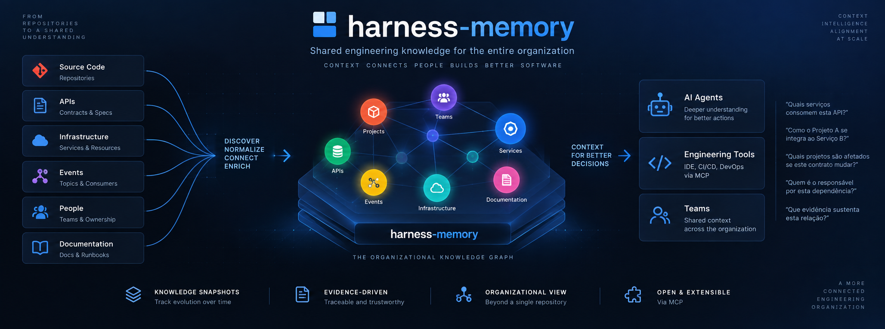

# Harness Memory

**Harness Memory** is an open-source engineering memory platform for making software
knowledge discoverable, explainable, and reusable across teams and repositories.

It gives developers and AI agents organization-level context about projects, services,
APIs, events, teams, dependencies, ownership, environments, and change impact. It
connects the knowledge that normally remains scattered across repositories, deployment
pipelines, and individual experts.

> A repository explains itself. Harness Memory explains how repositories relate to each other.

## Why teams use Harness Memory

Engineering teams lose time when answers depend on architectural rediscovery or one
person's memory. Harness Memory creates a shared, evidence-backed context for questions
that cross project boundaries:

- Which services consume this API?
- What depends on this library or contract?
- How does one project integrate with another?
- Which projects, teams, and services may be affected by a change?
- Which environment currently contains a version?
- What evidence supports a relationship?

Harness Memory stores answers as structured, versioned knowledge and exposes them through
the **Model Context Protocol (MCP)**. Developers ask questions through their preferred
LLM client; CI/CD publishes verified project snapshots through the REST API or SDK.

## Business benefits

| Benefit | Outcome |
| --- | --- |
| Faster engineering decisions | Find ownership, dependencies, consumers, and integration paths without searching many repositories. |
| Safer change planning | Analyze known downstream impact before changing shared APIs, events, or libraries. |
| Explainable AI assistance | Preserve provenance and evidence so answers can be reviewed instead of accepted as guesses. |
| Environment awareness | Compare staging and production snapshots and identify active project state. |
| Repeatable delivery knowledge | Publish complete snapshots from CI/CD with version, deployment identity, and idempotent retries. |
| Governed access | Separate administration, publication, and read-only MCP access with tenant-scoped user tokens and global admin access. |

## Core capabilities

Harness Memory provides a focused workflow:

1. **Publish project knowledge** as immutable, versioned environment snapshots.
2. **Discover entities and relationships** across projects, services, APIs, events, teams, and libraries.
3. **Inspect dependencies and integration paths** with ownership, provenance, and evidence.
4. **Analyze change impact** across project boundaries without allowing an LLM to invent missing relationships.
5. **Compare environments** and inspect active or historical snapshots.

Knowledge can represent entities such as projects, systems, services, APIs, events, libraries, and teams, connected through relationships such as `depends_on`, `consumes`, `provides`, `publishes`, `subscribes_to`, and `owned_by`.

## Who benefits

| Audience | Value |
| --- | --- |
| DevOps and platform teams | Configure credentials, publish deployment knowledge, and operate a provider-independent pipeline. |
| Developers and architects | Query dependencies, ownership, evidence, and impact from an MCP-enabled LLM. |
| Engineering managers and technical leaders | Improve decision context, reduce rediscovery, and compare environment state. |
| Common users | Ask natural-language questions about software systems without learning graph or database syntax. |

## Main commands

Start the local platform:

```bash
export API_ADMIN_TOKEN='replace-with-a-high-entropy-secret'
docker compose up --build -d
curl --fail http://localhost:8080/health
```

Connect an MCP client at `http://localhost:8000/mcp`. Use an API-issued user or
service-account token with the required scope. Set `HARNESS_MEMORY_API_KEY` as the
default client credential, or supply a bearer token directly. Admin data calls require
no tenant header and can read across tenants. Admin snapshot publication requires a
`tenant_id` destination in the request body.

Build and test the SDK:

```bash
npm --prefix sdk ci
npm --prefix sdk run build
npm --prefix sdk test
```

Run an SDK dry run against a checked-out repository:

```bash
node sdk/dist/cli/index.js publish \
  --repository /path/to/project \
  --model gpt-5 \
  --effort medium \
  --environment staging \
  --project-key com.example.project \
  --deployment-id dry-run-001 \
  --version HEAD \
  --dry-run \
  --output text
```

Run the backend test tiers:

```bash
./venv/bin/python -m pytest tests/unit
./venv/bin/python -m pytest tests/integration
./venv/bin/python -m pytest tests/e2e
```

Stop local services:

```bash
docker compose down
```

## Learn more

Start with the [Harness Memory Workflow README](docs/workflow/README.md). It routes each
audience to the right guide:

- [DevOps Playbook](docs/workflow/PLAYBOOK-DEVOPS.md): platform bootstrap, tokens, CI/CD, and SDK publication.
- [Developer Playbook](docs/workflow/PLAYBOOK-DEVELOPER.md): MCP configuration, LLM conversations, tools, resources, and impact analysis.
- [User Playbook](docs/workflow/PLAYBOOK-USER.md): onboarding, projects, resources, tokens, and everyday questions.
- [Setup guide](docs/workflow/SETUP.md): local installation and credential bootstrap.
- [SDK guide](sdk/README.md): full CLI, configuration, graph contract, and programmatic API.
- [API guide](api/README.md): REST management and publication endpoints.
- [MCP guide](harness_memory_mcp/README.md): server configuration and catalog.

## How It Works

```text
CI/CD / API
      │
      │ ProjectKnowledgeSnapshot
      ▼
 Harness Memory API
      │
      ├── validate
      ├── version
      ├── persist
      └── activate
      │
      ▼
   PostgreSQL
      │
      ▼
Corporate engineering graph
```

Projects publish complete snapshots rather than directly mutating arbitrary graph nodes and edges. This keeps publication versioned, auditable, and idempotent.

Important relationships can also carry **provenance** and **evidence**, making it possible to understand not only what is known, but where that knowledge came from.

## MCP Interface

The MCP surface is read-only and exposes the following tools:

| Tool | Purpose |
| --- | --- |
| `search_entities` | Search known entities by key, name, type, or project. |
| `get_context` | Retrieve bounded context around an entity. |
| `get_dependencies` | Query inbound and outbound dependencies. |
| `find_integration_paths` | Find known paths between engineering entities. |
| `analyze_impact` | Identify direct and indirect impact of a structured change. |
| `get_environment` | Read an environment and its active snapshot. |
| `compare_environments` | Compare two environment snapshots. |

Resources:

```text
memory://entities/{entity_id}
memory://projects/{project_key}
memory://snapshots/{snapshot_id}
```

Prompts:

```text
load_corporate_context
analyze_integration
review_change_impact
```

## Tech Stack

- Python 3.12+
- FastMCP 4.x
- Pydantic
- PostgreSQL 17
- Alembic
- Docker Compose

## Architecture

Harness Memory uses pragmatic Domain-Driven Design. Business rules remain independent from MCP transport and PostgreSQL implementation details.

```text
harness_memory_mcp ────────► core/application ────────► core/domain
                    │
                    ▼
             application ports
                    ▲
                    │
          core/infrastructure
```

Application code is organized by business domain and use case:

```text
core/application/<domain>/
├── use_cases/
│   └── <use_case>/
│       ├── handler.py
│       ├── inbound.py
│       └── outbound.py
├── services/
└── ports/
```

- `handler.py` orchestrates the use case.
- `inbound.py` defines its Pydantic input contract.
- `outbound.py` defines its stable Pydantic result contract.
- Domain objects own business invariants.
- Infrastructure implements persistence and external adapters.

See [`ARCHITECTURE.md`](docs/adr/ARCHITECTURE.md) for detailed architecture and dependency rules.

## Getting Started

For a community-friendly first run, follow the [developer setup guide](docs/workflow/SETUP.md)
and then use the [workflow README](docs/workflow/README.md). It links role-specific guides
for local credentials, read-only MCP access, governed API publication, and the test loop.

### Requirements

- Docker
- Docker Compose
- Python 3.12+ for local development

### Start the services

Copy `.env-example` to `.env`, set a long random `API_ADMIN_TOKEN`, then run:

```bash
docker compose up --build
```

Startup order:

```text
PostgreSQL
    ↓
Alembic migrations
    ↓
REST API and MCP server
```

The MCP server is exposed at:

```text
http://localhost:8000
```

The REST API is exposed at `http://localhost:8080`; use `/health` for a readiness check.

### Stop the services

```bash
docker compose down
```

To also remove the local PostgreSQL volume:

```bash
docker compose down -v
```

> This permanently removes the local database data stored by Docker Compose.

The production image runs as `appuser` (UID `10001`). The `migrate` service runs
`alembic upgrade head` before the API and MCP services accept traffic. The server checks
that the database revision equals Alembic `head`; it never runs implicit migrations.

## Database Migrations

Schema migrations are managed by Alembic and run automatically before the MCP service starts.

To run migrations manually:

```bash
docker compose run --rm migrate
```

## Development

The default Compose configuration builds the application into the Docker image. After changing Python code, rebuild the MCP service:

```bash
docker compose up -d --build mcp
```

For hot reload, use a development-specific Compose override with a source bind mount and an appropriate Python reload/watch mechanism.

For a local virtual environment:

```bash
python3 -m venv venv
./venv/bin/pip install -e ".[test]"
```

Set `DATABASE_URL` to a PostgreSQL `postgresql+psycopg2://` URL before running
`alembic upgrade head` or `harness-memory migrate`. Read-only migration status is
available with `harness-memory migrate --status`.

Run the test tiers in source order:

```bash
./venv/bin/python -m pytest tests/unit
./venv/bin/python -m pytest tests/integration
./venv/bin/python -m pytest tests/e2e
./venv/bin/python -m pytest --cov=api --cov=core --cov=harness_memory_mcp --cov-branch --cov-fail-under=80
```

The 80% global branch coverage gate is required in CI. Ruff format and lint must
also pass. Windows virtual environments use `venv\\Scripts\\python.exe` and
`venv\\Scripts\\pip.exe`.

### Authentication and tenancy

Production HTTP mode verifies bearer tokens issued by the REST API and stored as
SHA-256 digests. Every tool request is bound to the token owner; tenant identity is
never accepted from a tool payload. Scope checks protect reads and impact analysis
on MCP. Publication is available only through the API and requires the exact
`memory:publish` scope. Security audit records keep bounded safe identifiers and optional
W3C trace correlation.

### MCP example

After startup, an MCP client can discover the catalog with `tools/list`, then call
`search_entities` with a tenant-scoped query:

```json
{
  "jsonrpc": "2.0",
  "id": 1,
  "method": "tools/call",
  "params": {
    "name": "search_entities",
    "arguments": {"request": {"project": "payments"}}
  }
}
```

## Connect MCP Clients

Harness Memory exposes MCP over Streamable HTTP at `http://localhost:8000/mcp` when
running with Docker Compose. It does not currently expose a local `stdio` command.
For a remote deployment, use its publicly reachable HTTPS URL, such as
`https://mcp.example.com/mcp`.

### Authentication

The Compose configuration enables database authentication with
`MCP_AUTH_MODE=database`. Management endpoints require
`Authorization: Bearer <API_ADMIN_TOKEN>`. Create a user through
`POST http://localhost:8080/v1/users`, then create its token through
`POST http://localhost:8080/v1/tokens` and request only the required scopes. Save the
plaintext token returned once by the creation response. The complete bootstrap sequence
is in the [developer setup guide](docs/workflow/SETUP.md).

For automation, create a tenant-bound service account through `POST /v1/service-accounts`,
then issue its token through `POST /v1/tokens` with `service_account_id`. Omit `expires_at`
to create a non-expiring service-account token. See the [API guide](api/README.md).

Send that value through `Authorization: Bearer <token>`. The MCP server hashes the
value, accepts only an active stored token, and derives subject and tenant identity
from its owner. API-issued tokens authenticate MCP reads and, for tenant-bound service
accounts or users with the `memory:publish` scope, API publication requests. They never
authenticate REST management endpoints.

### Set the MCP token environment variable

Replace `<token>` with the plaintext token returned once by `POST /v1/tokens`. Keep
the token secret; do not commit it or put it directly in the MCP configuration.

On Windows, use PowerShell to create a persistent user environment variable:

```powershell
setx HARNESS_MEMORY_API_KEY "<token>"
```

Restart Codex so it reads the updated environment.

On Linux, export the variable in the shell that starts Codex:

```bash
export HARNESS_MEMORY_API_KEY="<token>"
```

This applies to the current shell and its child processes. For Bash login sessions,
add the `export` line to `~/.profile`, then start a new login session.

### Claude Code

Add this entry to the project-root `.mcp.json`. Set `HARNESS_MEMORY_API_KEY` in the
environment before starting Claude Code:

```json
{
  "mcpServers": {
    "harness-memory": {
      "type": "http",
      "url": "http://localhost:8000/mcp",
      "headers": {
        "Authorization": "Bearer ${HARNESS_MEMORY_API_KEY}"
      }
    }
  }
}
```

Start Claude Code in the project, approve the project MCP server if prompted, then
run `/mcp` to check its connection. See the [Claude Code MCP documentation](https://code.claude.com/docs/en/mcp).

### OpenAI Codex

Add this table to `~/.codex/config.toml`. Set `HARNESS_MEMORY_API_KEY` in the
environment before starting Codex:

```toml
[mcp_servers.harness-memory]
url = "http://localhost:8000/mcp"
bearer_token_env_var = "HARNESS_MEMORY_API_KEY"
```

The Codex CLI, desktop app, and IDE extension share this configuration. Run
`codex mcp list` or enter `/mcp` in the Codex TUI to check the connection. See the
[Codex MCP documentation](https://developers.openai.com/codex/mcp).

### Google Antigravity

In Antigravity IDE, open **MCP Servers > Manage MCP Servers > View raw config**.
Add this server to the `mcpServers` object in the global
`~/.gemini/config/mcp_config.json` file:

```json
{
  "mcpServers": {
    "harness-memory": {
      "serverUrl": "http://localhost:8000/mcp",
      "headers": {
        "Authorization": "Bearer <YOUR_TOKEN>"
      }
    }
  }
}
```

Replace `<YOUR_TOKEN>` with the plaintext returned by `POST /v1/tokens`. Keep this global
configuration private because it contains the token. Antigravity CLI also supports
workspace configuration in `.agents/mcp_config.json`; do not commit a real token
there. Open the MCP Servers panel in the IDE, or run `/mcp` in Antigravity CLI, to
check or reload the server. See the [Antigravity MCP documentation](https://antigravity.google/docs/mcp).

### Other MCP clients

Use a client that supports remote Streamable HTTP servers. Set its server URL to
`http://localhost:8000/mcp` (or your deployed HTTPS URL) and configure the
`Authorization` header with a valid bearer token. See the client's MCP settings for
the exact configuration format.

## Design Principles

- Keep business logic out of MCP adapters.
- Keep the domain independent from FastMCP, SQLAlchemy, and PostgreSQL drivers.
- Publish versioned snapshots instead of arbitrary graph mutations.
- Preserve evidence and provenance for important relationships.
- Derive impact from known graph relationships rather than LLM guesses.
- Keep the initial graph and infrastructure intentionally small.

## Project Status

Harness Memory is currently under active development. The initial implementation is focused on the MCP interface, snapshot publication, relationship queries, dependency traversal, and cross-project impact analysis.

The project is independent and does not require Harness Kit to operate.

## Contributing

Contributions are welcome.

If you want to propose a feature or architectural change, open an issue or pull request with a clear description of the problem, expected behavior, and relevant tests.

When contributing, preserve the dependency boundaries described in [`ARCHITECTURE.md`](docs/adr/ARCHITECTURE.md), keep one class per file, and add tests in the matching `unit`, `integration`, or `e2e` tree.

## License

Harness Memory is open-source software licensed under the **MIT License**.

See [`LICENSE`](LICENSE) for details.
