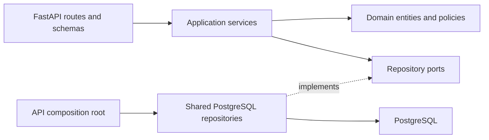
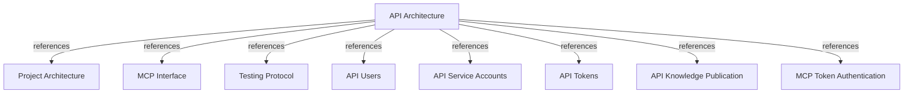

# API Architecture

## PURPOSE

`api/` exposes FastAPI endpoints for user, tenant-bound service-account, access-token,
and knowledge-publication operations. A static administrator bearer secret protects
management routes. API-issued owner-bound tokens authorize MCP reads and API publication,
but never management routes.

## MODULE BOUNDARIES

| Layer | Location | Responsibility |
|-------|----------|----------------|
| HTTP adapter | `api/adapters/http/` | Define route factories and Pydantic request/response schemas; translate application failures to HTTP responses. |
| Application | `api/application/services/`, `api/application/ports/` | Coordinate CRUD operations and depend on repository interfaces, not SQLAlchemy. |
| Domain | `api/domain/entities/`, `api/domain/services/` | Model users, service accounts, access tokens, issued plaintext, and token lifetime rules. |
| Composition root | `api/server/app.py` | Build FastAPI, configure the shared PostgreSQL session factory, inject repositories/services, and register routes. |
| Shared persistence | `core/infrastructure/postgres/` | Own SQLAlchemy API models and repository implementations alongside the rest of the system's PostgreSQL adapters. |
| Schema history | `migrations/versions/` | Version shared database schema, including users, service accounts, and access tokens. |

## DEPENDENCY FLOW

HTTP route factories call application services. Services depend on API-owned repository ports and domain entities/policies. The composition root injects concrete repositories from `core/infrastructure/postgres`; those adapters translate between domain objects and shared SQLAlchemy models.

REQUIRED: Keep SQLAlchemy and database sessions out of `api/domain/` and `api/application/`.
REQUIRED: Keep route functions thin and create route routers through injected application services.
REQUIRED: Reuse `core/infrastructure/postgres` configuration, models, and repositories rather than creating an API-local database stack.
PROHIBITED: Use ordinary API access tokens for REST management authentication.

## HTTP SURFACE

| Method | Path | Responsibility |
|--------|------|----------------|
| GET | `/health` | Return process health. |
| POST, GET | `/v1/users` | Create and list users. |
| GET, PATCH, DELETE | `/v1/users/{user_id}` | Read, update, or delete a user. |
| POST, GET | `/v1/service-accounts` | Create or list service accounts, optionally filtered by `tenant_id`. |
| GET, PATCH, DELETE | `/v1/service-accounts/{account_id}` | Read, rename, or delete a service account. |
| POST, GET | `/v1/tokens` | Issue a user or service-account token, or list token metadata. |
| GET, PATCH, DELETE | `/v1/tokens/{token_id}` | Read, update metadata/expiry, or revoke a token. |
| POST | `/v1/knowledge-publications` | Publish deployment facts and activate an environment snapshot. |
| GET | `/v1/environments`, `/v1/knowledge-publications` | Search environment and publication records with tenant, project, state, version, deployment, and text filters. |
| GET | `/v1/snapshots`, `/v1/entities`, `/v1/relations`, `/v1/evidence` | Search immutable snapshot facts with table-specific filters and bounded pagination. |
| POST, GET | `/v1/tenants` | Admin creates tenants; scoped credentials read according to identity. |
| GET, PATCH, DELETE | `/v1/tenants/{tenant_id}` | Read tenant; admin updates or deletes an empty tenant. |
| GET | `/v1/tenants/current` | Read the authenticated tenant for owner-bound credentials. |
| POST, GET | `/v1/projects` | Admin creates projects; credentials read within their access scope. |
| GET, PATCH, DELETE | `/v1/projects/{project_key}` | Read project; admin updates or deletes a project without dependent data. |
| GET | `/v1/projects/{project_key}/snapshots`, `/v1/snapshots/{snapshot_id}` | Read tenant-scoped snapshot history and payloads. |
| GET | `/docs`, `/openapi.json` | Serve Swagger UI and the generated OpenAPI schema. |

Prefix management endpoints with `/v1`. Keep health and API documentation routes unversioned.

Publication requests use the shared environment/publication handler. Require an active
user or service-account token with `memory:publish`, or the admin token. Ordinary tokens
derive tenant from their owner. Admin publication requires body `tenant_id` as its write
destination. The handler creates missing project and environment records on first publication.

Require `API_ADMIN_TOKEN` for every REST management route. `HARNESS_MEMORY_API_KEY` grants
global `memory:read` for knowledge tables; identity and token metadata remain admin-only.
Validate other bearers against shared `tokens` and apply their persisted scopes and owner
tenant. Tokens with `memory:publish` may read project, environment, and publication target
metadata for SDK preflight; other knowledge-table reads still require `memory:read`. API
and MCP accept the same token value.
Keep health and generated API documentation public. Never accept API-issued user or
service-account tokens as the management credential.

## TOKEN HANDOFF TO MCP

Issue each token for exactly one user or service account. Return plaintext only in the successful create-token response and persist only its SHA-256 digest. Require user-token expiry; allow service-account tokens without expiry. Limit any finite token lifetime to 90 days. Reads and updates return metadata, never the digest or plaintext.

The verifier hashes an ordinary bearer token and asks the shared token repository for
an active record and owner. Owner type does not change eligible permissions. The owner
supplies tenant context; the token supplies its persisted scopes. General reads require
`memory:read`; publication requires `memory:publish`. Target metadata reads used by SDK
preflight accept either scope. The baseline also accepts `memory:publish` for publishers.

## DOCUMENT MAP

## REFERENCES

- [**ARCHITECTURE.md**](./ARCHITECTURE.md): Global module and dependency rules.
- [**MCP.md**](./MCP.md): MCP transport and authentication boundary.
- [**TESTS.md**](./TESTS.md): Verification tiers and coverage policy.
- [**users.md**](../feature/api/users.md): User identity and tenant derivation contract.
- [**service-accounts.md**](../feature/api/service-accounts.md): Tenant-bound automation identity contract.
- [**tokens.md**](../feature/api/tokens.md): Token issuance, storage, and MCP handoff contract.
- [**knowledge-publication.md**](../feature/api/knowledge-publication.md): CI/CD publication boundary and response contract.
- [**token-authentication.md**](../feature/mcp/token-authentication.md): MCP verification of API-issued tokens.
