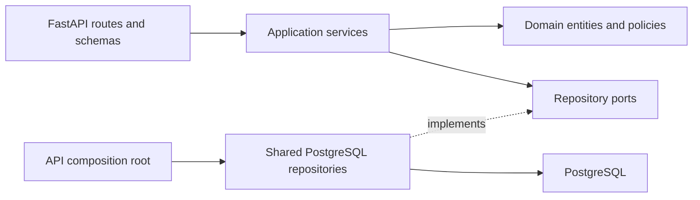
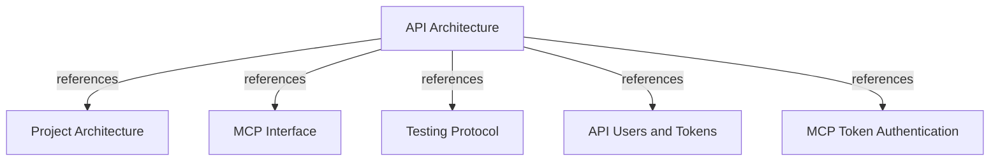

# API Architecture

## PURPOSE

`api/` is the project's second application module. It exposes FastAPI endpoints for user and access-token CRUD, a process health check, and generated OpenAPI documentation. API-issued tokens are credentials for MCP clients only; they do not authenticate the REST management endpoints.

## MODULE BOUNDARIES

| Layer | Location | Responsibility |
|-------|----------|----------------|
| HTTP adapter | `api/adapters/http/` | Define route factories and Pydantic request/response schemas; translate application failures to HTTP responses. |
| Application | `api/application/services/`, `api/application/ports/` | Coordinate CRUD operations and depend on repository interfaces, not SQLAlchemy. |
| Domain | `api/domain/entities/`, `api/domain/services/` | Model users, access tokens, issued plaintext, and the maximum token lifetime. |
| Composition root | `api/server/app.py` | Build FastAPI, configure the shared PostgreSQL session factory, inject repositories/services, and register routes. |
| Shared persistence | `core/infrastructure/postgres/` | Own SQLAlchemy API models and repository implementations alongside the rest of the system's PostgreSQL adapters. |
| Schema history | `migrations/versions/` | Version shared database schema, including user and access-token tables. |

## DEPENDENCY FLOW

HTTP route factories call application services. Services depend on API-owned repository ports and domain entities/policies. The composition root injects concrete repositories from `core/infrastructure/postgres`; those adapters translate between domain objects and shared SQLAlchemy models.

REQUIRED: Keep SQLAlchemy and database sessions out of `api/domain/` and `api/application/`.
REQUIRED: Keep route functions thin and create route routers through injected application services.
REQUIRED: Reuse `core/infrastructure/postgres` configuration, models, and repositories rather than creating an API-local database stack.
PROHIBITED: Use API access tokens as REST API authentication credentials.

## HTTP SURFACE

| Method | Path | Responsibility |
|--------|------|----------------|
| GET | `/health` | Return process health. |
| POST, GET | `/users` | Create and list users. |
| GET, PATCH, DELETE | `/users/{user_id}` | Read, update, or delete a user. |
| POST, GET | `/tokens` | Issue a token or list token metadata, optionally filtered by `user_id`. |
| GET, PATCH, DELETE | `/tokens/{token_id}` | Read, update metadata/expiry, or revoke a token. |
| GET | `/docs`, `/openapi.json` | Serve Swagger UI and the generated OpenAPI schema. |

The current REST CRUD routes do not declare an authentication dependency. Do not mistake MCP bearer-token verification for protection of this management API; restrict its network exposure until a separate REST authorization mechanism is introduced.

## TOKEN HANDOFF TO MCP

Issue a random opaque bearer token for a user and return its plaintext only in the successful create-token response. Persist only its SHA-256 digest. Enforce an expiry after issuance and no later than 90 days from issuance; reads and updates return metadata, never the digest or plaintext.

In database authentication mode, the MCP adapter hashes the presented bearer token and asks the shared token repository for an active record and its owner. The owner supplies the trusted MCP identity/tenant context. Token lifecycle and consumption are therefore split by responsibility: REST API manages credentials; MCP accepts them for MCP requests.

## DOCUMENT MAP

## REFERENCES

- [**ARCHITECTURE.md**](./ARCHITECTURE.md): Global module and dependency rules.
- [**MCP.md**](./MCP.md): MCP transport and authentication boundary.
- [**TESTS.md**](./TESTS.md): Verification tiers and coverage policy.
- [**users-and-tokens.md**](../feature/api/users-and-tokens.md): API routes and token lifecycle contract.
- [**token-authentication.md**](../feature/mcp/token-authentication.md): MCP verification of API-issued tokens.
