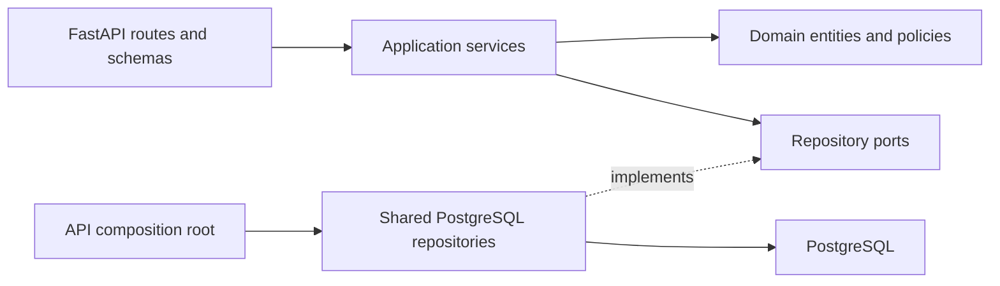
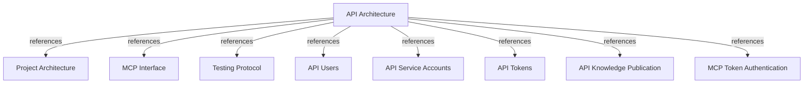

# API Architecture

## PURPOSE

`api/` is the project's second application module. It exposes FastAPI endpoints for user, tenant-bound service-account, access-token, and knowledge-publication operations, plus health and generated OpenAPI documentation. API-issued tokens are credentials for MCP clients only; they do not authenticate the REST management endpoints.

## MODULE BOUNDARIES

| Layer | Location | Responsibility |
|-------|----------|----------------|
| HTTP adapter | `api/adapters/http/` | Define route factories and Pydantic request/response schemas; translate application failures to HTTP responses. |
| Application | `api/application/services/`, `api/application/ports/` | Coordinate CRUD operations and depend on repository interfaces, not SQLAlchemy. |
| Domain | `api/domain/entities/`, `api/domain/services/` | Model users, service accounts, access tokens, issued plaintext, and token lifetime rules. |
| Composition root | `api/server/app.py` | Build FastAPI, configure the shared PostgreSQL session factory, inject repositories/services, and register routes. |
| Shared persistence | `core/infrastructure/postgres/` | Own SQLAlchemy API models and repository implementations alongside the rest of the system's PostgreSQL adapters. |
| Schema history | `migrations/versions/` | Version shared database schema, including users, service accounts, and access tokens. |

## DEPENDENCY FLOW

HTTP route factories call application services. Services depend on API-owned repository ports and domain entities/policies. The composition root injects concrete repositories from `core/infrastructure/postgres`; those adapters translate between domain objects and shared SQLAlchemy models.

REQUIRED: Keep SQLAlchemy and database sessions out of `api/domain/` and `api/application/`.
REQUIRED: Keep route functions thin and create route routers through injected application services.
REQUIRED: Reuse `core/infrastructure/postgres` configuration, models, and repositories rather than creating an API-local database stack.
PROHIBITED: Use API access tokens as REST API authentication credentials.

## HTTP SURFACE

| Method | Path | Responsibility |
|--------|------|----------------|
| GET | `/health` | Return process health. |
| POST, GET | `/v1/users` | Create and list users. |
| GET, PATCH, DELETE | `/v1/users/{user_id}` | Read, update, or delete a user. |
| POST, GET | `/v1/service-accounts` | Create or list service accounts, optionally filtered by `tenant_id`. |
| GET, PATCH, DELETE | `/v1/service-accounts/{account_id}` | Read, rename, or delete a service account. |
| POST, GET | `/v1/tokens` | Issue a user or service-account token, or list token metadata. |
| GET, PATCH, DELETE | `/v1/tokens/{token_id}` | Read, update metadata/expiry, or revoke a token. |
| POST | `/v1/knowledge-publications` | Publish deployment facts and activate an environment snapshot. |
| GET | `/docs`, `/openapi.json` | Serve Swagger UI and the generated OpenAPI schema. |

Prefix management endpoints with `/v1`. Keep health and API documentation routes unversioned.

Publication requests use the shared environment/publication handler. The current route accepts optional `X-Tenant-ID` and defaults to `default`; keep the unauthenticated surface private until REST authorization exists.

The current REST CRUD routes do not declare an authentication dependency. Do not mistake MCP bearer-token verification for protection of this management API; restrict its network exposure until a separate REST authorization mechanism is introduced.

## TOKEN HANDOFF TO MCP

Issue each token for exactly one user or service account. Return plaintext only in the successful create-token response and persist only its SHA-256 digest. Require user-token expiry; allow service-account tokens without expiry. Limit any finite token lifetime to 90 days. Reads and updates return metadata, never the digest or plaintext.

In database authentication mode, the MCP adapter hashes the presented bearer token and asks the shared token repository for an active record and its owner. The owner supplies the trusted MCP subject and tenant context. User tokens use the user ID as tenant ID; service-account tokens use the assigned tenant ID. Token lifecycle and consumption are split by responsibility: REST API manages credentials; MCP accepts them for MCP requests.

## DOCUMENT MAP

## REFERENCES

- [**ARCHITECTURE.md**](./ARCHITECTURE.md): Global module and dependency rules.
- [**MCP.md**](./MCP.md): MCP transport and authentication boundary.
- [**TESTS.md**](./TESTS.md): Verification tiers and coverage policy.
- [**users.md**](../feature/api/users.md): User identity and tenant derivation contract.
- [**service-accounts.md**](../feature/api/service-accounts.md): Tenant-bound automation identity contract.
- [**tokens.md**](../feature/api/tokens.md): Token issuance, storage, and MCP handoff contract.
- [**knowledge-publication.md**](../feature/api/knowledge-publication.md): CI/CD publication boundary and response contract.
- [**token-authentication.md**](../feature/mcp/token-authentication.md): MCP verification of API-issued tokens.
