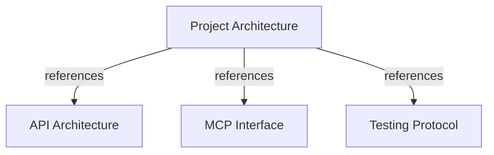

# Project Architecture

## OVERVIEW

Use **hexagonal architecture with pragmatic DDD** across four application components: `api/` provides the REST management and publication interface, `harness_memory_mcp/` provides the read-only MCP interface, `sdk/` provides the client-side snapshot publisher SDK and CLI, and `web/` provides the administrative console BFF for operator access and token lifecycle management. Backend modules depend inward on application/domain code and reuse `core/` for shared business capabilities and PostgreSQL infrastructure.

Keep transport concerns at module boundaries. Domain rules remain independent from FastAPI, FastMCP, SQLAlchemy, PostgreSQL, Alembic, Next.js, and client frameworks. `core/infrastructure/postgres` owns shared persistence adapters; `migrations/` owns schema revisions.

## GLOBAL MODULE MAP

| Module | Responsibility | Architecture detail |
|--------|----------------|--------------------|
| API | User and token management, and pipeline knowledge publication over REST. | [API.md](./API.md) |
| MCP | Read-only tools, resources, prompts, and authenticated MCP transport. | [MCP.md](./MCP.md) |
| Core | Shared domain/application capabilities and PostgreSQL models, repositories, and runtime. | [Platform foundation](../feature/core/platform-foundation.md), [tenant foundation](../feature/core/tenant-foundation.md), [snapshot publication](../feature/core/snapshot-publication.md) |
| SDK | Snapshot Publisher TypeScript CLI and programmatic client for CI/CD pipelines. | [Snapshot Publisher](../feature/sdk/snapshot-publisher.md) |
| Web | Next.js admin console and BFF for operator login, tenant bootstrap, and token issuance. | [Web Admin](../feature/web/admin-token-management.md) |
| Delivery | Project-wide containers, migration/startup checks, CI, and telemetry. | [Production delivery](../feature/core/production-delivery.md) |

## TOP-LEVEL STRUCTURE

```text
harness-memory/
├── api/                 # FastAPI adapter, API application/domain, composition root
├── harness_memory_mcp/   # FastMCP adapter, transport security, runtime
├── core/                # Shared application/domain and infrastructure
├── sdk/                 # TypeScript Snapshot Publisher SDK and CLI
├── web/                 # Next.js Admin Console BFF, UI components, and tests
├── migrations/          # Alembic revisions for shared PostgreSQL schema
├── tests/               # unit/, integration/, e2e/ mirroring source modules
└── docs/                # ADRs and feature documentation by owning module
```

## DEPENDENCY RULES

- **Inbound adapters**: `api/` and `harness_memory_mcp/` validate transport input, invoke application services/use cases, and map safe output.
- **Application**: Coordinate use cases, contracts, ports, transactions, and typed failures without depending on transport or persistence implementations.
- **Domain**: Enforce business invariants without framework or database imports.
- **Shared infrastructure**: `core/infrastructure/postgres` implements persistence ports for API, MCP, and core application behavior.
- **Client SDK**: `sdk/` communicates exclusively via REST (`POST /v1/knowledge-publications`) and does not access the database or backend codebase directly.
- **Web Admin BFF**: `web/` communicates exclusively with `api/` over REST using server actions; it never imports backend Python code or connects directly to PostgreSQL.
- **Migrations**: `migrations/versions/` describes schema changes; runtime startup verifies compatibility rather than migrating implicitly.

REQUIRED: Inject repository ports and boundary services through constructors or explicit handler arguments.
REQUIRED: Keep API PostgreSQL adapters in `core/infrastructure/postgres`; keep SQLAlchemy out of `api/domain` and `api/application`.
REQUIRED: Verify API-issued MCP tokens by stored digest, active lifetime, and owning user.
REQUIRED: Keep graph queries active-snapshot bounded and apply tenant filters when supplied.
REQUIRED: Keep pipeline publication independent of CI providers through the TypeScript SDK or REST API.
REQUIRED: Isolate Web Admin administrative credentials on the server side; authenticate clients via HTTP-only session cookies.
PROHIBITED: Import FastAPI, FastMCP, SQLAlchemy, PostgreSQL drivers, or infrastructure implementations into domain code.
PROHIBITED: Let prompts execute business logic or MCP tools mutate graph facts outside complete snapshot publication.
PROHIBITED: Let the SDK or Web Admin access PostgreSQL or backend Python modules directly.

## DOCUMENT MAP



## REFERENCES

- [**API.md**](./API.md): FastAPI module boundaries, persistence reuse, and token handoff to MCP.
- [**MCP.md**](./MCP.md): MCP components, transport, and security boundary.
- [**TESTS.md**](./TESTS.md): Test tiers, commands, and coverage policy.
- [**admin-token-management.md**](../feature/web/admin-token-management.md): Web admin console, tenant bootstrap, and token issuance.
- [**README.md**](../README.md): Documentation navigation index.
