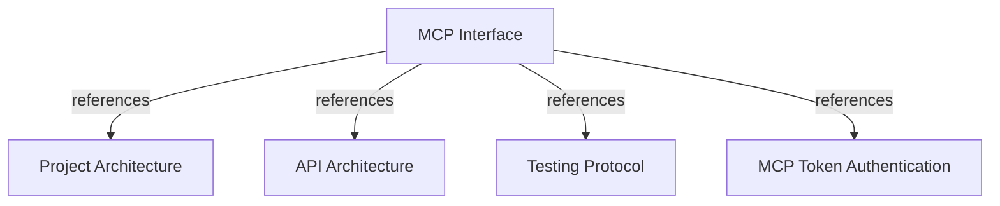

# MCP Interface

Define the read-only FastMCP surface for querying and analyzing corporate engineering knowledge.

## OVERVIEW

Use **FastMCP** for the knowledge interface: tools for actions, resources for bounded reads, and prompts for agent guidance. The separate FastAPI module manages users and MCP access tokens; it does not expose these knowledge operations.
Group application contracts and use cases by business domain; keep `harness_memory_mcp/server` and `harness_memory_mcp/tools` as adapter boundaries.
Run MCP over HTTP in production and use the FastMCP in-process client for development and contract tests.

## FOLDER STRUCTURE

Keep MCP adapters thin. Add business rules to application or domain layers.

```text
<project-root>/
+-- harness_memory_mcp/
|   +-- server/              # FastMCP registration and runtime.
|   +-- tools/               # Thin public adapters over application use cases.
|   +-- services/            # Authentication, tenant context, and response mapping.
|   +-- config.py, cli.py    # Runtime settings and operational commands.
+-- core/
    +-- domain/              # Entities, value objects, invariants, and ports.
    +-- application/         # Contracts, use cases, services, and ports.
    +-- infrastructure/postgres/ # Models, repositories, and database configuration.
```

## MAIN CONCEPTS / COMPONENTS

### Request flow

1. Authenticate request and resolve tenant identity from authenticated context.
2. Validate MCP arguments with Pydantic models, including snapshot schema version.
3. Dispatch a thin handler under the selected business domain's `use_cases/` package.
4. Execute tenant-scoped, bounded PostgreSQL reads through application ports.
5. Return a bounded Pydantic response with provenance, evidence, and unknowns where applicable.

Use stateless Streamable HTTP in production. Return malformed arguments as HTTP `200` JSON-RPC tool errors with `isError: true` and stable `INVALID_ARGUMENT` text. Return `401 invalid_token` and `403 insufficient_scope`; sanitize internal failures.

## TOOLS

Keep one public tool per file under `harness_memory_mcp/tools/`. Register modules through `harness_memory_mcp/server/`; delegate each handler to one domain-grouped application use case.

| Tool | Scope | Purpose | Input | Output |
|------|-------|---------|-------|--------|
| `search_projects` | `memory:read` | Find project records and verify whether they have active data. | Exact key or partial key/name query; bounded offset page. | Project key, name, and active-snapshot status. |
| `search_entities` | `memory:read` | Find entities in active snapshots, including document content. | Exact key/project, name prefix, type, or metadata phrase query. | Bounded matching entity identities and snapshot revisions. |
| `get_context` | `memory:read` | Read bounded context and evidence for one entity. | Entity identifier and result limits. | Entity, project, owner, relations, dependencies, and evidence. |
| `get_dependencies` | `memory:read` | Read an entity's inbound or outbound dependency relationships. | Entity identifier, direction, and result limits. | Known dependency relationships and provenance. |
| `find_integration_paths` | `memory:read` | Find bounded dependency paths between two entities. | Source and target entity identifiers and result limits. | Known paths, ownership, provenance, and evidence. |
| `analyze_impact` | `memory:impact` | Analyze downstream consumers of a proposed change. | Structured change description and analysis limits. | Direct and indirect consumers, affected projects/teams, paths, evidence, and unknowns. |
| `get_environment` | `memory:read` | Read an environment and its active snapshot. | Project key and environment name. | Environment metadata and active snapshot. |
| `compare_environments` | `memory:read` | Compare active entity fingerprints between environments. | Project key and two environment names. | Added, removed, modified, and unchanged entities. |

REQUIRED: Document each tool's purpose, scope, arguments, and result bounds in its FastMCP schema.
REQUIRED: Keep tools thin over one use case; keep services focused on MCP boundaries.
REQUIRED: Bound results by query scope and include evidence for important relationships.
PROHIBITED: Let MCP tools mutate graph nodes, relationships, snapshots, or environment pointers; all publication goes through the API.
PROHIBITED: Use an LLM to guess impact when graph relationships or evidence are absent.

## RESOURCES

| URI | Scope | Meaning |
|-----|-------|---------|
| `memory://entities/{entity_id}` | `memory:read` | Entity context and bounded relationships. |
| `memory://projects/{project_key}` | `memory:read` | Project facts and active snapshot context. |
| `memory://snapshots/{snapshot_id}` | `memory:read` | Versioned snapshot metadata and validated facts. |

REQUIRED: Bound resource data and filter every identifier by authenticated tenant.

## PROMPTS

| Prompt | Purpose | Allowed responsibility |
|--------|---------|------------------------|
| `load_corporate_context` | Prepare cross-system planning. | Suggest context-loading tool calls. |
| `analyze_integration` | Guide integration analysis. | Suggest entity, path, ownership, and evidence queries. |
| `review_change_impact` | Guide shared-contract review. | Suggest impact analysis and evidence review. |

Prompts guide tool usage only. Keep authorization, validation, persistence, and impact logic outside prompts.

## CONTRACTS

REQUIRED: Use Pydantic inbound/outbound contracts; reject malformed fields and unsupported schema versions.
REQUIRED: Separate shape validation from domain invariants; check relation endpoints, revisions, and tenant scope in application code.
REQUIRED: Map typed outputs to stable MCP responses.
PROHIBITED: Pass persistence models or unvalidated dictionaries from handlers into domain services.

## SECURITY AND OPERATIONS

| Concern | Rule |
|---------|------|
| Authentication | Accept configured admin/read secrets, API-issued opaque tokens, or externally verified JWTs over production HTTP. |
| Authorization | Map components to `memory:read` or `memory:impact`; deny unmapped components. |
| Tenant | Derive tenant identity from verified context, never payload fields. |
| Audit | Record impact, authentication, and authorization outcomes. |
| Transport and errors | Use in-process clients in tests and stateless Streamable HTTP in production. Return invalid arguments as HTTP `200` JSON-RPC errors, authentication as `401`, and scope failures as `403`. |

## TEST CONTRACT

REQUIRED: Cover `list_tools`, `call_tool`, `list_resources`, `read_resource`, `list_prompts`, and `get_prompt`.
REQUIRED: Test valid and invalid Pydantic schemas, authorization scopes, tenant isolation, bounded results, provenance, and evidence.
REQUIRED: Meet the backend branch-coverage gate in `TESTS.md`.
PROHIBITED: Treat prompt text tests as a replacement for tool and resource contract tests.

## DOCUMENT MAP



## REFERENCES

- [**ARCHITECTURE.md**](./ARCHITECTURE.md): Defines layers, Pydantic boundary rules, and integrations.
- [**API.md**](./API.md): Defines API-issued tokens and their handoff to MCP authentication.
- [**TESTS.md**](./TESTS.md): Defines MCP contract tests and backend coverage gate.
- [**token-authentication.md**](../feature/mcp/token-authentication.md): Defines database-backed API token verification for MCP clients.
