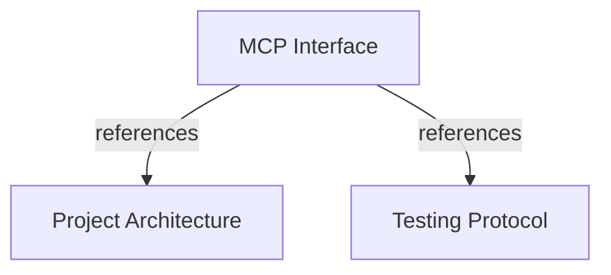

# MCP Interface

Define the FastMCP surface for publishing, querying, and analyzing corporate engineering knowledge.

## OVERVIEW

Use **FastMCP** as the only external application interface. Expose tools for actions, resources for bounded reads, and prompts for agent guidance.
Group application contracts and use cases by business domain; keep `mcp/server` and `mcp/tools` as adapter boundaries.
Run MCP over HTTP in production and use the FastMCP in-process client for development and contract tests.

## FOLDER STRUCTURE

Keep MCP adapters thin. Add business rules to application or domain layers.

```text
<project-root-folder>/
├── mcp/
│   ├── server/             # FastMCP registration and runtime.
│   ├── tools/              # One file per public MCP tool; call application handlers.
│   │   ├── publish_project_snapshot.py
│   │   ├── search_entities.py
│   │   ├── get_context.py
│   │   ├── get_dependencies.py
│   │   ├── find_integration_paths.py
│   │   └── analyze_impact.py
│   ├── services/            # Authentication, tenant context, and response mapping.
│   ├── config.py            # Runtime configuration.
│   └── cli.py               # Operational commands.
└── core/
    ├── domain/              # Business-domain packages with entities, value_objects, services, and ports.
    ├── application/        # Business-domain packages with use_cases, services, and ports.
    └── infrastructure/
        └── postgres/
            ├── config.py   # PostgreSQL configuration.
            ├── models/     # PostgreSQL persistence models.
            └── repositories/ # Repository implementations.
```

## MAIN CONCEPTS / COMPONENTS

### Interface categories

- **Tools**: Execute validated use cases and return structured results.
- **Resources**: Read bounded entity, project, or snapshot context by URI.
- **Prompts**: Guide agent workflows; never own business logic.
- **Pydantic schemas**: Validate tool input and serialize stable tool/resource output.

### Request flow

1. Authenticate request and resolve tenant identity from authenticated context.
2. Validate MCP arguments with Pydantic models, including snapshot schema version.
3. Dispatch a thin handler under the selected business domain's `use_cases/` package.
4. Enforce `core/domain` invariants and execute `core/infrastructure` PostgreSQL work in the required transaction.
5. Return a bounded Pydantic response with provenance, evidence, and unknowns where applicable.

## TOOLS

Keep one public tool per file under `mcp/tools/`. Register modules through `mcp/server/`; delegate each handler to one domain-grouped application use case.

| Tool | Scope | Input | Output |
|------|-------|-------|--------|
| `publish_project_snapshot` | `memory:publish` | Complete `ProjectKnowledgeSnapshot`. | Validation result, revision, activation status, and publication facts. |
| `search_entities` | `memory:read` | Key, name, type, or project filters. | Bounded matching corporate entities. |
| `get_context` | `memory:read` | Entity identifier. | Entity, project, owner, relations, dependencies, and evidence. |
| `get_dependencies` | `memory:read` | Entity identifier and inbound/outbound query. | Known dependency relationships and provenance. |
| `find_integration_paths` | `memory:read` | Source and target corporate entities. | Known paths, ownership, provenance, and evidence. |
| `analyze_impact` | `memory:impact` | Structured change description. | Direct and indirect consumers, affected projects/teams, paths, evidence, and unknowns. |

REQUIRED: Keep each tool a thin adapter over one application use case.
REQUIRED: Keep `mcp/services/` focused on MCP boundary concerns.
REQUIRED: Bound results by query scope; include evidence for important relationships.
PROHIBITED: Let tools mutate arbitrary graph nodes or edges outside snapshot publication.
PROHIBITED: Use an LLM to guess impact when graph relationships or evidence are absent.

## RESOURCES

| URI | Scope | Meaning |
|-----|-------|---------|
| `memory://entities/{entity_id}` | `memory:read` | Entity context and bounded relationships. |
| `memory://projects/{project_key}` | `memory:read` | Project facts and active snapshot context. |
| `memory://snapshots/{snapshot_id}` | `memory:read` | Versioned snapshot metadata and validated facts. |
| `memory://schema/entities` | `memory:read` | Optional entity schema reference. |
| `memory://schema/relations` | `memory:read` | Optional relation schema reference. |
| `memory://schema/snapshot` | `memory:read` | Optional snapshot schema reference. |

REQUIRED: Return resource data bounded to the requested entity, project, or snapshot.
PROHIBITED: Expose tenant data through an identifier without authenticated tenant filtering.

## PROMPTS

| Prompt | Purpose | Allowed responsibility |
|--------|---------|------------------------|
| `load_corporate_context` | Prepare cross-system planning. | Suggest context-loading tool calls. |
| `analyze_integration` | Guide integration analysis. | Suggest entity, path, ownership, and evidence queries. |
| `review_change_impact` | Guide shared-contract review. | Suggest impact analysis and evidence review. |

Prompts guide tool usage only. Keep authorization, validation, persistence, and impact logic outside prompts.

## PYDANTIC CONTRACTS

REQUIRED: Use Pydantic `inbound.py` and `outbound.py` models for application use-case contracts.
REQUIRED: Reject malformed fields and unsupported `schema_version` values before persistence.
REQUIRED: Keep domain invariants separate from shape validation; validate relation endpoints, revisions, and tenant scope in domain/application code.
REQUIRED: Map application outbound contracts to stable MCP tool and resource responses.
PROHIBITED: Pass persistence models or unvalidated dictionaries from FastMCP handlers into domain services.

```python
# CORRECT: validate at the MCP boundary, then delegate.
def search_entities(request: SearchEntitiesInput) -> SearchEntitiesOutput:
    return query_service.search(request)

# WRONG: mix transport parsing, persistence, and business rules in a tool.
def publish_project_snapshot(payload: dict):
    database.insert(payload)
```

## SECURITY AND OPERATIONS

| Concern | Rule |
|---------|------|
| Authentication | Require authentication for production MCP over HTTP. |
| Authorization | Enforce exact `memory:read`, `memory:publish`, and `memory:impact` scopes; deny unmapped components. |
| Tenant identity | Read tenant identity from authenticated context, never from untrusted payload fields. |
| Audit | Record snapshot publication, impact analysis, authentication failures, and authorization failures. |
| Transport | Use in-process client for development/tests and HTTP for production. |

## TEST CONTRACT

REQUIRED: Cover `list_tools`, `call_tool`, `list_resources`, `read_resource`, `list_prompts`, and `get_prompt`.
REQUIRED: Test valid and invalid Pydantic schemas, authorization scopes, tenant isolation, bounded results, provenance, and evidence.
REQUIRED: Maintain 80% minimum coverage across domain, application, infrastructure, and global totals.
PROHIBITED: Treat prompt text tests as a replacement for tool and resource contract tests.

## DOCUMENT MAP



## REFERENCES

- [**ARCHITECTURE.md**](./ARCHITECTURE.md): Defines layers, Pydantic boundary rules, and integrations.
- [**TESTS.md**](./TESTS.md): Defines MCP contract testing and 80% minimum coverage.
