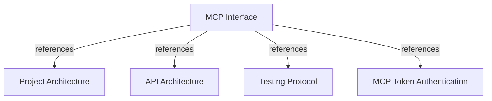

# MCP Interface

Define the FastMCP surface for publishing, querying, and analyzing corporate engineering knowledge.

## OVERVIEW

Use **FastMCP** for the knowledge interface: tools for actions, resources for bounded reads, and prompts for agent guidance. The separate FastAPI module manages users and MCP access tokens; it does not expose these knowledge operations.
Group application contracts and use cases by business domain; keep `harness_memory_mcp/server` and `harness_memory_mcp/tools` as adapter boundaries.
Run MCP over HTTP in production and use the FastMCP in-process client for development and contract tests.

## FOLDER STRUCTURE

Keep MCP adapters thin. Add business rules to application or domain layers.

```text
<project-root>/
+-- harness_memory_mcp/
|   +-- server/              # FastMCP registration and runtime.
|   +-- tools/               # Thin public adapters over application use cases.
|   +-- services/            # Authentication, tenant context, and response mapping.
|   +-- config.py, cli.py    # Runtime settings and operational commands.
+-- core/
    +-- domain/              # Entities, value objects, invariants, and ports.
    +-- application/         # Contracts, use cases, services, and ports.
    +-- infrastructure/postgres/ # Models, repositories, and database configuration.
```

## MAIN CONCEPTS / COMPONENTS

### Request flow

1. Authenticate request and resolve tenant identity from authenticated context.
2. Validate MCP arguments with Pydantic models, including snapshot schema version.
3. Dispatch a thin handler under the selected business domain's `use_cases/` package.
4. Enforce `core/domain` invariants and execute `core/infrastructure` PostgreSQL work in the required transaction.
5. Return a bounded Pydantic response with provenance, evidence, and unknowns where applicable.

For production Streamable HTTP, use stateless mode so each tool request can run without a prior session initialization. Keep malformed tool arguments in HTTP `200` JSON-RPC tool results with `isError: true` and stable `INVALID_ARGUMENT` text. Map authentication failures to `401` with a stable `invalid_token` body and authorization failures to `403` with an `insufficient_scope` challenge. Keep application error payloads free of verifier, persistence, tenant, and request-secret details.

## TOOLS

Keep one public tool per file under `harness_memory_mcp/tools/`. Register modules through `harness_memory_mcp/server/`; delegate each handler to one domain-grouped application use case.

| Tool | Scope | Purpose | Input | Output |
|------|-------|---------|-------|--------|
| `publish_project_snapshot` | `memory:publish` | Publish a complete project snapshot and activate a newer revision idempotently. | Complete `ProjectKnowledgeSnapshot`. | Validation result, revision, activation status, and publication facts. |
| `search_entities` | `memory:read` | Find tenant-visible entities with filters and pagination. | Key, name, type, or project filters. | Bounded matching corporate entities. |
| `get_context` | `memory:read` | Read bounded context and evidence for one entity. | Entity identifier and result limits. | Entity, project, owner, relations, dependencies, and evidence. |
| `get_dependencies` | `memory:read` | Read an entity's inbound or outbound dependency relationships. | Entity identifier, direction, and result limits. | Known dependency relationships and provenance. |
| `find_integration_paths` | `memory:read` | Find bounded dependency paths between two entities. | Source and target entity identifiers and result limits. | Known paths, ownership, provenance, and evidence. |
| `analyze_impact` | `memory:impact` | Analyze downstream consumers of a proposed change. | Structured change description and analysis limits. | Direct and indirect consumers, affected projects/teams, paths, evidence, and unknowns. |

REQUIRED: Give every public tool a clear purpose, required scope, and result boundaries in its FastMCP description.
REQUIRED: Describe every tool argument and nested Pydantic input field in the generated MCP schema.
REQUIRED: Keep each tool a thin adapter over one application use case.
REQUIRED: Keep `harness_memory_mcp/services/` focused on MCP boundary concerns.
REQUIRED: Bound results by query scope; include evidence for important relationships.
PROHIBITED: Let tools mutate arbitrary graph nodes or edges outside snapshot publication.
PROHIBITED: Use an LLM to guess impact when graph relationships or evidence are absent.

## RESOURCES

| URI | Scope | Meaning |
|-----|-------|---------|
| `memory://entities/{entity_id}` | `memory:read` | Entity context and bounded relationships. |
| `memory://projects/{project_key}` | `memory:read` | Project facts and active snapshot context. |
| `memory://snapshots/{snapshot_id}` | `memory:read` | Versioned snapshot metadata and validated facts. |
| `memory://schema/entities` | `memory:read` | Optional entity schema reference. |
| `memory://schema/relations` | `memory:read` | Optional relation schema reference. |
| `memory://schema/snapshot` | `memory:read` | Optional snapshot schema reference. |

REQUIRED: Return resource data bounded to the requested entity, project, or snapshot.
PROHIBITED: Expose tenant data through an identifier without authenticated tenant filtering.

## PROMPTS

| Prompt | Purpose | Allowed responsibility |
|--------|---------|------------------------|
| `load_corporate_context` | Prepare cross-system planning. | Suggest context-loading tool calls. |
| `analyze_integration` | Guide integration analysis. | Suggest entity, path, ownership, and evidence queries. |
| `review_change_impact` | Guide shared-contract review. | Suggest impact analysis and evidence review. |

Prompts guide tool usage only. Keep authorization, validation, persistence, and impact logic outside prompts.

## CONTRACTS

REQUIRED: Use Pydantic `inbound.py` and `outbound.py` models for application use-case contracts.
REQUIRED: Reject malformed fields and unsupported `schema_version` values before persistence.
REQUIRED: Keep shape validation separate from domain invariants; validate relation endpoints, revisions, and tenant scope in domain/application code.
REQUIRED: Map application outbound contracts to stable MCP tool and resource responses.
PROHIBITED: Pass persistence models or unvalidated dictionaries from FastMCP handlers into domain services.

## SECURITY AND OPERATIONS

| Concern | Rule |
|---------|------|
| Authentication | Accept database-backed opaque API bearer tokens or externally verified JWTs for production MCP over HTTP. |
| Authorization | Enforce exact `memory:read`, `memory:publish`, and `memory:impact` scopes; deny unmapped components. |
| Tenant identity | Read tenant identity from authenticated context, never from untrusted payload fields. |
| Audit | Record snapshot publication, impact analysis, authentication failures, and authorization failures. |
| Transport | Use in-process client for development/tests and stateless Streamable HTTP for production. |
| HTTP errors | Keep malformed arguments as HTTP `200` JSON-RPC tool errors marked `INVALID_ARGUMENT`; map authentication to `401` and authorization to `403`. |

## TEST CONTRACT

REQUIRED: Cover `list_tools`, `call_tool`, `list_resources`, `read_resource`, `list_prompts`, and `get_prompt`.
REQUIRED: Test valid and invalid Pydantic schemas, authorization scopes, tenant isolation, bounded results, provenance, and evidence.
REQUIRED: Maintain 80% minimum coverage across domain, application, infrastructure, and global totals.
PROHIBITED: Treat prompt text tests as a replacement for tool and resource contract tests.

## DOCUMENT MAP



## REFERENCES

- [**ARCHITECTURE.md**](./ARCHITECTURE.md): Defines layers, Pydantic boundary rules, and integrations.
- [**API.md**](./API.md): Defines API-issued tokens and their handoff to MCP authentication.
- [**TESTS.md**](./TESTS.md): Defines MCP contract testing and 80% minimum coverage.
- [**token-authentication.md**](../feature/mcp/token-authentication.md): Defines database-backed API token verification for MCP clients.
