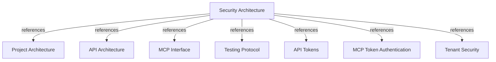

# Security Architecture

Define the authentication, authorization, tenant-isolation, secret-management, and
operational controls that protect the corporate engineering graph.

## OVERVIEW

Harness Memory separates **REST governance and publication** from the **read-only MCP
surface**. API and MCP accept the same bearer token. `API_ADMIN_TOKEN` grants admin access;
`HARNESS_MEMORY_API_KEY` grants global `memory:read`; other credentials are verified from
active token digests, owners, and persisted scopes in the shared `tokens` table.

## TOKEN TYPES

The database has one `AccessToken` model. “MCP token” is a usage role, not a separate
persisted credential type.

| Credential | Source and storage | Identity and lifetime | Allowed boundary |
| --- | --- | --- | --- |
| **User token** | `POST /v1/tokens` with `user_id`; stored as a SHA-256 digest in `tokens` | Owner is `User`; its tenant binding supplies tenant identity; expiration is required | Tenant data reads and publication according to scopes; never REST management |
| **Service-account token** | `POST /v1/tokens` with `service_account_id`; stored in `tokens` | Owner is `ServiceAccount`; immutable `tenant_id`; expiration may be omitted | Same eligible permissions as user tokens, according to scopes; never REST management |
| **MCP token** | No separate model; an active API token presented to `/mcp` | `DatabaseTokenVerifier` loads owner, expiry, and persisted scopes | Read-only tools, resources, and prompts through `ComponentScopePolicy` |
| **`API_ADMIN_TOKEN`** | Environment variable passed to API and MCP; never persisted in PostgreSQL | Compared with constant-time `compare_digest`; no owner or tenant | All REST privileges and cross-tenant data access; MCP component scope checks remain |
| **`HARNESS_MEMORY_API_KEY`** | Optional environment variable passed to API and MCP; never persisted | Compared with constant-time `compare_digest`; no owner or tenant | Global `memory:read`; no management, publication, or impact scope |

REQUIRED: Request the smallest valid scope set: `memory:read` for exploration,
`memory:impact` for impact analysis, and `memory:publish` for complete REST publication.
ALLOWED: Use `API_ADMIN_TOKEN` for cross-tenant reads and REST management. Publication body `tenant_id` selects only the write destination.
PROHIBITED: Assume that “MCP token” grants publication; the MCP catalog has no publication
registration and its scope matrix denies unmapped components.

## AUTHENTICATION AND AUTHORIZATION

1. `api/server/app.py` applies `ApiSecurity.require_admin` to management routers.
2. `ApiSecurity` accepts configured admin and read keys, or hashes an ordinary bearer,
   loads its active owner, checks persisted operation scopes, and derives its tenant.
3. `DatabaseTokenVerifier` accepts the same configured keys for MCP; other tokens use the
   active digest/owner lookup and receive only their persisted scopes.
4. `ComponentScopePolicy` maps every public MCP tool, resource, and prompt to
   `memory:read` or `memory:impact`; unmapped components are denied.

REQUIRED: Reject missing, blank, unknown, deleted, or expired bearer credentials with
`401`; return `403` for a known principal without the required scope.
REQUIRED: Keep ordinary-token tenant identity in the authenticated principal and apply it
in repository predicates. Admin data reads span tenants without tenant headers.

## TENANT AND DATA ISOLATION

- **User access** derives tenant identity from the user's tenant binding.
- **Service-account access** derives tenant identity from its immutable service-account
  binding; create another account to publish to another tenant.
- **Ordinary graph reads and writes** carry tenant predicates across projects,
  environments, snapshots, entities, relations, evidence, and token-owner lookups.
- **Admin graph reads** span tenants. Admin publication supplies the destination tenant.
- **Not-found responses** must not reveal whether an identifier exists in another tenant.

REQUIRED: Keep publication, environment promotion, and snapshot facts in one tenant-scoped
transaction.
PROHIBITED: Trust caller-supplied `tenant_id` as authorization for ordinary tokens. Only
the verified admin token may choose the publication destination; this does not limit its reads.

## SECRET AND TOKEN PROTECTION

- Store only the 64-character SHA-256 digest of API access tokens.
- Return plaintext only in the successful create-token response; never return the digest.
- Require expiry for user tokens; allow non-expiring service-account tokens only when the
  operational policy accepts that risk.
- Revoke access by deleting the token or its owner; database cascades remove owned tokens.
- Keep `API_ADMIN_TOKEN` in a secret manager or private environment configuration; never
  commit `.env` or include secrets in logs, traces, audit details, or error responses.
- Apply migration `009_token_scopes_and_environment_revisions` before accepting scoped
  tokens in an existing database.

## TRANSPORT, ERRORS, AND AUDIT

REQUIRED: Terminate production API and MCP traffic with HTTPS and restrict PostgreSQL to
the private application network; the Compose port exposure is for local development.
REQUIRED: Keep management routes private and expose only health/readiness publicly.
REQUIRED: Record bounded authentication failures, authorization failures, publication,
and impact operations with safe identifiers and optional trace correlation.
PROHIBITED: Include bearer values, claims, token hashes, database URLs, payload contents,
or SQL details in responses, logs, telemetry, or audit records.

The API maps authentication failures to `401`, insufficient scopes to `403`, invalid
publication data to `422`, missing resources to `404`, and divergent deployment retries to
`409`. This keeps client remediation distinct from internal persistence details.

## RUNTIME MODES AND LIMITS

`MCP_AUTH_MODE=database` uses API-issued opaque tokens and is the Compose default. JWT
mode is also supported; validate its issuer, JWKS, audience, and tenant claim externally.

The legacy publication CLI and unregistered `publish_project_snapshot` adapter remain for
compatibility tests, not as public MCP surfaces. Use REST publication until the CLI becomes
an authenticated API client.

## SECURITY CHECKLIST

1. Set a unique high-entropy `API_ADMIN_TOKEN` before starting Compose.
2. Apply Alembic migrations and verify the schema revision before serving traffic.
3. Issue separate user and service-account tokens with minimum scopes and bounded expiry.
4. Configure HTTPS, private database networking, secret storage, and log redaction.
5. Test tenant isolation, revocation, scope denial, publication authorization, and MCP
   catalog filtering; rotate credentials according to deployment policy.

## VERIFICATION

Validate security changes with the focused suites:

- `tests/unit/api/adapters/http/test_api_authentication.py`
- `tests/unit/mcp/services/test_database_token_verifier.py`
- `tests/unit/mcp/services/test_tenant_security_services.py`
- `tests/e2e/mcp/test_api_token_authentication.py`

## DOCUMENT MAP

## REFERENCES

- [**ARCHITECTURE.md**](./ARCHITECTURE.md): Defines dependency direction and security boundaries.
- [**API.md**](./API.md): Defines REST authentication, management, and publication routes.
- [**MCP.md**](./MCP.md): Defines MCP transport, scopes, and read-only surface.
- [**TESTS.md**](./TESTS.md): Defines security and integration verification tiers.
- [**tokens.md**](../feature/api/tokens.md): Defines token issuance, storage, and lifecycle.
- [**token-authentication.md**](../feature/mcp/token-authentication.md): Defines MCP bearer verification.
- [**tenant-security.md**](../feature/mcp/tenant-security.md): Defines tenant isolation and audit policy.
