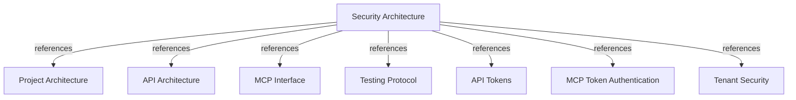

# Security Architecture

Define the authentication, authorization, tenant-isolation, secret-management, and
operational controls that protect the corporate engineering graph.

## OVERVIEW

Harness Memory separates **REST governance and publication** from the **read-only MCP
surface**. API and MCP accept the same bearer token. `API_ADMIN_TOKEN` grants admin access;
`HARNESS_MEMORY_API_KEY` grants global `memory:read`; other credentials are verified from
active token digests, owners, and persisted scopes in the shared `tokens` table. A
`memory:publish` token may read project, environment, and publication target metadata for
SDK preflight; other knowledge-table reads still require `memory:read`.

## TOKEN TYPES

The database has one `AccessToken` model. “MCP token” is a usage role, not a separate
persisted credential type.

| Credential | Source and storage | Identity and lifetime | Allowed boundary |
| --- | --- | --- | --- |
| **User token** | `POST /v1/tokens` with `user_id`; digest stored in `tokens` | User tenant binding; expiry required | Tenant reads/publication by scope; no management |
| **Service-account token** | `POST /v1/tokens` with `service_account_id`; digest stored | Fixed service-account tenant; expiry optional | Tenant reads/publication by scope; no management |
| **MCP token** | Active API token presented to `/mcp` | `DatabaseTokenVerifier` checks owner, expiry, scopes | Read-only tools/resources/prompts via `ComponentScopePolicy` |
| **`API_ADMIN_TOKEN`** | API/MCP environment variable; never persisted | Constant-time comparison; no owner or tenant | All REST privileges and cross-tenant access; MCP scope checks remain |
| **`HARNESS_MEMORY_API_KEY`** | Optional API/MCP environment variable; never persisted | Constant-time comparison; no owner or tenant | Global `memory:read`; no management, publication, or impact scope |

REQUIRED: Request the smallest valid scope set: `memory:read` for exploration,
`memory:impact` for impact analysis, and `memory:publish` for complete REST publication.
ALLOWED: Use `API_ADMIN_TOKEN` for cross-tenant reads and REST management. Publication body `tenant_id` selects only the write destination.
PROHIBITED: Assume that “MCP token” grants publication; the MCP catalog has no publication
registration and its scope matrix denies unmapped components.

## AUTHENTICATION AND AUTHORIZATION

1. `api/server/app.py` applies `ApiSecurity.require_admin` to management routers.
2. `ApiSecurity` accepts configured admin/read keys or verifies a database token's digest,
   active owner, persisted scopes, and tenant.
3. MCP uses the same configured keys or database-token verification; `ComponentScopePolicy`
   allows mapped `memory:read` and `memory:impact` components and denies unmapped ones.

REQUIRED: Reject missing, blank, unknown, deleted, or expired bearer credentials with
`401`; return `403` for a known principal without the required scope.
REQUIRED: Keep ordinary-token tenant identity in the authenticated principal and apply it
in repository predicates. Admin data reads span tenants without tenant headers.

## TENANT AND DATA ISOLATION

- **Owner access** derives tenant identity from the user binding or immutable
  service-account binding; use another service account to publish to another tenant.
- **Ordinary graph operations** apply owner-tenant predicates across all knowledge tables.
  Admin reads span tenants; admin publication supplies its destination tenant.
- **Not-found responses** hide whether a resource exists in another tenant.

REQUIRED: Keep publication, environment promotion, and snapshot facts in one tenant-scoped
transaction.
PROHIBITED: Trust caller-supplied `tenant_id` as authorization for ordinary tokens. Only
the verified admin token may choose the publication destination; this does not limit its reads.

## SECRET AND TOKEN PROTECTION

- Store only the 64-character SHA-256 token digest; return plaintext once in the successful
  create response. Require user-token expiry; allow service-account tokens without expiry
  only when operational policy accepts the risk.
- Revoke access by deleting the token or owner; database cascades remove owned tokens.
- Keep `API_ADMIN_TOKEN` in a secret manager or private environment file. Never commit
  `.env` or log secrets, token hashes, database URLs, payloads, or SQL details.
- Apply migration `009_token_scopes_and_environment_revisions` before scoped-token use in
  an existing database.

## TRANSPORT, ERRORS, AND AUDIT

REQUIRED: Use HTTPS in production and keep PostgreSQL on the private application network;
Compose port exposure is for local development.
REQUIRED: Keep management routes private, expose only health/readiness publicly, and audit
auth failures, publication, and impact operations with safe identifiers.
PROHIBITED: Include bearer values, claims, token hashes, database URLs, payloads, or SQL in
responses, logs, telemetry, or audit records.

The API maps authentication failures to `401`, insufficient scopes to `403`, invalid
publication data to `422`, missing resources to `404`, and divergent deployment retries to
`409`. This keeps client remediation distinct from internal persistence details.

## RUNTIME MODES AND LIMITS

`MCP_AUTH_MODE=database` is the Compose default and uses API-issued opaque tokens. For JWT
mode, validate issuer, JWKS, audience, and tenant claim externally. Legacy publication
CLI/adapters exist only for compatibility; publish through authenticated REST, not MCP.

## SECURITY CHECKLIST

1. Set a unique high-entropy `API_ADMIN_TOKEN`; apply migrations and verify schema before serving traffic.
2. Issue user/service-account tokens with minimum scopes and bounded expiry.
3. Configure HTTPS, private database networking, secret storage, and log redaction.
4. Test tenant isolation, revocation, scope denial, publication auth, and MCP filtering; rotate credentials by policy.

## VERIFICATION

Validate security changes with the focused suites:

- `tests/unit/api/adapters/http/test_api_authentication.py`
- `tests/unit/mcp/services/test_database_token_verifier.py`
- `tests/unit/mcp/services/test_tenant_security_services.py`
- `tests/e2e/mcp/test_api_token_authentication.py`

## DOCUMENT MAP

## REFERENCES

- [**ARCHITECTURE.md**](./ARCHITECTURE.md): Defines dependency direction and security boundaries.
- [**API.md**](./API.md): Defines REST authentication, management, and publication routes.
- [**MCP.md**](./MCP.md): Defines MCP transport, scopes, and read-only surface.
- [**TESTS.md**](./TESTS.md): Defines security and integration verification tiers.
- [**tokens.md**](../feature/api/tokens.md): Defines token issuance, storage, and lifecycle.
- [**token-authentication.md**](../feature/mcp/token-authentication.md): Defines MCP bearer verification.
- [**tenant-security.md**](../feature/mcp/tenant-security.md): Defines tenant isolation and audit policy.
