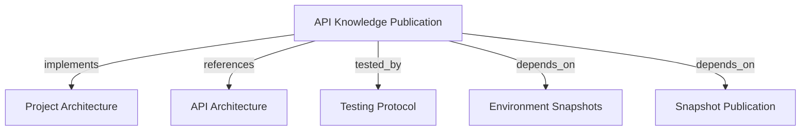

# API Knowledge Publication
Accept a CI/CD deployment declaration, build a knowledge snapshot, and activate it for a project environment.

```graph
{
  "node_id": "feature:api-knowledge-publication",
  "domain": "api-knowledge-publication",
  "implements": ["adr:architecture"],
  "tested_by": ["adr:tests"],
  "entrypoints": ["api/adapters/http/knowledge_publication_routes.py"],
  "registration_files": ["api/server/app.py"],
  "reference_files": [
    "api/adapters/http/api_security.py",
    "core/application/knowledge_publication/use_cases/publish_knowledge/handler.py",
    "core/infrastructure/postgres/repositories/knowledge_publication_repository.py",
    "core/infrastructure/postgres/repositories/environment_repository.py"
  ],
  "code_files": [
    "core/application/knowledge_publication/ports/publication_baseline_reader.py",
    "core/application/knowledge_publication/use_cases/get_publication_baseline.py",
    "api/adapters/http/schemas/knowledge_publication_request.py",
    "api/adapters/http/schemas/knowledge_publication_response.py",
    "core/application/knowledge_publication/use_cases/publish_knowledge/inbound.py",
    "core/application/knowledge_publication/use_cases/publish_knowledge/outbound.py",
    "core/domain/knowledge_publication/aggregates/knowledge_publication.py",
    "core/domain/knowledge_publication/types/publication_status.py",
    "core/domain/knowledge_publication/value_objects/deployment_id.py",
    "core/domain/knowledge_publication/value_objects/publication_id.py",
    "core/infrastructure/postgres/models/knowledge_publication.py",
    "core/infrastructure/postgres/models/environment.py",
    "migrations/versions/008_create_environments_and_publications.py",
    "migrations/versions/009_token_scopes_and_environment_revisions.py"
  ],
  "test_files": [
    "tests/unit/api/adapters/http/test_publication_baseline_routes.py",
    "tests/unit/core/application/knowledge_publication/use_cases/test_document_graph.py",
    "tests/integration/core/infrastructure/postgres/repositories/test_publication_baseline.py",
    "tests/unit/api/adapters/http/test_knowledge_publication_routes.py",
    "tests/unit/api/adapters/http/test_api_authentication.py",
    "tests/unit/core/application/knowledge_publication/use_cases/test_publish_knowledge.py",
    "tests/unit/core/domain/knowledge_publication/test_knowledge_publication.py",
    "tests/unit/core/infrastructure/postgres/repositories/test_knowledge_publication_repository.py"
  ]
}
```

## OVERVIEW

Expose `POST /v1/knowledge-publications` as the deterministic CI/CD write boundary. The handler resolves the target environment, records the deployment, creates a snapshot, and promotes the environment pointer atomically.

## FOLDER STRUCTURE

```text
api/adapters/http/                         # Publication route and transport schemas
core/application/knowledge_publication/   # Input, output, and publish handler
core/domain/{environment,knowledge_publication}/ # Publication invariants and events
core/infrastructure/postgres/             # Environment/publication persistence
tests/{unit,integration}/                  # Route, use-case, domain, and repository checks
```

## HTTP CONTRACT

| Item | Contract |
|------|----------|
| Method and path | `POST /v1/knowledge-publications` |
| Header | `Authorization: Bearer <token>` with `memory:publish`, or the admin bearer. |
| Required fields | `project_key`, `environment`, `deployment_id`, `version` |
| Admin destination | `tenant_id` in the JSON body; required only for `API_ADMIN_TOKEN` |
| Fact fields | `entities`, `relations`, `evidence`; default to empty arrays |
| New publication | HTTP 201 with status `ACTIVATED` |
| Completed retry | HTTP 200 with status `ALREADY_PUBLISHED` |
| Divergent retry | HTTP 409 when the same deployment ID carries different content. |
| Invalid facts | HTTP 422; entity, relation, and provenance fields are validated strictly. |
| Response | `status`, `publication_id`, `snapshot_id` |

## PUBLICATION RULES

### Baseline read

Use `GET /v1/knowledge-publications/latest?project_key=...&environment=...` with `memory:read` or `memory:publish` to start incremental documentation mapping. The response contains `snapshot_id`, `payload_hash`, and `graph` (`schema_version`, `entities`, `relations`, `evidence`). Resolve the environment's current snapshot.

REQUIRED: Derive tenant from the authenticated token; scope all project/environment joins to that tenant. Return 404 for no baseline, 401/403 for denied authentication/authorization, and 422 for invalid parameters. Never treat access denial or server failure as permission to bootstrap.

### Graph-native documentation

Accept `adr`, `feature`, `spec`, `document`, `document_revision`, `document_section`, and `rule` entity types. Store full Markdown or ordered content sections in entity metadata, plus rule statements, provenance, hashes, and feature context. Use `defines`, `applies_to`, `references`, `tested_by`, `child_of`, and `supersedes` alongside existing relation types.

REQUIRED: Persist these facts in the original snapshot payload and normalized entity/relation/evidence rows. Do not create a separate `project_memory` structure. Existing immutable snapshots retain prior document/rule versions for snapshot-scoped retrieval. Content changes participate in payload hashing and deployment-conflict checks. Existing database string columns require no enum migration.

### Activation

REQUIRED: Resolve project and environment inside the trusted tenant context.
REQUIRED: Derive ordinary-token tenant identity from the owner. Admin publication requires a destination `tenant_id` in the body.
REQUIRED: Create a missing project/environment pair on its first trusted publication.
REQUIRED: Use `(tenant, project, environment, deployment_id)` as the idempotency lookup.
REQUIRED: Return the existing publication and snapshot for a completed retry.
REQUIRED: Create and promote the snapshot in one persistence operation.
REQUIRED: Preserve deployment ID, version, publication ID, and snapshot ID.
PROHIBITED: Treat a deployment as active before environment resolution succeeds.
PROHIBITED: Let callers mutate individual graph facts through this route.

## SECURITY BOUNDARY

An active user or service-account token with `memory:publish` may publish for its bound
tenant. `API_ADMIN_TOKEN` may publish to any tenant by setting the body `tenant_id`.
Ordinary token callers cannot select or override their tenant.

## DOCUMENT MAP



## REFERENCES

- [**API.md**](../../adr/API.md): Defines API registration, versioning, and transport boundaries.
- [**TESTS.md**](../../adr/TESTS.md): Defines route and persistence verification tiers.
- [**environment-snapshots.md**](../core/environment-snapshots.md): Defines environment context and current snapshot behavior.
- [**snapshot-publication.md**](../core/snapshot-publication.md): Defines immutable snapshot and activation rules.
