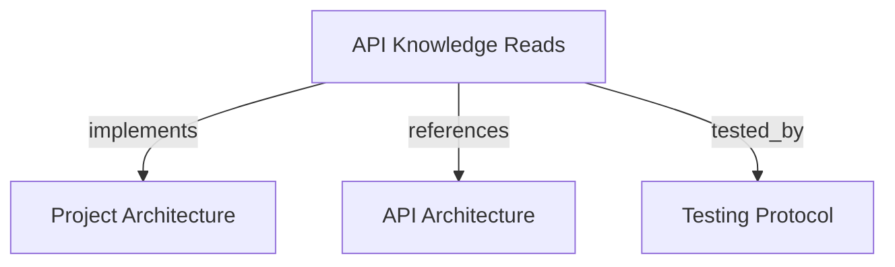

# API Knowledge Reads
Read tenant, project, and snapshot data through tenant-scoped user routes and global admin routes.

```graph
{
  "node_id": "feature:api-knowledge-reads",
  "domain": "api-knowledge-reads",
  "implements": ["adr:architecture"],
  "tested_by": ["adr:tests"],
  "entrypoints": ["api/adapters/http/knowledge_read_routes.py"],
  "registration_files": ["api/server/app.py"],
  "reference_files": ["api/adapters/http/api_security.py"],
  "code_files": ["core/infrastructure/postgres/repositories/knowledge_read_repository.py"],
  "test_files": ["tests/unit/api/adapters/http/test_api_authentication.py"]
}
```

## OVERVIEW

Use an active user or service-account token with `memory:read`. Both owner types receive
the same eligible permissions. Derive tenant identity from the token owner. An admin
bearer may read across all tenants without a tenant header. Supply `tenant_id` as a query
parameter only when duplicate project keys or publication baselines need disambiguation.

## FOLDER STRUCTURE

```text
api/adapters/http/                    # REST routes and security dependencies
core/infrastructure/postgres/         # Tenant-scoped read adapter
tests/unit/api/adapters/http/         # Route and isolation checks
```

## HTTP CONTRACT

| Method | Path | Result |
|--------|------|--------|
| GET | `/v1/tenants` | All tenants for admin; one bound tenant for ordinary tokens |
| GET | `/v1/tenants/current` | Bound tenant metadata for ordinary tokens |
| GET | `/v1/projects` | Projects for the authenticated tenant; all projects for admin |
| GET | `/v1/projects/{project_key}` | One project; admin may pass `?tenant_id=` to disambiguate |
| GET | `/v1/projects/{project_key}/snapshots` | Project snapshots; admin may pass `?tenant_id=` to disambiguate |
| GET | `/v1/snapshots/{snapshot_id}` | One snapshot, including stored payload |

REQUIRED: Filter ordinary-token queries by the authenticated tenant. Admin queries span all tenants unless a tenant selector disambiguates a non-unique key.
REQUIRED: Return 404 for missing resources and foreign-tenant identifiers to ordinary tokens.
PROHIBITED: Let an ordinary token select a tenant through a request parameter.

## DOCUMENT MAP



## REFERENCES

- [**ARCHITECTURE.md**](../../adr/ARCHITECTURE.md): Defines adapter and repository boundaries.
- [**API.md**](../../adr/API.md): Defines REST route registration and token handoff.
- [**TESTS.md**](../../adr/TESTS.md): Defines route and isolation test standards.
