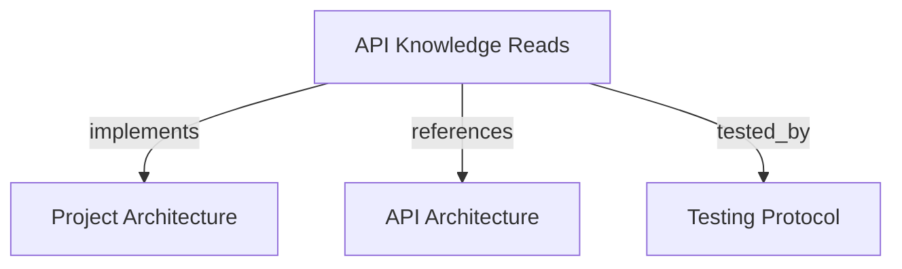

# API Knowledge Reads
Read snapshot data with scoped bearer tokens or the admin token. Manage tenants and projects with the admin token.

```graph
{
  "node_id": "feature:api-knowledge-reads",
  "domain": "api-knowledge-reads",
  "implements": ["adr:architecture"],
  "tested_by": ["adr:tests"],
  "entrypoints": [
    "api/adapters/http/knowledge_read_routes.py",
    "api/adapters/http/tenant_project_management_routes.py"
  ],
  "registration_files": ["api/server/app.py"],
  "reference_files": [
    "api/adapters/http/api_security.py",
    "api/application/services/tenant_management_service.py",
    "api/application/services/project_management_service.py"
  ],
  "code_files": [
    "api/application/ports/tenant_project_management_repository.py",
    "api/adapters/http/schemas/tenant_create.py",
    "api/adapters/http/schemas/tenant_update.py",
    "api/adapters/http/schemas/project_create.py",
    "api/adapters/http/schemas/project_update.py",
    "core/infrastructure/postgres/repositories/tenant_project_management_repository.py",
    "core/infrastructure/postgres/repositories/knowledge_read_repository.py"
  ],
  "test_files": [
    "tests/unit/api/adapters/http/test_api_authentication.py",
    "tests/unit/api/adapters/http/test_tenant_project_routes.py"
  ]
}
```

## OVERVIEW

API and MCP accept the same bearer token. `API_ADMIN_TOKEN` grants all REST permissions
and cross-tenant reads. Other credentials must match an active token in `tokens`; the
owner tenant and persisted scopes define access. Supply `tenant_id` to admin project
queries when duplicate project keys need disambiguation.

## FOLDER STRUCTURE

```text
api/adapters/http/                    # REST routes and security dependencies
core/infrastructure/postgres/         # Tenant-scoped read adapter
tests/unit/api/adapters/http/         # Route and isolation checks
```

## HTTP CONTRACT

| Method | Path | Result |
|--------|------|--------|
| POST | `/v1/tenants` | Admin creates tenant with unique `key`, `name`, and optional metadata |
| GET | `/v1/tenants` | Admin lists all tenants; owner token sees its tenant |
| GET | `/v1/tenants/current`, `/v1/tenants/{tenant_id}` | Read tenant metadata; owner token is limited to its tenant |
| PATCH | `/v1/tenants/{tenant_id}` | Admin updates tenant name, status, or metadata |
| DELETE | `/v1/tenants/{tenant_id}` | Admin deletes an empty tenant; dependent resources return 409 |
| POST | `/v1/projects` | Admin creates project using `tenant_id`, `key`, and optional name/metadata |
| GET | `/v1/projects`, `/v1/projects/{project_key}` | Read projects in owner tenant; admin can read globally |
| PATCH | `/v1/projects/{project_key}?tenant_id=...` | Admin updates project name or metadata |
| DELETE | `/v1/projects/{project_key}?tenant_id=...` | Admin deletes project with no snapshots, environments, or publications |
| GET | `/v1/projects/{project_key}/snapshots` | Read project snapshot history |
| GET | `/v1/snapshots/{snapshot_id}` | Read one snapshot, including stored payload; no write methods exist |

REQUIRED: Require `API_ADMIN_TOKEN` for tenant and project create, update, or delete operations.
REQUIRED: Filter owner-token queries by the authenticated tenant. Return 404 for foreign tenant identifiers.
REQUIRED: Keep snapshots read-only for every credential, including admin.
PROHIBITED: Let owner tokens select or mutate another tenant through request parameters.

## DOCUMENT MAP



## REFERENCES

- [**ARCHITECTURE.md**](../../adr/ARCHITECTURE.md): Defines adapter and repository boundaries.
- [**API.md**](../../adr/API.md): Defines REST route registration and token handoff.
- [**TESTS.md**](../../adr/TESTS.md): Defines route and isolation test standards.
