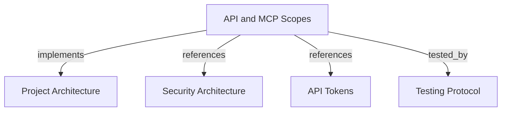

# API and MCP Scopes
Compare bearer permissions across REST and MCP without treating token ownership as a permission.

```graph
{
  "node_id": "feature:api-scopes",
  "domain": "api-scopes",
  "implements": ["adr:architecture"],
  "tested_by": ["adr:tests"],
  "entrypoints": ["api/adapters/http/knowledge_publication_routes.py"],
  "registration_files": ["api/server/app.py"],
  "reference_files": [
    "api/adapters/http/api_security.py",
    "harness_memory_mcp/services/component_scope_policy.py"
  ],
  "code_files": [
    "core/domain/tenant_security/types/memory_scope.py",
    "harness_memory_mcp/services/tenant_context.py",
    "api/adapters/http/service_account_routes.py"
  ],
  "test_files": [
    "tests/unit/api/adapters/http/test_api_authentication.py",
    "tests/unit/mcp/services/test_tenant_security_services.py",
    "tests/e2e/mcp/test_http_security.py"
  ]
}
```

## OVERVIEW

Use one bearer token for API and MCP. User and service-account tokens grant only their
persisted scopes. `API_ADMIN_TOKEN` grants all protected API operations and registered
MCP capabilities; `HARNESS_MEMORY_API_KEY` grants global `memory:read` only.

## FOLDER STRUCTURE

```text
api/adapters/http/             # REST scope checks and route dependencies
api/server/                    # Router registration and admin boundary
harness_memory_mcp/services/   # MCP component-to-scope policy
core/domain/tenant_security/   # Scope names and principal identity
tests/{unit,e2e}/              # Authorization contracts
```

## MEMORY:READ

| Surface | Permission |
| --- | --- |
| REST GET | Read tenants, projects, environments, publications, snapshots, entities, relations, evidence, and latest baseline. |
| MCP | Use mapped read tools, resources, and prompts. |
| Excluded | Read users, tokens, or service-account metadata; mutate REST resources; run MCP impact analysis. |

## MEMORY:PUBLISH

| Surface | Permission |
| --- | --- |
| REST POST | Publish a complete snapshot through `/v1/knowledge-publications`. |
| REST GET | Read project, environment, and publication target metadata. Read the latest baseline, including its complete active graph, for preflight. |
| Excluded | Use other REST POST/PATCH/DELETE routes; call general snapshot/entity/relation/evidence GET routes; publish through MCP. |

## MEMORY:IMPACT

| Surface | Permission |
| --- | --- |
| MCP tool | Run `analyze_impact` against the owner's tenant graph. |
| MCP prompt | Access `review_change_impact`. |
| Excluded | Access REST routes, publish, use general MCP reads, or mutate graph facts. |

REQUIRED: Treat scopes as independent. A token with `memory:read` and `memory:publish`
receives both sets of permissions; neither scope implies `memory:impact`.

## CREDENTIAL BOUNDARIES

| Credential | Permission source | Boundary |
| --- | --- | --- |
| `API_ADMIN_TOKEN` | Configured admin secret | Full REST management, reads, publication, and registered MCP scopes. Admin REST publication requires body `tenant_id`. |
| `HARNESS_MEMORY_API_KEY` | Configured read key | Global `memory:read`; no publication, impact, or management. |
| User token | Active `tokens` row and user owner | Exact stored scopes; owner tenant is identity and default publication destination. |
| Service-account token | Active `tokens` row and service-account owner | Same scope rules as user tokens; owner tenant is identity and default publication destination. |

REQUIRED: Verify token activity and required scope before applying a tenant filter or
publication destination. Return `401` for invalid credentials and `403` for a valid
credential without permission. Keep user and token CRUD admin-only.

## CURRENT REST ROUTE EXCEPTION

`GET /v1/service-accounts` and `GET /v1/service-accounts/{account_id}` currently share
the admin-only management router. `memory:read` cannot access them, although
service-account metadata is separate from user and token metadata. Change this router
policy separately if service-account reads should follow the broader read rule.

## DOCUMENT MAP



## REFERENCES

- [**SECURITY.md**](../../adr/SECURITY.md): Defines token verification and authorization boundaries.
- [**tokens.md**](./tokens.md): Defines token issuance, stored scopes, and revocation.
- [**TESTS.md**](../../adr/TESTS.md): Defines authorization test strategy.
