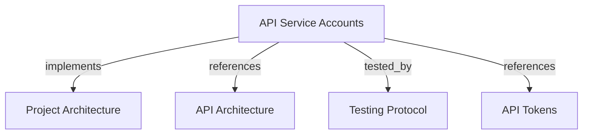

# API Service Accounts
Manage tenant-bound non-human identities for automation and MCP client credentials.

```graph
{
  "node_id": "feature:api-service-accounts",
  "domain": "api-service-accounts",
  "implements": ["adr:architecture"],
  "tested_by": ["adr:tests"],
  "entrypoints": ["api/adapters/http/service_account_routes.py"],
  "registration_files": ["api/server/app.py"],
  "reference_files": [
    "api/application/services/service_account_service.py",
    "api/domain/entities/service_account.py",
    "core/infrastructure/postgres/repositories/api_service_account_repository.py"
  ],
  "code_files": [
    "api/adapters/http/schemas/service_account_create.py",
    "api/adapters/http/schemas/service_account_update.py",
    "api/adapters/http/schemas/service_account_response.py",
    "api/application/ports/service_account_repository.py",
    "core/infrastructure/postgres/models/api_service_account.py",
    "migrations/versions/007_service_accounts.py"
  ],
  "test_files": [
    "tests/unit/api/application/test_service_account_service.py",
    "tests/integration/migrations/test_service_accounts.py",
    "tests/e2e/api/test_user_token_crud.py"
  ]
}
```

## OVERVIEW

Expose tenant-bound service-account CRUD under `/v1/service-accounts`. Keep `tenant_id` immutable after creation and use the service account as the owner of automation tokens.

## FOLDER STRUCTURE

```text
api/adapters/http/              # Service-account routes and schemas
api/application/                # Service-account service and repository port
api/domain/                     # Tenant-bound service-account entity
core/infrastructure/postgres/  # SQLAlchemy model and repository adapter
tests/{unit,integration,e2e}/   # Service, migration, and HTTP checks
```

## HTTP CONTRACT

| Method | Path | Success | Rule |
|--------|------|---------|------|
| POST | `/v1/service-accounts` | 201 | Create with name and tenant UUID. |
| GET | `/v1/service-accounts` | 200 | List all accounts or filter by `tenant_id`. |
| GET | `/v1/service-accounts/{account_id}` | 200 | Return one account or 404. |
| PATCH | `/v1/service-accounts/{account_id}` | 200 | Rename account only. |
| DELETE | `/v1/service-accounts/{account_id}` | 204 | Delete account and cascade owned tokens. |

## DOMAIN RULES

REQUIRED: Trim account names and reject empty values.
REQUIRED: Require a UUID `tenant_id` at creation.
REQUIRED: Preserve `tenant_id` for the account lifetime.
REQUIRED: Filter list queries by tenant when `tenant_id` is supplied.
REQUIRED: Delete owned tokens with the service account.
PROHIBITED: Accept `tenant_id` in update semantics.
PROHIBITED: Treat account name as tenant identity.

The update schema forbids extra fields. A client attempting to change `tenant_id` receives validation failure before the application service runs.

## TOKEN RELATION

Service-account tokens identify the assigned tenant during MCP authentication. They may omit `expires_at`; finite lifetimes still follow the 90-day token policy.

## DOCUMENT MAP



## REFERENCES

- [**API.md**](../../adr/API.md): Defines API layers and service-account route registration.
- [**TESTS.md**](../../adr/TESTS.md): Defines migration, unit, and HTTP verification tiers.
- [**tokens.md**](./tokens.md): Defines service-account token ownership and lifetime.
