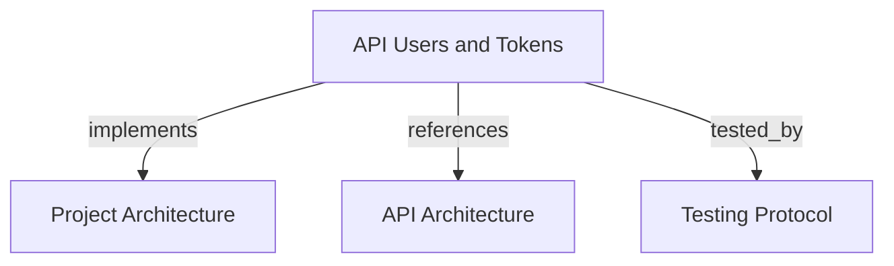

# API Users, Service Accounts, and Tokens

```graph
{
  "node_id": "feature:api-users-tokens",
  "domain": "api-access-management",
  "implements": ["adr:architecture"],
  "references": ["adr:api"],
  "tested_by": ["adr:tests"],
  "entrypoints": ["api/server/app.py"],
  "registration_files": ["core/infrastructure/postgres/models/__init__.py", "migrations/env.py", "docker-compose.yml"],
  "reference_files": ["api/application/services/token_service.py", "api/application/services/service_account_service.py", "core/infrastructure/postgres/repositories/api_token_repository.py", "core/infrastructure/postgres/repositories/api_service_account_repository.py"],
  "code_files": ["api/__init__.py", "api/adapters/__init__.py", "api/adapters/http/__init__.py", "api/adapters/http/user_routes.py", "api/adapters/http/token_routes.py", "api/adapters/http/service_account_routes.py", "api/adapters/http/schemas/__init__.py", "api/adapters/http/schemas/user_create.py", "api/adapters/http/schemas/user_update.py", "api/adapters/http/schemas/user_response.py", "api/adapters/http/schemas/token_create.py", "api/adapters/http/schemas/token_update.py", "api/adapters/http/schemas/token_response.py", "api/adapters/http/schemas/token_created_response.py", "api/adapters/http/schemas/service_account_create.py", "api/adapters/http/schemas/service_account_update.py", "api/adapters/http/schemas/service_account_response.py", "api/application/__init__.py", "api/application/ports/__init__.py", "api/application/ports/user_repository.py", "api/application/ports/token_repository.py", "api/application/ports/service_account_repository.py", "api/application/services/__init__.py", "api/application/services/user_service.py", "api/domain/__init__.py", "api/domain/entities/__init__.py", "api/domain/entities/user.py", "api/domain/entities/access_token.py", "api/domain/entities/issued_token.py", "api/domain/entities/service_account.py", "api/domain/services/__init__.py", "api/domain/services/token_expiration_policy.py", "api/server/__init__.py", "core/infrastructure/postgres/models/api_user.py", "core/infrastructure/postgres/models/api_access_token.py", "core/infrastructure/postgres/models/api_service_account.py", "core/infrastructure/postgres/repositories/api_user_repository.py", "migrations/versions/005_api_users_and_tokens.py", "migrations/versions/007_service_accounts.py"],
  "test_files": ["tests/unit/api/domain/test_token_policy.py", "tests/unit/api/application/test_user_service.py", "tests/unit/api/application/test_service_account_service.py", "tests/unit/api/application/test_token_service.py", "tests/integration/api/infrastructure/test_repositories.py", "tests/integration/migrations/test_service_accounts.py", "tests/unit/mcp/services/test_database_token_verifier.py", "tests/e2e/api/test_user_token_crud.py", "tests/e2e/mcp/test_api_token_authentication.py"]
}
```

## OVERVIEW

Expose user, tenant-bound service-account, and access-token CRUD through **FastAPI**. Keep API domain and application code independent from SQLAlchemy; implement persistence with shared `core/infrastructure/postgres` adapters.

## FOLDER STRUCTURE

<folder_structure>
```text
api/
├── domain/              # User, service-account, token, and expiry rules
├── application/         # CRUD services and repository ports
├── adapters/http/       # FastAPI routes and request/response schemas
└── server/              # Runtime composition
core/infrastructure/postgres/ # Shared user, service-account, and token persistence
```
</folder_structure>

## HTTP CONTRACT

| Method | Path | Success | Purpose |
|--------|------|---------|---------|
| GET | `/health` | 200 | Report API process health. |
| POST | `/v1/users` | 201 | Create user. |
| GET | `/v1/users` | 200 | List users. |
| GET | `/v1/users/{id}` | 200 | Get user. |
| PATCH | `/v1/users/{id}` | 200 | Update name or email. |
| DELETE | `/v1/users/{id}` | 204 | Delete user and owned tokens. |
| POST | `/v1/service-accounts` | 201 | Create a service account with a tenant UUID. |
| GET | `/v1/service-accounts` | 200 | List service accounts; optionally filter by `tenant_id`. |
| GET | `/v1/service-accounts/{id}` | 200 | Get service account. |
| PATCH | `/v1/service-accounts/{id}` | 200 | Rename service account. Tenant binding is immutable. |
| DELETE | `/v1/service-accounts/{id}` | 204 | Delete service account and revoke its tokens. |
| POST | `/v1/tokens` | 201 | Create token; return plaintext once. |
| GET | `/v1/tokens` | 200 | List token metadata; filter by `user_id` or `service_account_id`. |
| GET | `/v1/tokens/{id}` | 200 | Get token metadata. |
| PATCH | `/v1/tokens/{id}` | 200 | Update token name or expiration. |
| DELETE | `/v1/tokens/{id}` | 204 | Delete token. |

Prefix management routes with `/v1`. Keep health, OpenAPI (`/openapi.json`), and Swagger UI (`/docs`) unversioned.

## TOKEN RULES

REQUIRED: Issue each token for exactly one user or service account.
REQUIRED: Require expiration for user tokens; allow service-account tokens without expiration.
REQUIRED: Limit any finite token lifetime to **90 days** after issuance.
REQUIRED: Store only the SHA-256 token digest; return plaintext only from `POST /v1/tokens`.
REQUIRED: Delete a user's tokens through database cascade when deleting that user.
REQUIRED: Delete a service account's tokens when deleting that service account.
REQUIRED: Use issued tokens only to authenticate MCP clients.
PROHIBITED: Return token hashes from read or update endpoints.
PROHIBITED: Treat issued tokens as REST API authentication credentials.

## CONFIGURATION

| Name | Type | Required | Description | Default |
|------|------|----------|-------------|---------|
| `DATABASE_URL` | PostgreSQL URL | Docker: Yes | Shared database connection. | Local PostgreSQL URL |
| `APP_PORT` | Integer | No | Docker image health-check port. | `8000` |

## DOCUMENT MAP



## REFERENCES

- [**ARCHITECTURE.md**](../../adr/ARCHITECTURE.md): Defines hexagonal boundaries and shared infrastructure.
- [**API.md**](../../adr/API.md): Defines the FastAPI module layers and its shared PostgreSQL adapters.
- [**TESTS.md**](../../adr/TESTS.md): Defines unit, integration, E2E, and coverage gates.
- [**token-authentication.md**](../mcp/token-authentication.md): Consumes active API tokens for MCP authentication.
