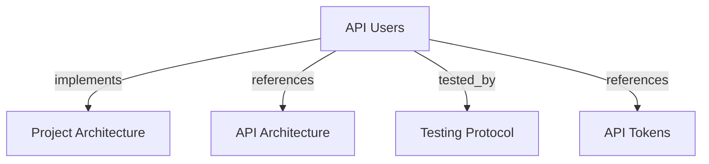

# API Users
Manage human API identities that also provide the default tenant identity for user-owned MCP tokens.

```graph
{
  "node_id": "feature:api-users",
  "domain": "api-users",
  "implements": ["adr:architecture"],
  "tested_by": ["adr:tests"],
  "entrypoints": ["api/adapters/http/user_routes.py"],
  "registration_files": ["api/server/app.py"],
  "reference_files": [
    "api/application/services/user_service.py",
    "api/domain/entities/user.py",
    "core/infrastructure/postgres/repositories/api_user_repository.py"
  ],
  "code_files": [
    "api/adapters/http/schemas/user_create.py",
    "api/adapters/http/schemas/user_update.py",
    "api/adapters/http/schemas/user_response.py",
    "api/application/ports/user_repository.py",
    "core/infrastructure/postgres/models/api_user.py",
    "migrations/versions/005_api_users_and_tokens.py"
  ],
  "test_files": [
    "tests/unit/api/application/test_user_service.py",
    "tests/integration/api/infrastructure/test_repositories.py",
    "tests/e2e/api/test_user_token_crud.py"
  ]
}
```

## OVERVIEW

Expose user CRUD under `/v1/users`. Normalize identity data in the application service, keep email unique, and map persistence through the user repository port.

## FOLDER STRUCTURE

```text
api/adapters/http/              # User routes and Pydantic schemas
api/application/                # User service and repository port
api/domain/                     # User entity and tenant identity rule
core/infrastructure/postgres/  # SQLAlchemy model and repository adapter
tests/{unit,integration,e2e}/   # Service, persistence, and HTTP checks
```

## HTTP CONTRACT

| Method | Path | Success | Rule |
|--------|------|---------|------|
| POST | `/v1/users` | 201 | Create a user with name and email. |
| GET | `/v1/users` | 200 | List users ordered by email. |
| GET | `/v1/users/{user_id}` | 200 | Return one user or 404. |
| PATCH | `/v1/users/{user_id}` | 200 | Update name, email, or both. |
| DELETE | `/v1/users/{user_id}` | 204 | Delete user and cascade owned tokens. |

## DOMAIN RULES

REQUIRED: Trim names and reject empty values.
REQUIRED: Trim emails, lowercase them, and reject invalid values.
REQUIRED: Reject duplicate email ownership with a conflict.
REQUIRED: Use the user UUID as `tenant_id` for user-owned MCP identity.
REQUIRED: Keep token deletion coupled to user deletion through database cascade.
PROHIBITED: Put normalization or duplicate checks in route functions.
PROHIBITED: Change a user's UUID to change tenant identity.

## INPUTS AND OUTPUTS

| Field | Create | Update | Response |
|-------|--------|--------|----------|
| `name` | Required, 1–120 characters | Optional, 1–120 characters | Included |
| `email` | Required, validated email | Optional, validated email | Included |
| `id` | Generated UUID | Not accepted | Included |

Return HTTP 404 for missing users. Return HTTP 409 for duplicate email, blank normalized values, or invalid service-level values.

## DOCUMENT MAP



## REFERENCES

- [**API.md**](../../adr/API.md): Defines API layers, registration, and management-route boundaries.
- [**TESTS.md**](../../adr/TESTS.md): Defines test tiers and coverage gates.
- [**tokens.md**](./tokens.md): Defines user-owned token lifecycle and deletion coupling.
