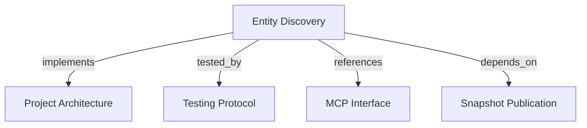

# Entity Discovery
Find projects and bounded Entity identities through tenant-scoped MCP search tools.

```graph
{
  "node_id": "feature:entity-discovery",
  "domain": "entity_discovery",
  "implements": ["adr:architecture"],
  "tested_by": ["adr:tests"],
  "entrypoints": [
    "harness_memory_mcp/tools/search_entities.py",
    "harness_memory_mcp/tools/search_projects.py"
  ],
  "registration_files": ["harness_memory_mcp/server/factory.py"],
  "reference_files": [
    "core/application/entity_discovery/use_cases/search_entities/handler.py",
    "core/infrastructure/postgres/repositories/entity_search_repository.py",
    "core/infrastructure/postgres/repositories/knowledge_read_repository.py"
  ],
  "code_files": [
    "core/application/entity_discovery/contracts/entity_search_criteria.py",
    "core/application/entity_discovery/contracts/entity_search_item.py",
    "core/application/entity_discovery/contracts/entity_search_page.py",
    "core/application/entity_discovery/contracts/project_environment_item.py",
    "core/application/entity_discovery/contracts/project_search_item.py",
    "core/application/entity_discovery/contracts/project_search_page.py",
    "core/application/entity_discovery/contracts/tenant_scope.py",
    "core/application/entity_discovery/errors/cursor_validation.py",
    "core/application/entity_discovery/errors/search_failure.py",
    "core/application/entity_discovery/errors/project_search_failure.py",
    "core/application/entity_discovery/ports/entity_search_repository.py",
    "core/application/entity_discovery/ports/project_search_repository.py",
    "core/application/entity_discovery/services/search_criteria_normalizer.py",
    "core/application/entity_discovery/services/search_cursor_codec.py",
    "core/application/entity_discovery/use_cases/search_entities/inbound.py",
    "core/application/entity_discovery/use_cases/search_entities/outbound.py",
    "core/application/entity_discovery/use_cases/search_projects/__init__.py",
    "core/application/entity_discovery/use_cases/search_projects/handler.py",
    "core/application/entity_discovery/use_cases/search_projects/inbound.py",
    "core/application/entity_discovery/value_objects/filter_fingerprint.py",
    "core/application/entity_discovery/value_objects/search_cursor.py",
    "core/application/snapshot_publication/errors/missing_tenant_context.py",
    "core/domain/snapshot_publication/types/entity_type.py",
    "core/infrastructure/postgres/models/entity.py",
    "core/infrastructure/postgres/models/environment.py",
    "core/infrastructure/postgres/models/project.py",
    "core/infrastructure/postgres/models/snapshot.py",
    "core/infrastructure/postgres/repositories/current_snapshot_predicate.py",
    "migrations/versions/002_entity_search_indexes.py",
    "harness_memory_mcp/services/entity_search_response_mapper.py",
    "harness_memory_mcp/services/tenant_context.py"
  ],
  "test_files": [
    "tests/unit/core/application/entity_discovery/contracts/test_contracts.py",
    "tests/unit/core/application/entity_discovery/services/test_cursor_and_criteria.py",
    "tests/unit/core/application/entity_discovery/use_cases/test_search_entities.py",
    "tests/unit/core/application/entity_discovery/use_cases/test_search_projects.py",
    "tests/unit/core/infrastructure/postgres/repositories/test_entity_search_sql.py",
    "tests/unit/core/infrastructure/postgres/models/test_entity_search_indexes.py",
    "tests/unit/core/infrastructure/postgres/migrations/test_entity_search_indexes.py",
    "tests/unit/mcp/tools/test_search_entities.py",
    "tests/unit/mcp/tools/test_search_projects.py",
    "tests/unit/core/infrastructure/postgres/repositories/test_knowledge_read_repository.py",
    "tests/integration/core/infrastructure/postgres/repositories/test_entity_search_repository.py",
    "tests/integration/migrations/test_entity_search_indexes.py",
    "tests/e2e/mcp/test_search_entities.py",
    "tests/e2e/mcp/test_tool_descriptions.py"
  ]
}
```

## OVERVIEW

`search_projects` discovers projects with tenant and environment attribution. `search_entities` searches each environment's current snapshot by default. Historical occurrences appear only when the caller explicitly selects history or a snapshot.

## FOLDER STRUCTURE

- `core/application/entity_discovery/`: search contracts and cursor policy.
- `core/infrastructure/postgres/`: snapshot selection and paged queries.
- `harness_memory_mcp/tools/`: project and entity search adapters.
- `tests/{unit,integration,e2e}/`: module-aligned checks.

## MAIN CONCEPTS / COMPONENTS

- **Snapshot scope**: Select one explicit snapshot, one environment's current snapshot, or every current environment snapshot. Use the project pointer only when no environment records exist. `include_past_snapshots` selects history; `include_history` adds document revisions and retired documents within selected snapshots.
- **Project and entity results**: Project search returns environment names and current snapshot IDs. Entity filters combine key, name, type, project, and a case-insensitive literal content query.
- **Identity and cursor**: Return canonical identity and physical occurrence ID with snapshot and publication context. Bind cursors to filters, trusted scope, selected snapshot set, and last row; reject changed context.
- **Bounded output**: Return scalar identity and revision fields. Omit metadata, relations, evidence, and total count.

## HOW TO SEARCH

1. Use `search_projects` to confirm project identity and inspect current environment snapshots.
2. Search entities with at least one filter or tenant, project, snapshot, or environment selector. Search older snapshots only when history or comparison is requested.
3. Match keys, project keys, and types exactly. Use `name` for a case-insensitive prefix and `query` for a case-insensitive literal phrase; wildcard characters remain literal.
4. Continue with the same cursor filters. Restart when selected snapshots change. Pass `entity_id` and `snapshot_id` together to `get_context`.

## PARAMETERS / CONFIGURATIONS

| Parameters | Contract |
|------------|----------|
| `key`, `project`, `type` | Exact key, project key, or supported entity type. |
| `name`, `query` | Case-insensitive name/key prefix or literal phrase in key, name, or metadata. |
| `tenant_id`, `project_id`, `environment`, `snapshot_id` | Narrow scope or select one immutable/current snapshot. With no environment, use every environment current snapshot; use the project pointer only if no environments exist. |
| `include_history`, `include_past_snapshots` | Independently include document revisions/retired documents or older snapshots. |
| `limit`, `cursor` | Page size 1?500; opaque cursor up to 1,024 characters, bound to scope and snapshot context. |
| `search_projects.key`, `query`, `limit`, `offset` | Exact key or substring query; page size 1?500 and offset 0?10,000. |

## BEST PRACTICES

REQUIRED: Authorize `memory:read` and treat tenant selectors as filters, never authorization.
REQUIRED: Narrow metadata searches by exact project key when known.
REQUIRED: Fetch one extra row to decide whether to emit `next_cursor`; bind cursor validity to scope and snapshot context.
REQUIRED: Search history only when requested; label historical matches.
PROHIBITED: Treat an empty entity result as proof that a project does not exist or a fact is false.

## TIPS

An empty default entity list means no current entity matched. Do not infer that a fact never existed. Search history only when the user asks for it. Check project existence separately with `search_projects`.

## DOCUMENT MAP



## REFERENCES

- [**ARCHITECTURE.md**](../../adr/ARCHITECTURE.md): Defines application ports and infrastructure boundaries.
- [**TESTS.md**](../../adr/TESTS.md): Defines query, persistence, and MCP test tiers.
- [**MCP.md**](../../adr/MCP.md): Defines the project and entity search tool contracts.
- [**snapshot-publication.md**](./snapshot-publication.md): Owns active snapshot publication and tenant-scoped facts.
