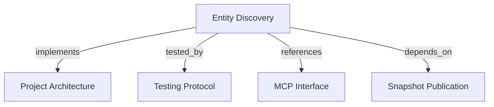

# Entity Discovery
Find bounded Entity identities from each tenant's active Project snapshots through `search_entities`.

```graph
{
  "node_id": "feature:entity-discovery",
  "domain": "entity_discovery",
  "implements": ["adr:architecture"],
  "tested_by": ["adr:tests"],
  "entrypoints": ["harness_memory_mcp/tools/search_entities.py"],
  "registration_files": ["harness_memory_mcp/server/factory.py"],
  "reference_files": [
    "core/application/entity_discovery/use_cases/search_entities/handler.py",
    "core/infrastructure/postgres/repositories/entity_search_repository.py"
  ],
  "code_files": [
    "core/application/entity_discovery/contracts/entity_search_criteria.py",
    "core/application/entity_discovery/contracts/entity_search_item.py",
    "core/application/entity_discovery/contracts/entity_search_page.py",
    "core/application/entity_discovery/contracts/tenant_scope.py",
    "core/application/entity_discovery/errors/cursor_validation.py",
    "core/application/entity_discovery/errors/search_failure.py",
    "core/application/entity_discovery/ports/entity_search_repository.py",
    "core/application/entity_discovery/services/search_criteria_normalizer.py",
    "core/application/entity_discovery/services/search_cursor_codec.py",
    "core/application/entity_discovery/use_cases/search_entities/inbound.py",
    "core/application/entity_discovery/use_cases/search_entities/outbound.py",
    "core/application/entity_discovery/value_objects/filter_fingerprint.py",
    "core/application/entity_discovery/value_objects/search_cursor.py",
    "core/application/snapshot_publication/errors/missing_tenant_context.py",
    "core/domain/snapshot_publication/types/entity_type.py",
    "core/infrastructure/postgres/models/entity.py",
    "core/infrastructure/postgres/models/project.py",
    "core/infrastructure/postgres/models/snapshot.py",
    "migrations/versions/002_entity_search_indexes.py",
    "harness_memory_mcp/services/entity_search_response_mapper.py",
    "harness_memory_mcp/services/tenant_context.py"
  ],
  "test_files": [
    "tests/unit/core/application/entity_discovery/contracts/test_contracts.py",
    "tests/unit/core/application/entity_discovery/services/test_cursor_and_criteria.py",
    "tests/unit/core/application/entity_discovery/use_cases/test_search_entities.py",
    "tests/unit/core/infrastructure/postgres/models/test_entity_search_indexes.py",
    "tests/unit/core/infrastructure/postgres/migrations/test_entity_search_indexes.py",
    "tests/unit/mcp/tools/test_search_entities.py",
    "tests/integration/core/infrastructure/postgres/repositories/test_entity_search_repository.py",
    "tests/integration/migrations/test_entity_search_indexes.py",
    "tests/e2e/mcp/test_search_entities.py"
  ]
}
```

## OVERVIEW

`search_entities` is a read-only, tenant-scoped query over Entity rows joined to each Project's current `active_snapshot_id`. It returns identity and active-version fields, not graph context.

## FOLDER STRUCTURE

```text
core/application/entity_discovery/   # Contracts, cursor policy, and use case
core/infrastructure/postgres/        # Active-snapshot query and indexes
harness_memory_mcp/tools/                           # Public search adapter
tests/{unit,integration,e2e}/        # Contract, repository, and MCP tests
```

## MAIN CONCEPTS / COMPONENTS

- **Active snapshot**: Exclude historical Entity rows and Projects without an active snapshot.
- **Conjunctive filters**: Apply every supplied key, name, type, and project filter together.
- **Keyset cursor**: Bind an opaque versioned cursor to normalized filters and the last Entity key/UUID tuple.
- **Bounded result**: Return scalar identity, Project, active Snapshot, and revision fields; omit metadata, relations, evidence, and total count.

## HOW TO SEARCH

1. Supply at least one filter: `key`, `name`, `type`, or `project`.
2. Use exact, case-sensitive matching for `key` and `project`; use exact type matching.
3. Use a case-insensitive literal prefix for `name`; wildcard characters remain literal data.
4. Follow `next_cursor` with unchanged filters to continue deterministic keyset pagination.

## PARAMETERS / CONFIGURATIONS

| Name | Type | Required | Description | Default |
|------|------|----------|-------------|---------|
| `key` | string | No | Exact Entity key, trimmed. | unset |
| `name` | string | No | Case-insensitive literal prefix, trimmed. | unset |
| `type` | EntityType | No | Exact supported Entity type. | unset |
| `project` | string | No | Exact Project key, trimmed. | unset |
| `limit` | strict integer | No | Result bound from 1 through 100. | `25` |
| `cursor` | opaque string | No | Versioned token up to 1,024 characters. | unset |

## BEST PRACTICES

REQUIRED: Read only active-snapshot rows and apply trusted tenant predicates to every repository query.
REQUIRED: Fetch one extra row to decide whether to emit `next_cursor`.
REQUIRED: Keep cursor contents free of tenant identity and contextual data.
PROHIBITED: Return metadata, relations, evidence, payloads, or a total count from this tool.
PROHIBITED: Add fuzzy, infix, ranked, or full-text search behavior to this bounded capability.

## TIPS

Treat an empty item list as a successful no-match response; no cursor means pagination is complete.

## DOCUMENT MAP



## REFERENCES

- [**ARCHITECTURE.md**](../../adr/ARCHITECTURE.md): Defines application ports and infrastructure boundaries.
- [**TESTS.md**](../../adr/TESTS.md): Defines query, persistence, and MCP test tiers.
- [**MCP.md**](../../adr/MCP.md): Defines the `search_entities` adapter contract.
- [**snapshot-publication.md**](./snapshot-publication.md): Owns active snapshot publication and tenant-scoped facts.
