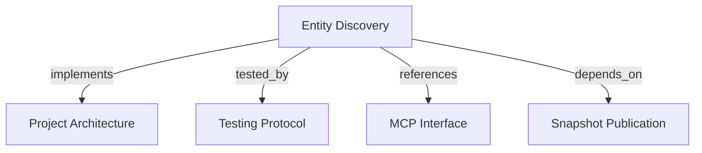

# Entity Discovery
Find projects and bounded Entity identities through tenant-scoped MCP search tools.

```graph
{
  "node_id": "feature:entity-discovery",
  "domain": "entity_discovery",
  "implements": ["adr:architecture"],
  "tested_by": ["adr:tests"],
  "entrypoints": [
    "harness_memory_mcp/tools/search_entities.py",
    "harness_memory_mcp/tools/search_projects.py"
  ],
  "registration_files": ["harness_memory_mcp/server/factory.py"],
  "reference_files": [
    "core/application/entity_discovery/use_cases/search_entities/handler.py",
    "core/infrastructure/postgres/repositories/entity_search_repository.py",
    "core/infrastructure/postgres/repositories/knowledge_read_repository.py"
  ],
  "code_files": [
    "core/application/entity_discovery/contracts/entity_search_criteria.py",
    "core/application/entity_discovery/contracts/entity_search_item.py",
    "core/application/entity_discovery/contracts/entity_search_page.py",
    "core/application/entity_discovery/contracts/project_search_item.py",
    "core/application/entity_discovery/contracts/project_search_page.py",
    "core/application/entity_discovery/contracts/tenant_scope.py",
    "core/application/entity_discovery/errors/cursor_validation.py",
    "core/application/entity_discovery/errors/search_failure.py",
    "core/application/entity_discovery/errors/project_search_failure.py",
    "core/application/entity_discovery/ports/entity_search_repository.py",
    "core/application/entity_discovery/ports/project_search_repository.py",
    "core/application/entity_discovery/services/search_criteria_normalizer.py",
    "core/application/entity_discovery/services/search_cursor_codec.py",
    "core/application/entity_discovery/use_cases/search_entities/inbound.py",
    "core/application/entity_discovery/use_cases/search_entities/outbound.py",
    "core/application/entity_discovery/use_cases/search_projects/__init__.py",
    "core/application/entity_discovery/use_cases/search_projects/handler.py",
    "core/application/entity_discovery/use_cases/search_projects/inbound.py",
    "core/application/entity_discovery/value_objects/filter_fingerprint.py",
    "core/application/entity_discovery/value_objects/search_cursor.py",
    "core/application/snapshot_publication/errors/missing_tenant_context.py",
    "core/domain/snapshot_publication/types/entity_type.py",
    "core/infrastructure/postgres/models/entity.py",
    "core/infrastructure/postgres/models/project.py",
    "core/infrastructure/postgres/models/snapshot.py",
    "migrations/versions/002_entity_search_indexes.py",
    "harness_memory_mcp/services/entity_search_response_mapper.py",
    "harness_memory_mcp/services/tenant_context.py"
  ],
  "test_files": [
    "tests/unit/core/application/entity_discovery/contracts/test_contracts.py",
    "tests/unit/core/application/entity_discovery/services/test_cursor_and_criteria.py",
    "tests/unit/core/application/entity_discovery/use_cases/test_search_entities.py",
    "tests/unit/core/application/entity_discovery/use_cases/test_search_projects.py",
    "tests/unit/core/infrastructure/postgres/repositories/test_entity_search_sql.py",
    "tests/unit/core/infrastructure/postgres/models/test_entity_search_indexes.py",
    "tests/unit/core/infrastructure/postgres/migrations/test_entity_search_indexes.py",
    "tests/unit/mcp/tools/test_search_entities.py",
    "tests/unit/mcp/tools/test_search_projects.py",
    "tests/unit/core/infrastructure/postgres/repositories/test_knowledge_read_repository.py",
    "tests/integration/core/infrastructure/postgres/repositories/test_entity_search_repository.py",
    "tests/integration/migrations/test_entity_search_indexes.py",
    "tests/e2e/mcp/test_search_entities.py",
    "tests/e2e/mcp/test_tool_descriptions.py"
  ]
}
```

## OVERVIEW

`search_projects` discovers projects with tenant and environment attribution. `search_entities` searches current facts by default. An explicit historical search returns matching occurrences across snapshots with their publication attribution.

## FOLDER STRUCTURE

```text
core/application/entity_discovery/   # Contracts, cursor policy, and use case
core/infrastructure/postgres/        # Active-snapshot query and indexes
harness_memory_mcp/tools/                           # Public search adapter
tests/{unit,integration,e2e}/        # Contract, repository, and MCP tests
```

## MAIN CONCEPTS / COMPONENTS

- **Snapshot scope**: Search the selected environment's current snapshot, or the project's active snapshot. Explicit `snapshot_id` selects one immutable snapshot. `include_past_snapshots=true` searches past and current snapshots; `include_history` independently includes document revisions and retired documents within selected snapshots.
- **Project discovery**: List accessible projects without filters, or match an exact project key or a case-insensitive substring in project keys and names; report whether an active snapshot exists.
- **Entity filters**: Combine supplied key, name, type, project, and content query filters.
- **Content query**: Find a case-insensitive literal phrase in entity keys, names, or serialized metadata, including document-section content.
- **Stable identity**: Return the canonical identity plus the physical occurrence ID so repeated identities are distinguishable across snapshots. Report `snapshot_id`, `revision`, `environment_name`, `is_current_snapshot`, `publication_id`, `publication_version`, `publication_status`, and `deployment_id` for each occurrence when available.
- **Keyset cursor**: Bind an opaque versioned cursor to filters, trusted scope, selected snapshot context, and the last physical row ID. A changed active snapshot or historical snapshot set invalidates continuation; restart discovery.
- **Bounded result**: Return scalar identity, Project, Snapshot, publication, and revision fields; omit metadata, relations, evidence, and total count.

## HOW TO SEARCH

1. Use `search_projects` without filters to list accessible projects, or supply `key`/`query` to narrow results. Reuse the tenant and project ID, available environments, and active snapshot.
2. Supply at least one entity filter or tenant/project/snapshot/environment selector. `include_history`, `include_past_snapshots`, `limit`, and `cursor` alone are insufficient.
3. Use exact, case-sensitive matching for `key` and `project`; use exact type matching.
4. Use `name` for a case-insensitive literal prefix. Use `query` for a case-insensitive literal phrase in entity keys, names, and metadata. Enter `%`, `_`, and `!` literally; the service escapes SQL wildcards.
5. Keep `project` exact when known; this bounds metadata content search to one project.
6. If current search returns no match, retry with `include_past_snapshots=true`. Check `is_current_snapshot` and `publication_version`; describe a historical match as historical. Results are ordered by entity key and occurrence ID, not publication recency.
7. Follow `next_cursor` with unchanged filters. Restart if the selected current snapshot or historical snapshot set changes.
8. Pass the returned `snapshot_id` and entity ID to `get_context` for matching metadata and evidence.

## PARAMETERS / CONFIGURATIONS

| Name | Type | Required | Description | Default |
|------|------|----------|-------------|---------|
| `key` | string | No | Exact Entity key, trimmed. | unset |
| `name` | string | No | Case-insensitive literal Entity name or key prefix, trimmed. | unset |
| `type` | EntityType | No | Exact supported Entity type. | unset |
| `project` | string | No | Exact Project key, trimmed. | unset |
| `query` | string | No | Case-insensitive literal phrase in Entity key, name, or metadata content. | unset |
| `tenant_id` / `project_id` | string / UUID | No | Narrow discovery to a known tenant or project without extending access. | unset |
| `environment` / `snapshot_id` | string / UUID | No | Select environment current state or an immutable snapshot. | project active |
| `include_history` | boolean | No | Include document revisions and retired documents. | `false` |
| `include_past_snapshots` | boolean | No | Search past and current snapshots; requires a search filter or scope selector. Independent of `include_history`. | `false` |
| `limit` | strict integer | No | Result bound from 1 through 100. | `25` |
| `cursor` | opaque string | No | Versioned token up to 1,024 characters. | unset |
| `search_projects.key` | string | No | Exact, case-sensitive project key; blank text is invalid. | unset |
| `search_projects.query` | string | No | Case-insensitive substring in project keys or names; blank text is invalid. | unset |
| `search_projects.limit` | strict integer | No | Result bound from 1 through 100. | `25` |
| `search_projects.offset` | strict integer | No | Number of project records to skip, up to 10,000. | `0` |

## BEST PRACTICES

REQUIRED: Authorize `memory:read`; apply trusted scope and explicit selectors consistently. Global read credentials can discover across tenants.
REQUIRED: Use exact project keys to narrow metadata searches when the project is known.
REQUIRED: Use `search_projects` to verify project existence; entity search uses current snapshots unless `snapshot_id` selects one older snapshot or `include_past_snapshots=true` searches all accessible snapshots.
REQUIRED: Fetch one extra row to decide whether to emit `next_cursor`.
REQUIRED: Bind cursor validity to tenant scope, selected context, and current snapshot; never use cursor contents as authorization.
REQUIRED: Validate result identity strings before emitting MCP responses.
PROHIBITED: Return metadata, relations, evidence, payloads, or a total count from this tool.
PROHIBITED: Treat an empty entity result as proof that a project does not exist or a fact is false.

## TIPS

An empty default entity list means no current entity matched. Search past snapshots explicitly before concluding that no historical match exists. Check project existence separately with `search_projects`.

## DOCUMENT MAP



## REFERENCES

- [**ARCHITECTURE.md**](../../adr/ARCHITECTURE.md): Defines application ports and infrastructure boundaries.
- [**TESTS.md**](../../adr/TESTS.md): Defines query, persistence, and MCP test tiers.
- [**MCP.md**](../../adr/MCP.md): Defines the project and entity search tool contracts.
- [**snapshot-publication.md**](./snapshot-publication.md): Owns active snapshot publication and tenant-scoped facts.
