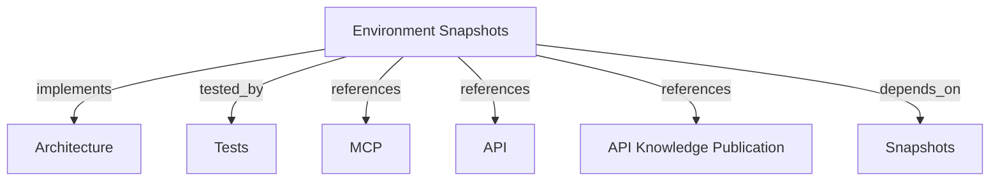

# Environment Snapshots and Pipeline Publication
Contextualize organizational knowledge by environment, publish pipeline snapshots via API/CLI, and inspect or compare environments via MCP.

```graph
{
  "node_id": "feature:environment-snapshots",
  "domain": "environment_context",
  "implements": ["adr:architecture"],
  "tested_by": ["adr:tests"],
  "entrypoints": [
    "api/adapters/http/knowledge_publication_routes.py",
    "harness_memory_mcp/publication_cli.py",
    "harness_memory_mcp/tools/get_environment.py",
    "harness_memory_mcp/tools/compare_environments.py"
  ],
  "registration_files": [
    "api/server/app.py",
    "harness_memory_mcp/cli.py",
    "harness_memory_mcp/server/factory.py"
  ],
  "reference_files": [
    "core/domain/environment/aggregates/environment.py",
    "core/domain/knowledge_publication/aggregates/knowledge_publication.py",
    "core/infrastructure/postgres/repositories/environment_repository.py",
    "core/infrastructure/postgres/repositories/knowledge_publication_repository.py"
  ],
  "code_files": [
    "api/adapters/http/schemas/knowledge_publication_request.py",
    "api/adapters/http/schemas/knowledge_publication_response.py",
    "core/application/environment_context/ports/environment_repository.py",
    "core/application/environment_context/ports/memory_snapshot_query_port.py",
    "core/application/environment_context/use_cases/compare_environments/handler.py",
    "core/application/environment_context/use_cases/compare_environments/inbound.py",
    "core/application/environment_context/use_cases/compare_environments/outbound.py",
    "core/application/environment_context/use_cases/get_environment/handler.py",
    "core/application/environment_context/use_cases/get_environment/inbound.py",
    "core/application/environment_context/use_cases/get_environment/outbound.py",
    "core/application/knowledge_publication/ports/knowledge_publication_repository.py",
    "core/application/knowledge_publication/use_cases/publish_knowledge/handler.py",
    "core/application/knowledge_publication/use_cases/publish_knowledge/inbound.py",
    "core/application/knowledge_publication/use_cases/publish_knowledge/outbound.py",
    "core/domain/environment/events/environment_snapshot_promoted.py",
    "core/domain/environment/value_objects/environment_name.py",
    "core/domain/environment/value_objects/environment_type.py",
    "core/domain/knowledge_publication/events/knowledge_publication_recorded.py",
    "core/domain/knowledge_publication/types/publication_status.py",
    "core/domain/knowledge_publication/value_objects/deployment_id.py",
    "core/domain/knowledge_publication/value_objects/publication_id.py",
    "core/infrastructure/postgres/models/environment.py",
    "core/infrastructure/postgres/models/knowledge_publication.py",
    "migrations/versions/008_create_environments_and_publications.py"
  ],
  "test_files": [
    "tests/unit/api/adapters/http/test_knowledge_publication_routes.py",
    "tests/unit/core/application/environment_context/use_cases/test_compare_environments.py",
    "tests/unit/core/application/environment_context/use_cases/test_get_environment.py",
    "tests/unit/core/application/knowledge_publication/use_cases/test_publish_knowledge.py",
    "tests/unit/core/domain/environment/test_environment.py",
    "tests/unit/core/domain/environment/test_environment_name.py",
    "tests/unit/core/domain/environment/test_environment_type.py",
    "tests/unit/core/domain/knowledge_publication/test_deployment_id.py",
    "tests/unit/core/domain/knowledge_publication/test_knowledge_publication.py",
    "tests/unit/core/domain/knowledge_publication/test_publication_id.py",
    "tests/unit/core/domain/knowledge_publication/test_publication_status.py",
    "tests/unit/core/infrastructure/postgres/repositories/test_environment_repository.py",
    "tests/unit/core/infrastructure/postgres/repositories/test_knowledge_publication_repository.py",
    "tests/unit/mcp/test_publication_cli.py",
    "tests/unit/mcp/tools/test_compare_environments.py",
    "tests/unit/mcp/tools/test_get_environment.py"
  ]
}
```

## OVERVIEW

Contextualize organizational knowledge by environment. Pipelines publish deployment events via REST/CLI to promote active snapshot pointers, while AI agents and developers inspect and compare environments via MCP.

## FOLDER STRUCTURE

```text
core/domain/               # Environment & publication aggregates, value objects, events
core/application/          # Ports & use cases for environment context & publication
core/infrastructure/       # Postgres models, repositories, and migration 008
api/adapters/http/         # FastAPI publication routes & schemas
harness_memory_mcp/        # MCP tools (get_environment, compare_environments) & CLI
tests/unit/                # Unit test suites across domain, application, infra, and MCP
```

## MAIN CONCEPTS / COMPONENTS

- **Environment**: Named target in tenant/project (e.g. `production`, `staging`). Holds pointer `current_snapshot_id`.
- **KnowledgePublication**: Immutable deployment record tracking project, environment, version, revision, deployment ID, status.
- **Pipeline Publication Boundary**: Deterministic ingestion surface via REST (`POST /v1/knowledge-publications`) and CLI (`harness-memory-publish`).
- **MCP Contextual Read Surface**: Interactive read tools `get_environment` and `compare_environments` for inspection and diffing.
- **Atomic Promotion**: Resolves environment, records publication, links snapshot, and promotes active pointer in one transaction.

## HOW TO PUBLISH AND COMPARE

### Prerequisites
1. Use an authenticated MCP identity for environment reads.
2. Use a tenant-bound user or service-account token with `memory:publish` for publication.
3. Let the first trusted publication create the target project/environment when absent.

### Steps
1. Pipeline sends deployment event via REST `POST /v1/knowledge-publications` or `harness-memory-publish` CLI.
2. Ingestion pipeline atomically resolves environment, records publication, attaches snapshot, and updates `current_snapshot_id`.
3. AI agents or developers query environment status via MCP tool `get_environment(project_name="...", environment_name="production")`.
4. Agents evaluate promotion drift using `compare_environments(project_name="...", source_environment="staging", target_environment="production")`.

## PARAMETERS / CONFIGURATIONS

| Name | Type | Required | Description | Default |
|------|------|----------|-------------|---------|
| `project_name` | string | Yes | Project identifier | — |
| `environment_name` | string | Yes | Environment name | — |
| `environment_type` | string | No | Classification (`production`, `staging`, `development`, `other`) | `other` |
| `version` | string | Yes | Application version | — |
| `source_revision` | string | Yes | VCS commit SHA | — |
| `deployment_id` | string | No | Pipeline deployment ID | — |
| `source_environment` | string | Yes | Origin environment for diff | — |
| `target_environment` | string | Yes | Destination environment for diff | — |

## BEST PRACTICES

REQUIRED: Separate CI/CD writes (REST/CLI) from interactive agent exploration (MCP read).
REQUIRED: Scope all operations to a verified tenant context.
REQUIRED: Execute snapshot promotion and publication recording in an atomic transaction.
REQUIRED: Sanitize database errors and stack traces before returning responses.
PROHIBITED: Trusting tenant identity from payload bodies; derive strictly from tokens.
PROHIBITED: Accept payload tenant fields as tenant authorization for ordinary tokens. Admin publication may use the body `tenant_id` only as its write destination; admin reads span tenants.
PROHIBITED: Unbounded in-memory diffing without pagination or stream limits.

The REST publication route validates the bearer token, exact scope, active state, and
owner before deriving tenant context.

## TIPS

Use `compare_environments` in pre-deployment pipeline gates or agent workflows to verify dependency contract compatibility between staging and production.

## DOCUMENT MAP



## REFERENCES

- [**ARCHITECTURE.md**](../../adr/ARCHITECTURE.md): Architecture and dependency rules.
- [**TESTS.md**](../../adr/TESTS.md): Test standards and execution tiers.
- [**MCP.md**](../../adr/MCP.md): MCP tool and resource specifications.
- [**API.md**](../../adr/API.md): FastAPI routes and auth handoff.
- [**knowledge-publication.md**](../api/knowledge-publication.md): Exact REST publication request and response contract.
- [**snapshot-publication.md**](./snapshot-publication.md): Snapshot aggregate and storage.
