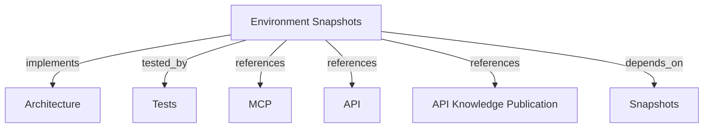

# Environment Snapshots and Pipeline Publication
Contextualize knowledge by environment, publish complete snapshots through REST and the SDK CLI, and inspect environments through MCP.

```graph
{
  "node_id": "feature:environment-snapshots",
  "domain": "environment_context",
  "implements": ["adr:architecture"],
  "tested_by": ["adr:tests"],
  "entrypoints": [
    "api/adapters/http/knowledge_publication_routes.py",
    "sdk/src/cli/index.ts",
    "harness_memory_mcp/tools/get_environment.py",
    "harness_memory_mcp/tools/compare_environments.py"
  ],
  "registration_files": [
    "api/server/app.py",
    "sdk/package.json",
    "harness_memory_mcp/cli.py",
    "harness_memory_mcp/server/factory.py"
  ],
  "reference_files": [
    "core/domain/environment/aggregates/environment.py",
    "core/domain/knowledge_publication/aggregates/knowledge_publication.py",
    "core/infrastructure/postgres/repositories/environment_repository.py",
    "core/infrastructure/postgres/repositories/knowledge_publication_repository.py",
    "sdk/src/infrastructure/api/rest-publication-client.ts"
  ],
  "code_files": [
    "api/adapters/http/schemas/knowledge_publication_request.py",
    "api/adapters/http/schemas/knowledge_publication_response.py",
    "harness_memory_mcp/publication_cli.py",
    "core/application/environment_context/ports/environment_repository.py",
    "core/application/environment_context/ports/memory_snapshot_query_port.py",
    "core/application/environment_context/use_cases/compare_environments/handler.py",
    "core/application/environment_context/use_cases/compare_environments/inbound.py",
    "core/application/environment_context/use_cases/compare_environments/outbound.py",
    "core/application/environment_context/use_cases/get_environment/handler.py",
    "core/application/environment_context/use_cases/get_environment/inbound.py",
    "core/application/environment_context/use_cases/get_environment/outbound.py",
    "core/application/knowledge_publication/ports/knowledge_publication_repository.py",
    "core/application/knowledge_publication/use_cases/publish_knowledge/handler.py",
    "core/application/knowledge_publication/use_cases/publish_knowledge/inbound.py",
    "core/application/knowledge_publication/use_cases/publish_knowledge/outbound.py",
    "core/domain/environment/events/environment_snapshot_promoted.py",
    "core/domain/environment/value_objects/environment_name.py",
    "core/domain/environment/value_objects/environment_type.py",
    "core/domain/knowledge_publication/events/knowledge_publication_recorded.py",
    "core/domain/knowledge_publication/types/publication_status.py",
    "core/domain/knowledge_publication/value_objects/deployment_id.py",
    "core/domain/knowledge_publication/value_objects/publication_id.py",
    "core/infrastructure/postgres/models/environment.py",
    "core/infrastructure/postgres/models/knowledge_publication.py",
    "migrations/versions/008_create_environments_and_publications.py"
  ],
  "test_files": [
    "tests/unit/api/adapters/http/test_knowledge_publication_routes.py",
    "tests/unit/core/application/environment_context/use_cases/test_compare_environments.py",
    "tests/unit/core/application/environment_context/use_cases/test_get_environment.py",
    "tests/unit/core/application/knowledge_publication/use_cases/test_publish_knowledge.py",
    "tests/unit/core/domain/environment/test_environment.py",
    "tests/unit/core/domain/environment/test_environment_name.py",
    "tests/unit/core/domain/environment/test_environment_type.py",
    "tests/unit/core/domain/knowledge_publication/test_deployment_id.py",
    "tests/unit/core/domain/knowledge_publication/test_knowledge_publication.py",
    "tests/unit/core/domain/knowledge_publication/test_publication_id.py",
    "tests/unit/core/domain/knowledge_publication/test_publication_status.py",
    "tests/unit/core/infrastructure/postgres/repositories/test_environment_repository.py",
    "tests/unit/core/infrastructure/postgres/repositories/test_knowledge_publication_repository.py",
    "tests/unit/mcp/test_publication_cli.py",
    "sdk/tests/e2e/cli-publish.test.ts",
    "tests/unit/mcp/tools/test_compare_environments.py",
    "tests/unit/mcp/tools/test_get_environment.py"
  ]
}
```

## OVERVIEW

Contextualize knowledge by environment. Pipelines publish complete snapshots through authenticated REST, including through the TypeScript SDK CLI. MCP supports bounded environment reads and comparisons.

## FOLDER STRUCTURE

- `core/domain/` and `core/application/`: environment and publication rules.
- `core/infrastructure/`: PostgreSQL persistence.
- `api/adapters/http/` and `sdk/src/`: pipeline publication clients.
- `harness_memory_mcp/`: environment reads and comparisons.
- `migrations/versions/` and `tests/`: schema history and module-aligned checks.

## MAIN CONCEPTS / COMPONENTS

- **Environment**: Tenant/project-scoped name with a `current_snapshot_id` pointer.
- **Knowledge publication**: Deployment identity, version, revision, status, and snapshot link.
- **Pipeline boundary**: Publish complete snapshots through REST or the TypeScript SDK CLI; MCP remains read-only.
- **Promotion**: Resolve the environment, record publication and snapshot, then update the pointer atomically. Completed deployment retries return the existing result.
- **MCP reads**: `get_environment` reads one environment; `compare_environments` compares selected current snapshots.

## HOW TO PUBLISH AND COMPARE

1. Authenticate MCP reads and use `memory:publish` for REST or SDK writes. Admin publication needs body `tenant_id`; scoped tokens default to owner tenant.
2. Publish with `POST /v1/knowledge-publications` or `hrns-memo`. REST may create a missing project/environment; SDK preflight requires the project but permits a missing environment.
3. Read with `get_environment`; compare two named environments with `compare_environments`. Use returned snapshot IDs to identify the compared state.

## PARAMETERS / CONFIGURATIONS

| Parameters | Contract |
|------------|----------|
| `project_key`, `environment` | Exact project and environment identifiers for publication or reads. |
| `deployment_id`, `version` | Required REST retry identity and deployed version; SDK may generate deployment ID. |
| `tenant_id` | Admin publication must specify it; scoped publisher defaults to owner tenant. |
| `source_environment`, `target_environment` | Names of environments to compare. |
| `limit`, `offset` | Comparison page bounds: up to 500 results per category and offset up to 10,000. |

## BEST PRACTICES

REQUIRED: Separate CI/CD writes (REST/CLI) from interactive agent exploration (MCP read).
REQUIRED: Verify the required scope and use the selected tenant as the publication destination.
REQUIRED: Execute snapshot promotion and publication recording in an atomic transaction.
REQUIRED: Sanitize database errors and stack traces before returning responses.
PROHIBITED: Treat payload tenant fields as authorization; require `memory:publish` before using body `tenant_id` as the write destination.
PROHIBITED: Unbounded in-memory diffing without pagination or stream limits.

The comparison repository computes counts and pages in SQL, returning both snapshot IDs. Repeat if either environment pointer changes between pages. REST validates bearer identity, scope, activity, and owner before choosing the destination tenant.

## TIPS

Use `compare_environments` in pre-deployment pipeline gates or agent workflows to verify dependency contract compatibility between staging and production.

## DOCUMENT MAP



## REFERENCES

- [**ARCHITECTURE.md**](../../adr/ARCHITECTURE.md): Architecture and dependency rules.
- [**TESTS.md**](../../adr/TESTS.md): Test standards and execution tiers.
- [**MCP.md**](../../adr/MCP.md): MCP tool and resource specifications.
- [**API.md**](../../adr/API.md): FastAPI routes and auth handoff.
- [**knowledge-publication.md**](../api/knowledge-publication.md): Exact REST publication request and response contract.
- [**snapshot-publication.md**](./snapshot-publication.md): Snapshot aggregate and storage.
