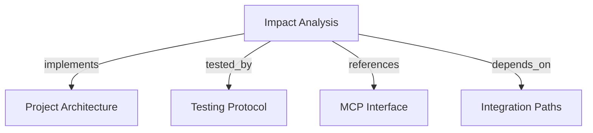

# Impact Analysis
Analyze structured changes against active tenant graph relationships through `analyze_impact`.

```graph
{
  "node_id": "feature:impact-analysis",
  "domain": "impact_analysis",
  "implements": ["adr:architecture"],
  "tested_by": ["adr:tests"],
  "entrypoints": ["harness_memory_mcp/tools/analyze_impact.py"],
  "registration_files": ["harness_memory_mcp/server/factory.py"],
  "reference_files": [
    "core/application/impact_analysis/use_cases/analyze_impact/handler.py",
    "core/infrastructure/postgres/repositories/impact_analysis_repository.py"
  ],
  "code_files": [
    "core/application/impact_analysis/contracts/change_description.py",
    "core/application/impact_analysis/contracts/dependency_path_view.py",
    "core/application/impact_analysis/contracts/impact_consumer_view.py",
    "core/application/impact_analysis/errors/impact_entity_not_found.py",
    "core/application/impact_analysis/errors/impact_query_failure.py",
    "core/application/impact_analysis/ports/impact_analysis_repository.py",
    "core/application/impact_analysis/types/impact_analysis_bounds.py",
    "core/application/impact_analysis/use_cases/analyze_impact/inbound.py",
    "core/application/impact_analysis/use_cases/analyze_impact/outbound.py",
    "migrations/versions/003_canonical_impact_identity.py",
    "harness_memory_mcp/services/impact_response_mapper.py"
  ],
  "test_files": [
    "tests/unit/core/application/impact_analysis/contracts/test_contracts.py",
    "tests/unit/core/application/impact_analysis/use_cases/test_analyze_impact.py",
    "tests/unit/core/infrastructure/postgres/repositories/test_impact_result_budget.py",
    "tests/unit/mcp/services/test_impact_response_mapper.py",
    "tests/integration/core/infrastructure/postgres/repositories/test_impact_analysis_repository.py",
    "tests/e2e/mcp/test_analyze_impact.py"
  ]
}
```

## OVERVIEW

Accept one changed entity, structured change description, and bounded analysis limits. Traverse inbound consumer relations with PostgreSQL, then return disjoint direct and indirect consumer sets with context.

## FOLDER STRUCTURE

```text
core/application/impact_analysis/          # Change contracts, bounds, port, handler
core/infrastructure/postgres/repositories/ # Canonical identity traversal and report assembly
migrations/                                # Canonical impact identity revision
harness_memory_mcp/tools/ and harness_memory_mcp/services/               # Scope enforcement and response mapping
tests/{unit,integration,e2e}/              # Contract, repository, and MCP tests
```

## MAIN CONCEPTS / COMPONENTS

- **Consumer edge**: Traverse only inbound `consumes`, `depends_on`, and `subscribes_to` relations.
- **Classification**: Put shortest-depth one consumers in `direct_consumers`; put depth two or greater in `indirect_consumers`.
- **Canonical identity**: Resolve project-local active copies through canonical identity without duplicating returned consumers.
- **Impact context**: Derive projects and teams from impacted consumers; reuse integration-path views for paths, ownership, provenance, and evidence.
- **Response budget**: Cap materialized ownership rows and globally returned teams at 100, enforce the serialized byte limit across every response collection, and strip optional metadata before dropping records.

## HOW TO ANALYZE IMPACT

1. Submit a changed entity UUID and a bounded structured change; never submit tenant identity.
2. Require trusted tenant scope and read only active snapshot facts.
3. Treat `unknowns` as explicit knowledge gaps for no consumers, missing requested evidence, or bounded traversal.
4. Treat `truncated=true` as incomplete graph coverage; preserve deterministic ordering.

## PARAMETERS / CONFIGURATIONS

| Name | Type | Required | Description | Default |
|------|------|----------|-------------|---------|
| `change_type` | string | Yes | Change category, 1–64 characters. | — |
| `description` | string | Yes | Bounded change explanation, up to 4096 characters. | — |
| `changed_fields` | string array | No | Typed fields affected by the change. | `[]` |
| `max_depth` | integer | No | Traversal depth from 1 through 8. | `4` |
| `max_consumers` | integer | No | Consumer bound from 1 through 500. | `100` |
| `max_paths` / `evidence_limit` / `owner_limit` | integer | No | Bounds from 1–100, 0–20, and 0–20. | `25` / `5` / `5` |
| `max_result_bytes` | integer | No | Serialized response budget from 64 KiB through 16 MiB. | `1 MiB` |

## BEST PRACTICES

REQUIRED: Enforce graph and response bounds during traversal and context loading, then perform an authoritative serialized-size check across consumers, paths, projects, teams, metadata, and evidence.
REQUIRED: Deduplicate affected projects and teams from impacted consumers; exclude the changed entity's own context unless reached through impact.
REQUIRED: Preserve provenance and bounded evidence; distinguish intentional evidence omission from missing evidence.
PROHIBITED: Infer impact with an LLM or traverse ownership, structural, provider, or publication relations as consumer edges.
PROHIBITED: Leak tenant, SQL, persistence, or free-text details through failure mapping or audit details.

## TIPS

Set `evidence_limit=0` when the caller needs topology without evidence-gap reporting.

## DOCUMENT MAP



## REFERENCES

- [**ARCHITECTURE.md**](../../adr/ARCHITECTURE.md): Defines application ports and persistence boundaries.
- [**TESTS.md**](../../adr/TESTS.md): Defines traversal, PostgreSQL, and MCP contract test tiers.
- [**MCP.md**](../../adr/MCP.md): Defines the `analyze_impact` scope and response boundary.
- [**integration-paths.md**](./integration-paths.md): Supplies reusable path, hop, ownership, and evidence views.
