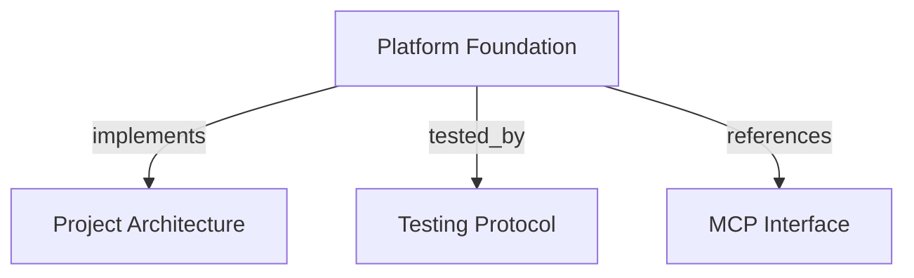

# Platform Foundation
Provide the runnable DDD structure, PostgreSQL schema, migration boundary, and MCP registration base for Harness Memory.

```graph
{
  "node_id": "feature:platform-foundation",
  "domain": "platform_foundation",
  "implements": ["adr:architecture"],
  "tested_by": ["adr:tests"],
  "entrypoints": ["harness_memory_mcp/cli.py", "harness_memory_mcp/server/app.py"],
  "registration_files": ["harness_memory_mcp/server/factory.py", "pyproject.toml"],
  "reference_files": ["core/infrastructure/postgres/engine_factory.py", "core/infrastructure/architecture/validator.py"],
  "code_files": [
    "harness_memory_mcp/config.py",
    "harness_memory_mcp/migration_cli.py",
    "harness_memory_mcp/migration_mode.py",
    "core/infrastructure/architecture/rules.py",
    "core/infrastructure/architecture/violation.py",
    "core/infrastructure/postgres/alembic_runtime.py",
    "core/infrastructure/postgres/config.py",
    "core/infrastructure/postgres/create_postgres_engine.py",
    "core/infrastructure/postgres/inspect_migration_status.py",
    "core/infrastructure/postgres/migrations.py",
    "core/infrastructure/postgres/migrations_status.py",
    "core/infrastructure/postgres/upgrade_database.py",
    "core/infrastructure/postgres/models/base.py",
    "core/infrastructure/postgres/models/entity.py",
    "core/infrastructure/postgres/models/evidence.py",
    "core/infrastructure/postgres/models/foundation_id.py",
    "core/infrastructure/postgres/models/metadata.py",
    "core/infrastructure/postgres/models/metadata_type.py",
    "core/infrastructure/postgres/models/project.py",
    "core/infrastructure/postgres/models/relation.py",
    "core/infrastructure/postgres/models/snapshot.py",
    "core/infrastructure/postgres/models/types.py",
    "migrations/env.py",
    "migrations/versions/001_foundation.py",
    "migrations/versions/006_default_workspace.py",
    "migrations/versions/007_service_accounts.py"
  ],
  "test_files": [
    "tests/unit/architecture/test_rules.py",
    "tests/unit/core/infrastructure/postgres/test_config.py",
    "tests/unit/core/infrastructure/postgres/test_engine_factory.py",
    "tests/unit/core/infrastructure/postgres/test_migrations.py",
    "tests/unit/core/infrastructure/postgres/models/test_schema.py",
    "tests/unit/core/infrastructure/postgres/models/test_types.py",
    "tests/unit/mcp/test_cli.py",
    "tests/unit/mcp/test_config.py",
    "tests/unit/mcp/server/test_factory.py",
    "tests/unit/core/infrastructure/postgres/migrations/test_default_workspace.py",
    "tests/integration/migrations/test_initial_foundation.py",
    "tests/integration/migrations/test_default_workspace.py",
    "tests/integration/migrations/test_service_accounts.py",
    "tests/e2e/mcp/test_catalog.py",
    "tests/e2e/mcp/test_import.py"
  ]
}
```

## OVERVIEW

Use **pragmatic DDD organized by business domain**. Keep FastMCP at the adapter edge, PostgreSQL and Alembic in infrastructure, and dependencies pointed inward.

## FOLDER STRUCTURE

```text
harness_memory_mcp/                          # Runtime, CLI, and transport adapters
core/application/             # Feature use cases and ports
core/domain/                  # Business invariants and value objects
core/infrastructure/postgres/ # Database configuration and adapters
migrations/                   # Versioned schema revisions
tests/{unit,integration,e2e}/ # Mirrored verification tiers
```

## MAIN CONCEPTS / COMPONENTS

- **Runtime boundary**: Build the FastMCP server without database connections, migrations, or transport startup.
- **Persistence boundary**: Keep five tenant-scoped foundation tables: projects, snapshots, entities, relations, and evidence.
- **Migration boundary**: Use explicit Alembic revisions through the CLI; keep startup schema creation disabled.
- **Default workspace seed**: Revision 006 inserts an `Admin` API user and a `Default Project`; `tenant_id` is the user UUID because token verification derives tenant identity from user ownership. Tenant is an identity value rather than a separate table; the seed creates no API token or admin role.
- **Service accounts**: Revision 007 adds tenant-bound API service accounts and permits tokens without expiration for those accounts.
- **Dependency boundary**: Let `mcp` call application code, application code use domain rules and ports, and infrastructure implement ports.

## HOW TO OPERATE

1. Set `MCP_HOST` and `MCP_PORT`; keep `DATABASE_URL` optional until database work starts.
2. Run `harness-memory migrate` to upgrade the PostgreSQL schema through Alembic head and apply the default workspace seed.
3. Run `harness-memory migrate --status` to inspect current and head revisions without mutation.
4. Add each feature under its domain packages and mirror its tests under `unit`, `integration`, and `e2e`.

## PARAMETERS / CONFIGURATIONS

| Name | Type | Required | Description | Default |
|------|------|----------|-------------|---------|
| `MCP_HOST` | string | No | Non-empty MCP bind host. | `127.0.0.1` |
| `MCP_PORT` | integer | No | Port from 1 through 65535. | `8000` |
| `DATABASE_URL` | secret URL | Database commands only | PostgreSQL `psycopg2` connection URL. | unset |

## BEST PRACTICES

REQUIRED: Keep tenant, project, and snapshot ownership in composite PostgreSQL constraints.
REQUIRED: Keep ORM models in infrastructure and map future domain objects explicitly.
REQUIRED: Use the seeded user's UUID as the default project's tenant identity.
REQUIRED: Redact credentials and connection details from migration diagnostics.
PROHIBITED: Run migrations or create schema during MCP server construction.
PROHIBITED: Treat the seeded `Admin` identity as a privileged role or assume it has an API token.
PROHIBITED: Import FastMCP, SQLAlchemy, or PostgreSQL drivers into domain code.

## TIPS

Use `--status` before an upgrade when diagnosing a deployment database; it performs read-only revision inspection.

## DOCUMENT MAP



## REFERENCES

- [**ARCHITECTURE.md**](../../adr/ARCHITECTURE.md): Defines layer ownership and dependency direction.
- [**TESTS.md**](../../adr/TESTS.md): Defines test tiers and coverage policy.
- [**MCP.md**](../../adr/MCP.md): Defines server and adapter boundaries.
