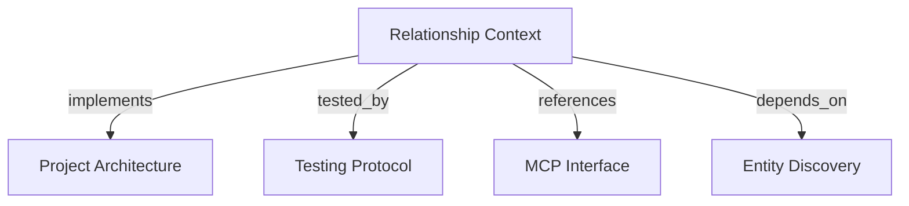

# Relationship Context
Return bounded active-snapshot context and direct dependency views for an entity.

```graph
{
  "node_id": "feature:relationship-context",
  "domain": "relationship_context",
  "implements": ["adr:architecture"],
  "tested_by": ["adr:tests"],
  "entrypoints": ["harness_memory_mcp/tools/get_context.py", "harness_memory_mcp/tools/get_dependencies.py"],
  "registration_files": ["harness_memory_mcp/server/factory.py"],
  "reference_files": [
  ],
  "code_files": [
    "harness_memory_mcp/services/tenant_context.py",
    "harness_memory_mcp/services/relationship_response_mapper.py",
    "core/application/entity_discovery/contracts/tenant_scope.py",
    "core/application/relationship_context/contracts/entity_context_item.py",
    "core/application/relationship_context/contracts/project_context_item.py",
    "core/application/relationship_context/contracts/evidence_view.py",
    "core/application/relationship_context/contracts/relation_view.py",
    "core/application/relationship_context/contracts/dependency_view.py",
    "core/application/relationship_context/types/dependency_relation_type.py",
    "core/application/relationship_context/types/relationship_direction.py",
    "core/application/relationship_context/types/relationship_query_bounds.py",
    "core/application/relationship_context/ports/relationship_query_repository.py",
    "core/application/relationship_context/errors/entity_context_not_found.py",
    "core/application/relationship_context/errors/relationship_query_failure.py",
    "core/application/relationship_context/use_cases/get_context/inbound.py",
    "core/application/relationship_context/use_cases/get_context/handler.py",
    "core/application/relationship_context/use_cases/get_context/outbound.py",
    "core/application/relationship_context/use_cases/get_dependencies/inbound.py",
    "core/application/relationship_context/use_cases/get_dependencies/handler.py",
    "core/application/relationship_context/use_cases/get_dependencies/outbound.py",
    "core/infrastructure/postgres/repositories/relationship_query_repository.py"
  ],
  "test_files": [
    "tests/unit/core/application/relationship_context/contracts/test_contracts.py",
    "tests/unit/core/application/relationship_context/ports/test_relationship_query_repository.py",
    "tests/unit/core/application/relationship_context/use_cases/test_get_context.py",
    "tests/unit/core/application/relationship_context/use_cases/test_get_dependencies.py",
    "tests/unit/mcp/services/test_relationship_response_mapper.py",
    "tests/unit/mcp/server/test_relationship_factory.py",
    "tests/unit/mcp/tools/test_get_context.py",
    "tests/unit/mcp/tools/test_get_dependencies.py",
    "tests/integration/core/infrastructure/postgres/repositories/test_relationship_context_query.py",
    "tests/integration/core/infrastructure/postgres/repositories/test_relationship_query_plans.py",
    "tests/e2e/mcp/test_relationship_queries.py"
  ]
}
```

## OVERVIEW

`get_context` and `get_dependencies` are read-only queries over one trusted tenant's active snapshot. They expose direct relations, owners, dependency peers, provenance, and linked evidence within request bounds.

## FOLDER STRUCTURE

```text
harness_memory_mcp/tools/                                  # Thin context and dependency adapters
harness_memory_mcp/services/                               # Tenant and safe response mapping
core/application/relationship_context/      # Contracts, ports, and handlers
core/infrastructure/postgres/repositories/  # Active-snapshot relationship reads
tests/{unit,integration,e2e}/               # Contract, repository, and MCP tests
```

## MAIN CONCEPTS / COMPONENTS

- **Active context**: Resolve the requested UUID only when it belongs to the trusted tenant and its Project's active snapshot.
- **Direct relation**: Return one-hop relations; derive owners from outbound `owned_by` relations targeting teams.
- **Dependency relation**: Limit dependency views to `depends_on`, `consumes`, and `subscribes_to`; support inbound, outbound, and both directions.
- **Evidence**: Attach only evidence linked to returned relations; exclude snapshot-level evidence from entity context.

## HOW TO QUERY

1. Discover an active entity UUID with `search_entities`.
2. Call `get_context` for project, owners, direct relations, dependency subset, provenance, and linked evidence.
3. Call `get_dependencies` with `inbound`, `outbound`, or `both` for one-hop dependency views.
4. Treat not-found responses for unknown, stale, and other-tenant UUIDs as the same non-disclosing result.

## PARAMETERS / CONFIGURATIONS

| Name | Type | Required | Description | Default |
|------|------|----------|-------------|---------|
| `entity_id` | UUID | Yes | Active entity identity from discovery. | — |
| `direction` | enum | No | `inbound`, `outbound`, or `both`; dependencies only. | `both` |
| `limit` | strict integer | No | Relation bound from 1 through 100. | `25` |
| `evidence_limit` | strict integer | No | Evidence bound per relation from 0 through 20. | `5` |

## BEST PRACTICES

REQUIRED: Apply tenant and active-snapshot predicates to every entity, project, snapshot, relation, and evidence join.
REQUIRED: Use one read transaction per query so returned facts come from one active snapshot.
REQUIRED: Preserve relation direction, provenance, peer identity, and linked evidence in output projections.
PROHIBITED: Recurse through dependency paths; reserve transitive traversal for integration-path or impact features.
PROHIBITED: Accept tenant identity from tool payloads or disclose whether another tenant owns a UUID.

## TIPS

Use `evidence_limit=0` when only relation identity, direction, provenance, and peer data are needed.

## DOCUMENT MAP



## REFERENCES

- [**ARCHITECTURE.md**](../../adr/ARCHITECTURE.md): Defines application read ports and infrastructure ownership.
- [**TESTS.md**](../../adr/TESTS.md): Defines bounded query and MCP contract test tiers.
- [**MCP.md**](../../adr/MCP.md): Defines tool, tenant, and response boundaries.
- [**entity-discovery.md**](./entity-discovery.md): Supplies active entity discovery and trusted tenant scope.
