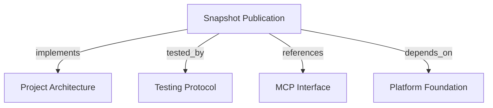

# Snapshot Publication
Publish a complete immutable project snapshot and switch its active pointer atomically.

```graph
{
  "node_id": "feature:snapshot-publication",
  "domain": "snapshot_publication",
  "implements": ["adr:architecture"],
  "tested_by": ["adr:tests"],
  "entrypoints": ["mcp/tools/publish_project_snapshot.py"],
  "registration_files": ["mcp/server/factory.py"],
  "reference_files": [
    "core/domain/snapshot_publication/aggregates/project_knowledge_snapshot.py",
    "core/infrastructure/postgres/repositories/snapshot_publication_repository.py"
  ],
  "code_files": [
    "mcp/services/tenant_context.py",
    "mcp/services/publication_response_mapper.py",
    "core/application/snapshot_publication/contracts/base.py",
    "core/application/snapshot_publication/contracts/entity_input.py",
    "core/application/snapshot_publication/contracts/evidence_input.py",
    "core/application/snapshot_publication/contracts/project_input.py",
    "core/application/snapshot_publication/contracts/relation_input.py",
    "core/application/snapshot_publication/errors/missing_tenant_context.py",
    "core/application/snapshot_publication/ports/snapshot_publication_store.py",
    "core/application/snapshot_publication/services/canonical_payload_serializer.py",
    "core/application/snapshot_publication/services/payload_hash_calculator.py",
    "core/application/snapshot_publication/types/publication_context.py",
    "core/application/snapshot_publication/types/publication_record.py",
    "core/application/snapshot_publication/types/publication_status.py",
    "core/application/snapshot_publication/use_cases/publish_project_snapshot/handler.py",
    "core/application/snapshot_publication/use_cases/publish_project_snapshot/inbound.py",
    "core/application/snapshot_publication/use_cases/publish_project_snapshot/outbound.py",
    "core/domain/snapshot_publication/entities/entity_fact.py",
    "core/domain/snapshot_publication/entities/evidence_fact.py",
    "core/domain/snapshot_publication/entities/project_descriptor.py",
    "core/domain/snapshot_publication/entities/relation_fact.py",
    "core/domain/snapshot_publication/errors/persistence_failure.py",
    "core/domain/snapshot_publication/errors/revision_conflict.py",
    "core/domain/snapshot_publication/errors/snapshot_invariant_violation.py",
    "core/domain/snapshot_publication/errors/stale_revision.py",
    "core/domain/snapshot_publication/services/snapshot_builder.py",
    "core/domain/snapshot_publication/services/snapshot_revision_policy.py",
    "core/domain/snapshot_publication/types/entity_type.py",
    "core/domain/snapshot_publication/types/provenance_kind.py",
    "core/domain/snapshot_publication/types/relation_type.py",
    "core/domain/snapshot_publication/types/revision_decision.py",
    "core/domain/snapshot_publication/value_objects/current_snapshot_descriptor.py",
    "core/domain/snapshot_publication/value_objects/entity_key.py",
    "core/domain/snapshot_publication/value_objects/generated_at.py",
    "core/domain/snapshot_publication/value_objects/metadata_object.py",
    "core/domain/snapshot_publication/value_objects/payload_hash.py",
    "core/domain/snapshot_publication/value_objects/project_descriptor.py",
    "core/domain/snapshot_publication/value_objects/project_key.py",
    "core/domain/snapshot_publication/value_objects/relation_reference.py",
    "core/domain/snapshot_publication/value_objects/revision.py",
    "core/domain/snapshot_publication/value_objects/schema_version.py",
    "core/infrastructure/postgres/repositories/snapshot_graph_rows.py",
    "core/infrastructure/postgres/repositories/snapshot_persistence_mapper.py"
  ],
  "test_files": [
    "tests/unit/core/application/snapshot_publication/contracts/test_inbound.py",
    "tests/unit/core/application/snapshot_publication/helpers.py",
    "tests/unit/core/application/snapshot_publication/services/test_payload_hash.py",
    "tests/unit/core/application/snapshot_publication/use_cases/test_publish_project_snapshot.py",
    "tests/unit/core/domain/snapshot_publication/services/test_revision_policy.py",
    "tests/unit/core/domain/snapshot_publication/test_snapshot_domain.py",
    "tests/unit/core/infrastructure/postgres/repositories/test_snapshot_persistence_mapper.py",
    "tests/integration/core/infrastructure/postgres/repositories/test_snapshot_publication_repository.py",
    "tests/e2e/mcp/test_publish_project_snapshot.py"
  ]
}
```

## OVERVIEW

Validate a complete schema `1.0` payload, build an immutable domain aggregate, calculate a canonical hash, and persist the graph through a tenant-scoped transaction.

## FOLDER STRUCTURE

```text
core/domain/snapshot_publication/        # Snapshot invariants and revision policy
core/application/snapshot_publication/  # Contracts, hashing, and publication use case
core/infrastructure/postgres/            # Graph mapping and atomic persistence
mcp/tools/                               # Public publication adapter
tests/{unit,integration,e2e}/            # Domain, persistence, and MCP contracts
```

## MAIN CONCEPTS / COMPONENTS

- **Complete snapshot**: Validate entity, relation, and evidence references within one immutable publication.
- **Revision policy**: Activate higher revisions; return `ALREADY_PUBLISHED` for identical revision/hash; reject conflicts and stale revisions.
- **Active pointer**: Replace active facts by switching `projects.active_snapshot_id`; retain historical snapshots and facts.
- **Trusted tenant**: Obtain tenant identity from `PublicationContext`, never from payload fields.

## HOW TO PUBLISH

1. Submit schema `1.0` with positive revision, offset-aware timestamp, bounded metadata, and supported fact types.
2. Supply tenant context through the adapter boundary; exclude `tenant_id` from the snapshot payload.
3. Resolve relation endpoints and evidence references within the same snapshot.
4. Treat `ACTIVATED` as a new active snapshot and `ALREADY_PUBLISHED` as an idempotent retry.

## PARAMETERS / CONFIGURATIONS

| Name | Type | Required | Description | Default |
|------|------|----------|-------------|---------|
| `schema_version` | string | Yes | Supported publication schema. | `1.0` |
| `revision` | positive integer | Yes | Project publication revision. | — |
| `generated_at` | datetime | Yes | Offset-aware timestamp normalized to UTC. | — |
| `entities` | array | Yes | Maximum 10,000 entity facts. | `[]` |
| `relations` | array | Yes | Maximum 50,000 relation facts. | `[]` |
| `evidence` | array | Yes | Maximum 50,000 evidence facts. | `[]` |

## BEST PRACTICES

REQUIRED: Hash validated canonical content, including revision and normalized timestamp, while excluding tenant context.
REQUIRED: Keep Pydantic shape validation separate from domain graph invariants.
REQUIRED: Map persistence failures to stable MCP-safe errors without SQL, credentials, or payload contents.
PROHIBITED: Delete historical snapshots when activating a newer revision.
PROHIBITED: Allow arbitrary graph mutations outside complete snapshot publication.

## TIPS

Retry the exact payload and revision to verify idempotency; a changed field at the same revision is a conflict.

## DOCUMENT MAP



## REFERENCES

- [**ARCHITECTURE.md**](../../adr/ARCHITECTURE.md): Defines dependency direction and persistence ownership.
- [**TESTS.md**](../../adr/TESTS.md): Defines domain, persistence, and MCP test boundaries.
- [**MCP.md**](../../adr/MCP.md): Defines the tool and trusted-context boundary.
- [**platform-foundation.md**](./platform-foundation.md): Supplies schema, engine, and migration foundations.
