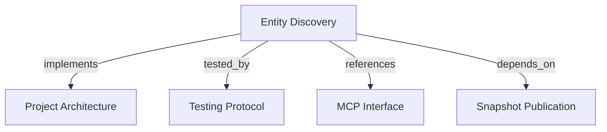

```graph
{
  "node_id": "feature:entity-discovery",
  "domain": "entity_discovery",
  "implements": ["adr:architecture"],
  "tested_by": ["adr:tests"],
  "entrypoints": ["mcp/tools/search_entities.py"],
  "registration_files": ["mcp/server/factory.py"],
  "reference_files": [
    "core/application/entity_discovery/use_cases/search_entities/handler.py",
    "core/infrastructure/postgres/repositories/entity_search_repository.py"
  ],
  "code_files": [
    "core/application/entity_discovery/contracts/entity_search_criteria.py",
    "core/application/entity_discovery/contracts/entity_search_item.py",
    "core/application/entity_discovery/contracts/entity_search_page.py",
    "core/application/entity_discovery/contracts/tenant_scope.py",
    "core/application/entity_discovery/errors/cursor_validation.py",
    "core/application/entity_discovery/errors/search_failure.py",
    "core/application/entity_discovery/ports/entity_search_repository.py",
    "core/application/entity_discovery/services/search_criteria_normalizer.py",
    "core/application/entity_discovery/services/search_cursor_codec.py",
    "core/application/entity_discovery/use_cases/search_entities/inbound.py",
    "core/application/entity_discovery/use_cases/search_entities/outbound.py",
    "core/application/entity_discovery/value_objects/filter_fingerprint.py",
    "core/application/entity_discovery/value_objects/search_cursor.py",
    "core/application/snapshot_publication/errors/missing_tenant_context.py",
    "core/domain/snapshot_publication/types/entity_type.py",
    "core/infrastructure/postgres/models/entity.py",
    "core/infrastructure/postgres/models/project.py",
    "core/infrastructure/postgres/models/snapshot.py",
    "migrations/versions/f003_entity_search_indexes.py",
    "mcp/services/entity_search_response_mapper.py",
    "mcp/services/tenant_context.py"
  ],
  "test_files": [
    "tests/unit/core/application/entity_discovery/contracts/test_contracts.py",
    "tests/unit/core/application/entity_discovery/services/test_cursor_and_criteria.py",
    "tests/unit/core/application/entity_discovery/use_cases/test_search_entities.py",
    "tests/unit/core/infrastructure/postgres/models/test_entity_search_indexes.py",
    "tests/unit/core/infrastructure/postgres/migrations/test_entity_search_indexes.py",
    "tests/unit/mcp/tools/test_search_entities.py",
    "tests/integration/core/infrastructure/postgres/repositories/test_entity_search_repository.py",
    "tests/integration/migrations/test_entity_search_indexes.py",
    "tests/e2e/mcp/test_search_entities.py"
  ]
}
```

# Entity Discovery
Find bounded Entity identities from each tenant's active Project snapshots through `search_entities`.

## OVERVIEW

`search_entities` is a **read-only query** over persisted Entities. It joins each Project's **active snapshot**, scopes every query by trusted tenant identity, and returns scalar identity and version fields without graph context.

## FOLDER STRUCTURE

```text
core/application/entity_discovery/  # Contracts, cursor policy, and use case
core/infrastructure/postgres/       # Active-snapshot query and search indexes
mcp/tools/                           # Public search adapter
tests/{unit,integration,e2e}/        # Contract, repository, and MCP verification
```

## FILTERS AND OUTPUT

| Input | Match |
|---|---|
| `key` | Exact, case-sensitive Entity key. |
| `name` | Case-insensitive literal prefix; `%`, `_`, and `\` are escaped. |
| `type` | Exact supported Entity type. |
| `project` | Exact, case-sensitive Project key. |
| `limit` | Strict integer from 1–100; default 25. |
| `cursor` | Opaque versioned token; maximum 1,024 characters. |

REQUIRED: Return Entity ID, key, optional name, type, Project key/name, active snapshot ID, and revision.
PROHIBITED: Return metadata, relations, evidence, provenance, snapshot payload, or a total count.

## SEARCH GUARANTEES

- REQUIRED: Supply at least one filter; combine all supplied filters with AND semantics.
- REQUIRED: Read only Entity rows whose snapshot equals the Project's current `active_snapshot_id`.
- REQUIRED: Use **keyset pagination** ordered by Entity key and UUID; fetch one extra row to decide whether to issue a next cursor.
- REQUIRED: Bind a cursor to normalized filters; exclude tenant identity from cursor contents and request filters.
- ALLOWED: Treat traversal across a concurrent snapshot activation as best-effort; each page reads current active state.
- PROHIBITED: Add authentication or `memory:read` authorization here; the production authorization boundary belongs to a later security feature.

## HOW TO EXTEND

1. Add filters to the strict inbound contract and immutable criteria together.
2. Apply new predicates in the repository with bound values and preserve tenant and active-snapshot predicates.
3. Add unit, repository, pagination, and MCP contract tests for the new filter.
4. Add or revise PostgreSQL indexes only with a reversible migration and matching model declaration.

## KNOWN GAPS

- REQUIRED: Validate maximum text lengths after trimming; current inbound field limits run before normalization.
- REQUIRED: Verify query plans and migration behavior on PostgreSQL; current repository integration tests use SQLite.
- PROHIBITED: Treat the current suite as proof of production authorization; tenant scoping exists, but authorization remains out of scope.

## DOCUMENT MAP



## REFERENCES

- [**ARCHITECTURE.md**](../adr/ARCHITECTURE.md): Defines layer boundaries and inward dependencies.
- [**TESTS.md**](../adr/TESTS.md): Defines query and MCP test strategy.
- [**MCP.md**](../adr/MCP.md): Defines tool and tenant-context boundaries.
- [**snapshot-publication.md**](./snapshot-publication.md): Defines the active snapshot data this query reads.
