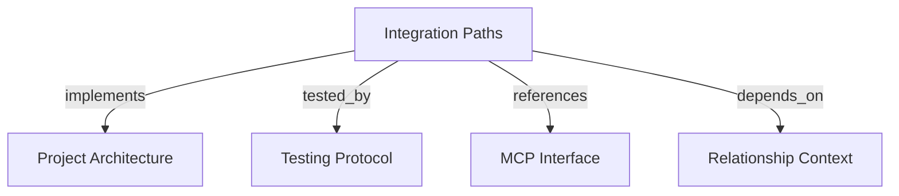

# Integration Paths
Find bounded, tenant-scoped paths between active graph entities through `find_integration_paths`.

```graph
{
  "node_id": "feature:integration-paths",
  "domain": "integration_paths",
  "implements": ["adr:architecture"],
  "tested_by": ["adr:tests"],
  "entrypoints": ["mcp/tools/find_integration_paths.py"],
  "registration_files": ["mcp/server/factory.py"],
  "reference_files": [
    "core/application/integration_paths/use_cases/find_integration_paths/handler.py",
    "core/infrastructure/postgres/repositories/integration_path_repository.py"
  ],
  "code_files": [
    "core/application/integration_paths/contracts/integration_path_view.py",
    "core/application/integration_paths/contracts/ownership_view.py",
    "core/application/integration_paths/contracts/path_entity_view.py",
    "core/application/integration_paths/contracts/path_hop_view.py",
    "core/application/integration_paths/errors/integration_path_endpoint_not_found.py",
    "core/application/integration_paths/errors/integration_path_query_failure.py",
    "core/application/integration_paths/ports/integration_path_repository.py",
    "core/application/integration_paths/services/path_traversal_policy.py",
    "core/application/integration_paths/types/integration_path_bounds.py",
    "core/application/integration_paths/types/path_termination_reason.py",
    "core/application/integration_paths/types/path_traversal_direction.py",
    "core/application/integration_paths/use_cases/find_integration_paths/inbound.py",
    "core/application/integration_paths/use_cases/find_integration_paths/outbound.py",
    "mcp/services/integration_path_response_mapper.py",
    "mcp/services/tenant_context.py"
  ],
  "test_files": [
    "tests/unit/core/application/integration_paths/ports/test_integration_path_repository.py",
    "tests/unit/core/application/integration_paths/services/test_path_traversal_policy.py",
    "tests/unit/core/application/integration_paths/types/test_contracts.py",
    "tests/unit/core/application/integration_paths/use_cases/test_find_integration_paths.py",
    "tests/unit/mcp/server/test_integration_path_factory.py",
    "tests/unit/mcp/services/test_integration_path_response_mapper.py",
    "tests/unit/mcp/tools/test_find_integration_paths.py",
    "tests/integration/core/infrastructure/postgres/repositories/test_integration_path_limits.py",
    "tests/integration/core/infrastructure/postgres/repositories/test_integration_path_plans.py",
    "tests/integration/core/infrastructure/postgres/repositories/test_integration_path_rework.py",
    "tests/integration/core/infrastructure/postgres/repositories/test_integration_path_traversal.py",
    "tests/e2e/mcp/test_find_integration_paths.py",
    "tests/e2e/mcp/test_find_integration_paths_catalog.py"
  ]
}
```

## OVERVIEW

Use a read-only application query with PostgreSQL recursive traversal. Resolve both endpoints from one trusted tenant's active snapshots, then return typed path, hop, ownership, provenance, and evidence views.

## FOLDER STRUCTURE

```text
core/application/integration_paths/       # Bounds, contracts, policy, port, handler
core/infrastructure/postgres/repositories/ # Recursive traversal and bounded hydration
mcp/tools/ and mcp/services/              # Public adapter and safe response mapping
tests/{unit,integration,e2e}/              # Policy, repository, MCP, and catalog tests
```

## MAIN CONCEPTS / COMPONENTS

- **Eligible hop**: Traverse `provides`, `consumes`, `depends_on`, `publishes`, `subscribes_to`, and `implements`; exclude `owned_by` and `part_of`.
- **Simple path**: Treat eligible relations as bidirectional adjacency while preserving stored endpoints and traversal direction; never repeat an entity UUID.
- **Bounded result**: Limit depth to 1–8, paths to 1–25, evidence and owners to 0–20, and recursive expansion to 10,000.
- **Explanatory context**: Attach direct hop evidence and explicit outbound team ownership; do not infer missing facts.

## HOW TO FIND PATHS

1. Supply source and target active entity UUIDs; derive tenant scope from authenticated context.
2. Use bounds to control depth, path count, evidence, and ownership.
3. Treat source equal to target as one zero-hop path and disconnected visible endpoints as an empty success.
4. Treat hidden, stale, foreign, or unknown endpoints as one sanitized not-found result.

## PARAMETERS / CONFIGURATIONS

| Name | Type | Required | Description | Default |
|------|------|----------|-------------|---------|
| `source_entity_id` | UUID | Yes | Visible starting entity. | — |
| `target_entity_id` | UUID | Yes | Visible ending entity. | — |
| `max_depth` | integer | No | Path depth from 1 through 8. | `4` |
| `max_paths` | integer | No | Returned path bound from 1 through 25. | `10` |
| `evidence_limit` / `owner_limit` | integer | No | Per-relation/per-entity bound from 0 through 20. | `5` |

## BEST PRACTICES

REQUIRED: Anchor endpoint, traversal, ownership, and evidence reads to one coherent active-snapshot transaction.
REQUIRED: Order paths by hop count, entity keys, and relation IDs; preserve parallel relation paths when sequences differ.
REQUIRED: Set truncation and termination reason when path or expansion bounds omit results.
PROHIBITED: Join disconnected projects by entity key or return partial paths after a query failure.
PROHIBITED: Put recursive SQL, ownership inference, or tenant selection in the MCP adapter.

## TIPS

Use `evidence_limit=0` and `owner_limit=0` when path topology is enough for the caller.

## DOCUMENT MAP



## REFERENCES

- [**ARCHITECTURE.md**](../adr/ARCHITECTURE.md): Defines ports, layers, and infrastructure ownership.
- [**TESTS.md**](../adr/TESTS.md): Defines recursive-query and MCP contract test tiers.
- [**MCP.md**](../adr/MCP.md): Defines the `find_integration_paths` adapter scope.
- [**relationship-context.md**](./relationship-context.md): Supplies active relationship and tenant semantics.
