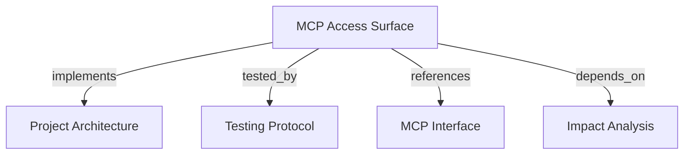

# MCP Access Surface
Expose bounded memory resources and deterministic workflow prompts through the FastMCP catalog.

```graph
{
  "node_id": "feature:mcp-access-surface",
  "domain": "mcp_access_surface",
  "implements": ["adr:architecture"],
  "tested_by": ["adr:tests"],
  "entrypoints": [
    "mcp/resources/entity_resource.py",
    "mcp/resources/project_resource.py",
    "mcp/resources/snapshot_resource.py",
    "mcp/prompts/load_corporate_context.py",
    "mcp/prompts/analyze_integration.py",
    "mcp/prompts/review_change_impact.py"
  ],
  "registration_files": ["mcp/server/factory.py"],
  "reference_files": [
    "core/application/mcp_access_surface/use_cases/get_project_resource/handler.py",
    "core/infrastructure/postgres/repositories/memory_resource_repository.py"
  ],
  "code_files": [
    "core/application/mcp_access_surface/contracts/project_resource_input.py",
    "core/application/mcp_access_surface/contracts/project_resource_output.py",
    "core/application/mcp_access_surface/contracts/snapshot_context_item.py",
    "core/application/mcp_access_surface/contracts/snapshot_fact_page.py",
    "core/application/mcp_access_surface/contracts/snapshot_resource_input.py",
    "core/application/mcp_access_surface/contracts/snapshot_resource_output.py",
    "core/application/mcp_access_surface/errors/resource_not_found.py",
    "core/application/mcp_access_surface/errors/resource_query_failure.py",
    "core/application/mcp_access_surface/ports/memory_resource_repository.py",
    "core/application/mcp_access_surface/types/resource_read_bounds.py",
    "core/application/mcp_access_surface/use_cases/get_project_resource/inbound.py",
    "core/application/mcp_access_surface/use_cases/get_project_resource/outbound.py",
    "core/application/mcp_access_surface/use_cases/get_snapshot_resource/handler.py",
    "core/application/mcp_access_surface/use_cases/get_snapshot_resource/inbound.py",
    "core/application/mcp_access_surface/use_cases/get_snapshot_resource/outbound.py",
    "mcp/prompts/_guidance.py",
    "mcp/services/resource_error_mapper.py"
  ],
  "test_files": [
    "tests/unit/core/application/mcp_access_surface/contracts/test_contracts.py",
    "tests/unit/core/application/mcp_access_surface/use_cases/test_get_project_resource.py",
    "tests/unit/core/application/mcp_access_surface/use_cases/test_get_snapshot_resource.py",
    "tests/unit/mcp/prompts/test_prompts.py",
    "tests/unit/mcp/resources/test_entity_resource.py",
    "tests/unit/mcp/resources/test_project_resource.py",
    "tests/unit/mcp/resources/test_snapshot_resource.py",
    "tests/unit/mcp/server/test_factory.py",
    "tests/integration/core/infrastructure/postgres/repositories/test_project_resource.py",
    "tests/integration/core/infrastructure/postgres/repositories/test_snapshot_resource.py",
    "tests/e2e/mcp/test_resource_catalog.py",
    "tests/e2e/mcp/test_resources.py",
    "tests/e2e/mcp/test_prompts.py"
  ]
}
```

## OVERVIEW

Register three read-only resources and three prompts. Resources delegate to application ports and PostgreSQL projections; prompts render guidance only and never call tools, repositories, or handlers.

## FOLDER STRUCTURE

```text
mcp/resources/                           # Entity, project, and snapshot URI adapters
mcp/prompts/                              # Three deterministic workflow renderers
core/application/mcp_access_surface/     # Resource contracts, bounds, handlers, port
core/infrastructure/postgres/repositories/ # Bounded tenant-filtered resource reads
tests/{unit,integration,e2e}/             # Contract, persistence, catalog, and read tests
```

## MAIN CONCEPTS / COMPONENTS

- **Entity resource**: Reuse active relationship context at `memory://entities/{entity_id}`.
- **Project resource**: Read only the project's active snapshot at `memory://projects/{project_key}`; decode one URI segment once.
- **Snapshot resource**: Read a tenant-owned historical snapshot at `memory://snapshots/{snapshot_id}` without activation or raw payload exposure.
- **Prompt surface**: Guide search, context, paths, and impact calls; keep business decisions in existing capabilities.

## HOW TO READ

1. Require trusted tenant context and `memory:read` for every resource.
2. Apply fixed bounds of 25 facts and 5 evidence items; expose truncation flags.
3. Return identical sanitized not-found results for missing and foreign-tenant identifiers.
4. Validate prompt arguments as bounded data and render deterministic text without I/O.

## PARAMETERS / CONFIGURATIONS

| Name | Type | Required | Description | Default |
|------|------|----------|-------------|---------|
| `entity_id` | UUID | Resource path | Active entity identity. | — |
| `project_key` | URI segment | Resource path | Percent-encoded project key, decoded once. | — |
| `snapshot_id` | UUID | Resource path | Tenant-owned snapshot identity. | — |
| `fact_limit` | fixed integer | Internal | Maximum resource facts. | `25` |
| `evidence_limit` | fixed integer | Internal | Maximum evidence items per bounded fact. | `5` |

## BEST PRACTICES

REQUIRED: Keep resource outputs bounded, deterministic, tenant-filtered, and free of raw snapshot payloads.
REQUIRED: Keep prompt renderers data-free; mention existing public tools instead of duplicating business logic.
REQUIRED: Enforce authorization on catalog listing and direct read/get operations.
PROHIBITED: Accept tenant identity from URI or prompt arguments, infer cross-tenant existence, or expose repository errors.
PROHIBITED: Let resource adapters own SQL, traversal, activation, or impact classification.

## TIPS

Percent-encode project keys containing `/` as one URI segment before calling the project resource.

## DOCUMENT MAP



## REFERENCES

- [**ARCHITECTURE.md**](../adr/ARCHITECTURE.md): Defines adapter, application, and persistence boundaries.
- [**TESTS.md**](../adr/TESTS.md): Defines FastMCP catalog, read, and persistence test tiers.
- [**MCP.md**](../adr/MCP.md): Defines resource URIs, prompt responsibilities, and scopes.
- [**impact-analysis.md**](./impact-analysis.md): Supplies the existing impact contract named by review guidance.
