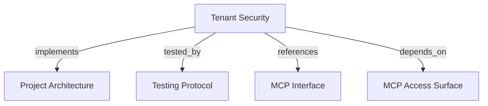

# Tenant Security
Protect the MCP surface with verified bearer identity, exact scope authorization, tenant isolation, and append-only audit facts.

```graph
{
  "node_id": "feature:tenant-security",
  "domain": "tenant_security",
  "implements": ["adr:architecture"],
  "tested_by": ["adr:tests"],
  "entrypoints": ["harness_memory_mcp/server/app.py"],
  "registration_files": ["harness_memory_mcp/server/factory.py"],
  "reference_files": [
    "harness_memory_mcp/services/component_scope_policy.py",
    "harness_memory_mcp/services/security_audit_middleware.py",
    "core/infrastructure/postgres/repositories/security_audit_repository.py"
  ],
  "code_files": [
    "core/domain/tenant_security/entities/security_audit_record.py",
    "core/domain/tenant_security/types/audit_event_type.py",
    "core/domain/tenant_security/types/audit_outcome.py",
    "core/domain/tenant_security/types/audit_phase.py",
    "core/domain/tenant_security/types/memory_scope.py",
    "core/domain/tenant_security/value_objects/authenticated_principal.py",
    "core/application/tenant_security/ports/security_audit_repository.py",
    "core/application/tenant_security/use_cases/record_security_audit/handler.py",
    "core/application/tenant_security/use_cases/record_security_audit/inbound.py",
    "core/application/tenant_security/use_cases/record_security_audit/outbound.py",
    "core/infrastructure/postgres/models/security_audit_event.py",
    "migrations/versions/004_security_audit_events.py",
    "harness_memory_mcp/config.py",
    "harness_memory_mcp/server/http_security.py",
    "harness_memory_mcp/services/audited_operation.py",
    "harness_memory_mcp/services/authenticated_principal.py",
    "harness_memory_mcp/services/authenticated_principal_factory.py",
    "harness_memory_mcp/services/request_security_context.py",
    "harness_memory_mcp/services/security_failure_mapper.py",
    "harness_memory_mcp/services/tenant_context.py"
  ],
  "test_files": [
    "tests/unit/core/application/tenant_security/test_security_audit.py",
    "tests/unit/core/domain/tenant_security/test_security_types.py",
    "tests/unit/core/infrastructure/postgres/repositories/test_security_audit_repository.py",
    "tests/unit/mcp/server/test_factory.py",
    "tests/unit/mcp/server/test_integration_path_factory.py",
    "tests/unit/mcp/server/test_relationship_factory.py",
    "tests/unit/mcp/server/test_app_transport.py",
    "tests/unit/mcp/services/test_security_hardening.py",
    "tests/unit/mcp/services/test_tenant_security_services.py",
    "tests/unit/mcp/test_rework_security.py",
    "tests/e2e/mcp/test_http_security.py"
  ]
}
```

## OVERVIEW

Verify production bearer tokens through active database records or configured JWT issuer metadata. Bind one immutable principal per request, apply exact scope policy, keep tenant predicates in repositories, and normalize HTTP security failures.

## FOLDER STRUCTURE

```text
core/domain/tenant_security/             # Principal, scope, and audit invariants
core/application/tenant_security/        # Append-only audit use case and port
core/infrastructure/postgres/            # Audit model, repository, and migration
harness_memory_mcp/server/ and harness_memory_mcp/services/            # HTTP security pipeline, context, policy, mapping
tests/{unit,integration,e2e}/             # Security, audit, and HTTP contract tests
```

## MAIN CONCEPTS / COMPONENTS

- **Authenticated principal**: Build only from verified claims; require non-empty subject and tenant; store exact scopes.
- **Component policy**: Map every MCP tool, resource, and prompt to `memory:read` or `memory:impact`; deny unmapped components. Reserve `memory:publish` for the API.
- **Tenant context**: Bind and reset request-scoped identity with `ContextVar`; pass tenant scope separately from public payloads.
- **Security audit**: Append attempted/completed operation and authentication/authorization facts with bounded safe details and idempotent identity. Apply backpressure when concurrent authentication-failure writes reach capacity; never silently discard an event because the write slots are full.

## HOW TO SECURE REQUESTS

1. Verify bearer token before catalog filtering, authorization, handler execution, or repository access.
2. Bind principal for request lifetime; reset context on success and exception.
3. Require exact scope membership and preserve `401` authentication versus `403 insufficient_scope` authorization semantics.
4. Normalize missing or invalid tokens to a generic `401` `invalid_token` response; include the required scope in `403` challenges when known.
5. Preserve validation failures as HTTP `200` JSON-RPC tool results with `isError: true` and stable `INVALID_ARGUMENT` text.
6. Audit protected operation attempts before publication or impact execution; never store tokens, claims, payloads, evidence, or credentials.

## PARAMETERS / CONFIGURATIONS

| Name | Type | Required | Description | Default |
|------|------|----------|-------------|---------|
| `MCP_AUTH_MODE` | `database` or `jwt` | No | Select bearer verification strategy. | `jwt` |
| `DATABASE_URL` | PostgreSQL URL | Database mode | Active API-token source. | unset |
| `MCP_ISSUER` | HTTPS URL | JWT mode | JWT issuer. | unset |
| `MCP_JWKS_URI` | HTTPS URL | JWT mode | Asymmetric signing-key source. | unset |
| `MCP_AUDIENCE` | string | JWT mode | Required JWT audience. | unset |
| `MCP_TENANT_CLAIM` | string | No | Claim used for tenant identity. | `tenant_id` |
| `MCP_REQUIRE_AUTH` | boolean | Production | Require complete authentication settings. | `false` |
| `scope` claim | space-delimited string | Token | Exact memory scopes. | none |

## BEST PRACTICES

REQUIRED: Derive tenant identity only from verified claims and enforce tenant predicates on every repository query.
REQUIRED: Filter catalogs and recheck authorization on direct calls, reads, and prompt retrieval.
REQUIRED: Run production Streamable HTTP in stateless mode so tool calls do not depend on an initialized session.
REQUIRED: Keep audit records append-only, bounded, idempotent, and secret-free; apply request backpressure rather than dropping authentication failures when the audit concurrency limit is reached; fail closed when required audit persistence fails.
REQUIRED: Keep authentication and authorization response bodies free of presented tokens, verifier details, tenant identifiers, and persistence errors.
PROHIBITED: Use fixed tenants, request payload tenant fields, permissive missing-scope defaults, or raw verifier errors.
PROHIBITED: Treat authentication or authorization audit failure as permission to continue the denied operation.

## TIPS

Use a deterministic injected verifier and audit repository for in-process tests; do not add production bypass settings.

## DOCUMENT MAP



## REFERENCES

- [**ARCHITECTURE.md**](../../adr/ARCHITECTURE.md): Defines dependency direction and security integration ownership.
- [**TESTS.md**](../../adr/TESTS.md): Defines security, audit, tenant, and HTTP test tiers.
- [**MCP.md**](../../adr/MCP.md): Defines component scopes and production transport boundaries.
- [**mcp-access-surface.md**](./mcp-access-surface.md): Supplies protected resources and prompts.
- [**token-authentication.md**](./token-authentication.md): Defines database-backed API token verification.
