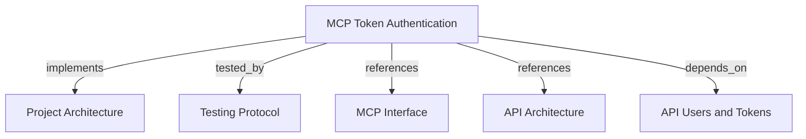

# MCP Token Authentication

Authenticate MCP clients with opaque bearer tokens issued by the REST API.

```graph
{
  "node_id": "feature:mcp-token-authentication",
  "domain": "mcp-token-authentication",
  "implements": ["adr:architecture"],
  "tested_by": ["adr:tests"],
  "references": ["adr:mcp", "adr:api"],
  "depends_on": ["feature:api-users-tokens"],
  "entrypoints": ["harness_memory_mcp/server/app.py"],
  "registration_files": ["harness_memory_mcp/server/factory.py", "docker-compose.yml"],
  "reference_files": ["harness_memory_mcp/services/database_token_verifier.py", "core/infrastructure/postgres/repositories/api_token_repository.py", "core/infrastructure/postgres/repositories/api_service_account_repository.py"],
  "code_files": ["harness_memory_mcp/config.py", "api/application/ports/token_repository.py", "api/domain/entities/service_account.py", "api/domain/entities/access_token.py", "core/infrastructure/postgres/models/api_service_account.py", "core/domain/tenant_security/types/memory_scope.py"],
  "test_files": ["tests/unit/mcp/services/test_database_token_verifier.py", "tests/unit/mcp/server/test_factory.py", "tests/unit/mcp/test_config.py", "tests/integration/api/infrastructure/test_repositories.py", "tests/e2e/api/test_user_token_crud.py", "tests/e2e/mcp/test_api_token_authentication.py"]
}
```

## OVERVIEW

Use an API-issued token only as **MCP bearer authentication**. Reject blank credentials, hash every other presented token, load its active database record and owner, then create the FastMCP identity without exposing the stored digest.

## FOLDER STRUCTURE

<folder_structure>
```text
harness_memory_mcp/
├── services/             # Opaque-token verification adapter
├── server/               # Authentication composition
└── config.py             # Authentication mode selection
core/infrastructure/postgres/ # Active-token lookup
```
</folder_structure>

## AUTHENTICATION FLOW

1. Create either a user through `POST /v1/users` or a service account through `POST /v1/service-accounts`.
2. Create a token through `POST /v1/tokens` for exactly one owner. Omit `expires_at` for a non-expiring service-account token.
3. Configure the MCP client with `Authorization: Bearer <token>`.
4. Connect the client to `http://localhost:8000/mcp`.

The verifier maps the token owner's ID to `sub`. User tokens use the user ID as `tenant_id`; service-account tokens use the service account's assigned tenant. Current API tokens receive `memory:read`, `memory:publish`, and `memory:impact` scopes because role management is outside this feature.

## CONFIGURATION

| Name | Type | Required | Description | Default |
|------|------|----------|-------------|---------|
| `MCP_AUTH_MODE` | `database` or `jwt` | No | Select opaque database tokens or external JWT verification. | `jwt` |
| `DATABASE_URL` | PostgreSQL URL | Database mode: Yes | Load active token and its user or service-account owner. | None |

## SECURITY RULES

REQUIRED: Compare only SHA-256 token digests in persistence.
REQUIRED: Reject unknown, deleted, or expired tokens with HTTP 401; treat a null expiry as non-expiring.
REQUIRED: Resolve subject and tenant from the stored token owner.
REQUIRED: Reject active token records with missing token or owner data before creating a principal.
PROHIBITED: Accept user or tenant identity from MCP request payloads.
PROHIBITED: Use API tokens to authenticate REST API endpoints.

## DOCUMENT MAP



## REFERENCES

- [**ARCHITECTURE.md**](../../adr/ARCHITECTURE.md): Defines adapter and persistence boundaries.
- [**TESTS.md**](../../adr/TESTS.md): Defines verification tiers.
- [**MCP.md**](../../adr/MCP.md): Defines MCP transport and component contracts.
- [**API.md**](../../adr/API.md): Defines issuance and ownership of MCP bearer tokens.
- [**users-and-tokens.md**](../api/users-and-tokens.md): Defines token issuance and lifecycle.
