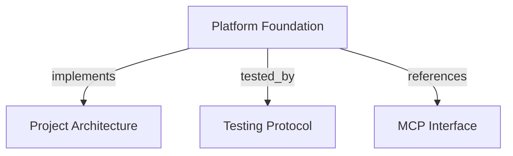

```graph
{
  "node_id": "feature:platform-foundation",
  "domain": "platform_foundation",
  "implements": ["adr:architecture"],
  "tested_by": ["adr:tests"],
  "entrypoints": ["mcp/cli.py", "mcp/server/app.py"],
  "registration_files": ["mcp/server/factory.py", "pyproject.toml"],
  "reference_files": ["core/infrastructure/postgres/engine_factory.py", "core/infrastructure/architecture/validator.py"],
  "code_files": [
    "mcp/config.py",
    "mcp/migration_cli.py",
    "mcp/migration_mode.py",
    "core/infrastructure/architecture/rules.py",
    "core/infrastructure/architecture/violation.py",
    "core/infrastructure/postgres/alembic_runtime.py",
    "core/infrastructure/postgres/config.py",
    "core/infrastructure/postgres/create_postgres_engine.py",
    "core/infrastructure/postgres/inspect_migration_status.py",
    "core/infrastructure/postgres/migrations.py",
    "core/infrastructure/postgres/migrations_status.py",
    "core/infrastructure/postgres/upgrade_database.py",
    "core/infrastructure/postgres/models/base.py",
    "core/infrastructure/postgres/models/entity.py",
    "core/infrastructure/postgres/models/evidence.py",
    "core/infrastructure/postgres/models/foundation_id.py",
    "core/infrastructure/postgres/models/metadata.py",
    "core/infrastructure/postgres/models/metadata_type.py",
    "core/infrastructure/postgres/models/project.py",
    "core/infrastructure/postgres/models/relation.py",
    "core/infrastructure/postgres/models/snapshot.py",
    "core/infrastructure/postgres/models/types.py",
    "migrations/env.py",
    "migrations/versions/initial_foundation.py"
  ],
  "test_files": [
    "tests/unit/architecture/test_rules.py",
    "tests/unit/core/infrastructure/postgres/test_config.py",
    "tests/unit/core/infrastructure/postgres/test_engine_factory.py",
    "tests/unit/core/infrastructure/postgres/test_migrations.py",
    "tests/unit/core/infrastructure/postgres/models/test_schema.py",
    "tests/unit/core/infrastructure/postgres/models/test_types.py",
    "tests/unit/mcp/test_cli.py",
    "tests/unit/mcp/test_config.py",
    "tests/unit/mcp/server/test_factory.py",
    "tests/integration/migrations/test_initial_foundation.py",
    "tests/e2e/mcp/test_catalog.py",
    "tests/e2e/mcp/test_import.py"
  ]
}
```

# Platform Foundation
Provide the runnable backend structure, persistence schema, migration boundary, and verification base for Harness Memory.

## OVERVIEW

Use **pragmatic DDD** with domain-grouped application code. Keep **FastMCP** at the transport edge, **PostgreSQL** and **Alembic** in infrastructure, and dependencies pointed inward.

## FOLDER STRUCTURE

```text
mcp/                         # Runtime, CLI, and transport adapters
core/application/             # Feature use cases and ports
core/domain/                  # Business invariants and value objects
core/infrastructure/postgres/ # Database configuration and adapters
migrations/                   # Versioned schema revisions
tests/{unit,integration,e2e}/  # Mirrored verification tiers
```

## BOUNDARIES

- REQUIRED: Build the FastMCP server without connecting to PostgreSQL or running migrations.
- REQUIRED: **Run schema changes** through `harness-memory migrate`; use `--status` for read-only revision inspection.
- PROHIBITED: Put business rules or SQL in MCP tools, or make server startup create schema.
- REQUIRED: Keep the initial schema tenant-scoped across `projects`, `snapshots`, `entities`, `relations`, and `evidence`.

## PARAMETERS / CONFIGURATIONS

| Setting | Type | Default | Rule |
|---|---|---|---|
| `MCP_HOST` | string | `127.0.0.1` | REQUIRED: Trim and reject empty values. |
| `MCP_PORT` | integer | `8000` | REQUIRED: Accept `1`–`65535`. |
| `DATABASE_URL` | secret URL | unset | REQUIRED: Supply PostgreSQL `psycopg2` URL before database operations. |

## HOW TO EXTEND

1. Add domain behavior and application ports under the feature's domain package.
2. Implement PostgreSQL adapters without importing them into domain code.
3. Register each MCP feature through `mcp/server/factory.py`; add owned schema changes as reversible Alembic revisions.
4. Add tests under matching `tests/unit/`, `tests/integration/`, and `tests/e2e/` paths.

## KNOWN GAPS

- REQUIRED: Harden migration error redaction; quoted database usernames can leave part of the name in output.
- REQUIRED: Extend architecture checks to resolve relative imports; current validation can miss prohibited relative dependencies.
- REQUIRED: Correct the composite active-snapshot foreign-key delete action; its `SET NULL` may target non-null Project identity columns.

## DOCUMENT MAP



## REFERENCES

- [**ARCHITECTURE.md**](../adr/ARCHITECTURE.md): Defines layer ownership and dependency direction.
- [**TESTS.md**](../adr/TESTS.md): Defines the project test strategy and coverage policy.
- [**MCP.md**](../adr/MCP.md): Defines server, tool, and context boundaries.
