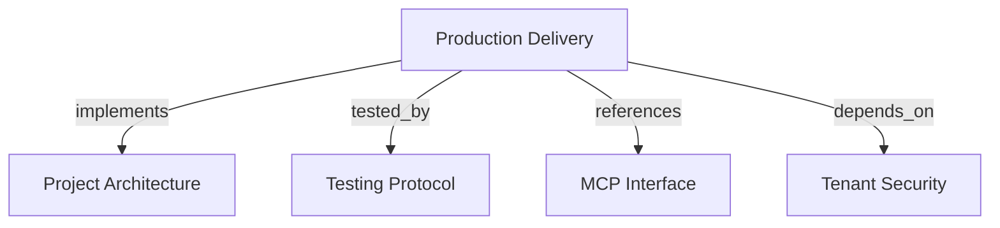

# Production Delivery
Package and operate Harness Memory as a non-root, migration-gated, observable MCP HTTP service.

```graph
{
  "node_id": "feature:production-delivery",
  "domain": "production_delivery",
  "implements": ["adr:architecture"],
  "tested_by": ["adr:tests"],
  "entrypoints": ["mcp/server/app.py"],
  "registration_files": [],
  "reference_files": [
    "core/infrastructure/postgres/schema_compatibility_checker.py",
    "core/infrastructure/postgres/verify_startup_schema.py",
    "core/infrastructure/telemetry/telemetry_tracer.py",
    "mcp/server/server_lifespan_manager.py"
  ],
  "code_files": [
    ".dockerignore",
    "Dockerfile",
    "docker-compose.yml",
    ".github/workflows/ci.yml",
    "pyproject.toml",
    "core/domain/platform/schema_compatibility_error.py",
    "core/domain/platform/schema_compatibility_status.py",
    "core/domain/platform/schema_incompatible_error.py",
    "core/domain/platform/trace_correlation_id.py",
    "core/infrastructure/telemetry/telemetry_span_sanitizer.py",
    "core/infrastructure/telemetry/tracer_provider.py",
    "mcp/config.py",
    "mcp/docker_config.py",
    "mcp/server/factory.py",
    "mcp/services/telemetry_middleware.py",
    "mcp/services/trace_context_extractor.py",
    "mcp/services/trace_context_holder.py"
  ],
  "test_files": [
    "tests/e2e/docker/test_dockerfile.py",
    "tests/integration/core/infrastructure/postgres/test_startup_schema_compatibility.py",
    "tests/integration/mcp/services/test_telemetry_integration.py",
    "tests/integration/mcp/test_production_config.py",
    "tests/unit/core/domain/platform/test_schema_compatibility_status.py",
    "tests/unit/core/infrastructure/postgres/test_schema_compatibility_checker.py",
    "tests/unit/core/infrastructure/telemetry/test_telemetry_span_sanitizer.py",
    "tests/unit/core/infrastructure/telemetry/test_tracer_provider.py",
    "tests/unit/mcp/server/test_server_lifespan_manager.py",
    "tests/unit/mcp/server/test_server_lifespan_registration.py",
    "tests/unit/mcp/server/test_server_startup_schema.py",
    "tests/unit/mcp/services/test_telemetry_middleware.py",
    "tests/unit/mcp/services/test_trace_context_extractor.py",
    "tests/unit/mcp/test_docker_config.py",
    "tests/unit/architecture/test_rules.py",
    "tests/unit/core/infrastructure/postgres/repositories/test_impact_result_budget.py",
    "tests/unit/production_delivery/test_ci_workflow.py"
  ]
}
```

## OVERVIEW

Build a Python 3.12 slim image with `appuser` UID `10001`. Compose separates PostgreSQL, explicit migration, and MCP services.

Check Alembic compatibility during server lifespan startup. Keep startup fail-closed and never run implicit migrations.

## FOLDER STRUCTURE

```text
Dockerfile and docker-compose.yml       # Non-root runtime and local service graph
core/domain/platform/                   # Immutable schema status and startup error
core/infrastructure/postgres/           # Alembic inspection and startup verification
core/infrastructure/telemetry/          # NoOp-safe span adapters and sanitization
mcp/server/ and mcp/services/           # Lifespan, HTTP runtime, tracing middleware
.github/workflows/                      # Ruff, migrations, test tiers, coverage
tests/{unit,integration,e2e}/           # Delivery, startup, telemetry, and Docker checks
```

## MAIN CONCEPTS / COMPONENTS

- **Runtime image**: Exclude development and test artifacts; execute as non-root.
- **Schema gate**: Compare current Alembic revision with head before serving requests.
- **Telemetry boundary**: Record bounded tool and trace-correlation fields; use NoOp when no exporter exists.
- **CI gate**: Run lint, migration, unit, integration, E2E, and branch coverage jobs.

## HOW TO OPERATE

1. Run `docker compose up --build` to start PostgreSQL, migration, and MCP services.
2. Run `harness-memory migrate --status` to inspect revision state without mutation.
3. Run local pytest tiers through `./venv/bin/python -m pytest` before changing runtime behavior.
4. Keep production configuration complete before starting HTTP mode.

## PARAMETERS / CONFIGURATIONS

| Name | Type | Required | Description | Default |
|------|------|----------|-------------|---------|
| `MCP_PRODUCTION` | boolean | Production only | Enables production runtime validation. | `false` |
| `DATABASE_URL` | secret URL | Production only | PostgreSQL connection used by lifespan and migrations. | unset |
| `MCP_HOST` | string | No | HTTP bind host. | `0.0.0.0` in production |
| `MCP_PORT` | integer | No | HTTP bind port. | `8000` |

## BEST PRACTICES

REQUIRED: Run migrations as an explicit service or CLI operation before runtime startup.
REQUIRED: Sanitize telemetry attributes and trace correlation before export or audit use.
REQUIRED: Keep CI integration checks on PostgreSQL, gate the repository source tree's architecture rules, and enforce global 80% branch coverage.
PROHIBITED: Run the server as root or auto-create/upgrade production schema during startup.
PROHIBITED: Export bearer tokens, claims, payloads, evidence, credentials, or database URLs.

## TIPS

Use `harness-memory migrate --status` when diagnosing a startup schema mismatch.

## DOCUMENT MAP



## REFERENCES

- [**ARCHITECTURE.md**](../adr/ARCHITECTURE.md): Defines runtime layers and integration ownership.
- [**TESTS.md**](../adr/TESTS.md): Defines CI, migration, and coverage checks.
- [**MCP.md**](../adr/MCP.md): Defines HTTP interface and security boundaries.
- [**tenant-security.md**](./tenant-security.md): Supplies authenticated production context and audit contracts.
