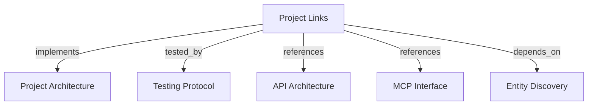

```graph
{"node_id":"feature:project-links","domain":"project_links","implements":["adr:architecture"],"tested_by":["adr:tests"],"entrypoints":["web/src/components/project-link-panel.tsx","api/adapters/http/project_link_routes.py","harness_memory_mcp/tools/search_projects.py"],"registration_files":["api/server/app.py","web/src/app/actions/project-links.ts"],"reference_files":["core/domain/project_link/entities/project_link.py","core/domain/project_link/value_objects/canonical_project_pair.py","core/infrastructure/postgres/repositories/project_link_repository.py"],"code_files":["core/domain/project_link/events/project_linked.py","core/domain/project_link/events/project_unlinked.py","core/infrastructure/postgres/models/project_link.py","migrations/versions/001_foundation.py","migrations/versions/002_indexes_and_relationships.py","core/application/entity_discovery/contracts/project_link_item.py","core/application/entity_discovery/contracts/project_search_item.py","core/infrastructure/postgres/repositories/knowledge_read_repository.py","api/application/ports/project_link_repository.py","api/application/services/project_link_management_service.py","api/adapters/http/schemas/project_link_create.py","api/adapters/http/schemas/project_link_response.py","web/src/application/ports/harness-api-client.port.ts","web/src/infrastructure/api/rest-harness-api-client.ts","web/src/components/project-table.tsx"],"test_files":["tests/unit/core/domain/project_link/value_objects/test_canonical_project_pair.py","tests/unit/core/domain/project_link/entities/test_project_link.py","tests/integration/core/infrastructure/postgres/models/test_project_link_model.py","tests/integration/core/infrastructure/postgres/repositories/test_project_link_repository.py","tests/unit/api/application/services/test_project_link_management_service.py","tests/unit/api/adapters/http/test_project_link_routes.py","tests/e2e/test_project_links_api.py","tests/unit/core/application/entity_discovery/contracts/test_project_link_item.py","tests/unit/core/application/entity_discovery/contracts/test_project_search_item.py","tests/integration/core/infrastructure/postgres/repositories/test_knowledge_read_repository_search_projects_links.py","tests/unit/mcp/tools/test_search_projects.py","tests/e2e/test_mcp_search_projects_links.py","web/tests/unit/domain/project-link-types.test.ts","web/tests/unit/infrastructure/rest-harness-api-client-project-links.test.ts","web/tests/unit/application/project-links.action.test.ts","web/tests/unit/components/project-link-panel.test.tsx","web/tests/unit/components/project-table-links.test.tsx","web/tests/e2e/project-links.spec.ts"]}
```

# Project Links

## OVERVIEW

Project links establish bidirectional associations between two projects across intra-tenant and cross-tenant boundaries. Link management is exposed via admin REST endpoints and Web UI, while MCP tools provide read-only consumption through `search_projects`.

## FOLDER STRUCTURE

<folder_structure>
```text
core/
├── domain/project_link/           # CanonicalProjectPair, ProjectLink entity, events
├── application/entity_discovery/  # ProjectLinkItem and ProjectSearchItem contracts
└── infrastructure/postgres/       # ProjectLinkModel and PostgreSQL repositories
api/
├── adapters/http/                 # REST routes and Pydantic schemas
└── application/                   # Service and repository ports
web/src/
├── app/actions/                   # Next.js server actions for link mutations
└── components/                    # ProjectLinkPanel UI and table triggers
harness_memory_mcp/tools/          # MCP search_projects tool with links enrichment
```
</folder_structure>

## MAIN CONCEPTS / COMPONENTS

- **Bidirectional Canonical Pair**: `CanonicalProjectPair` normalizes UUID pairs deterministically (`project_a_id < project_b_id`) to enforce logical uniqueness.
- **Cross-Tenant Associations**: Links connect projects regardless of whether their tenant IDs match.
- **Isolation Boundary**: Creating a project link creates an explicit association only. It never grants implicit access, inheritance, or sharing of entities, documents, or snapshots.
- **Cascading Deletion**: Deleting a project automatically cascades to remove associated project link records.
- **Read-Only MCP Exposure**: MCP `search_projects` resolves bidirectional links in batch and serializes them in a `links` array.

## HOW TO MANAGE PROJECT LINKS

### Prerequisites
1. Both origin and target projects must exist in PostgreSQL.
2. Operator must authenticate using administrative credentials.

### Steps to Link Projects via Web
1. Open the project row trigger in `ProjectTable` to display `ProjectLinkPanel`.
2. Select the target project across available tenants.
3. Submit the link creation action to persist the normalized pair.

<code_example>
# CORRECT: Normalize pair deterministically before persistence
pair = CanonicalProjectPair(project_a_id=min(id_1, id_2), project_b_id=max(id_1, id_2))

# WRONG: Persisting non-canonical order allowing duplicate pairs
link = ProjectLink(project_a_id=id_1, project_b_id=id_2)
</code_example>

## PARAMETERS / CONFIGURATIONS

| Parameter | Type | Required | Description | Default |
|-----------|------|----------|-------------|---------|
| `target_project_key` | string | Yes | Unique project key of target project | — |
| `target_tenant_id` | UUID | No | Tenant UUID when linking cross-tenant | Origin tenant |
| `links` (MCP response) | array | Yes | Array of `{project_id, name, tenant_id}` | `[]` |

## BEST PRACTICES

REQUIRED: Normalize link pairs with `CanonicalProjectPair` to enforce `project_a_id < project_b_id`.
REQUIRED: Enforce database-level uniqueness `UNIQUE (project_a_id, project_b_id)` and check `CHECK (project_a_id <> project_b_id)`.
REQUIRED: Return `links: []` when a project has no associations; never return null or omit the property in MCP responses.
REQUIRED: Keep link management operations restricted to REST API and Web admin; keep MCP read-only.
FORBIDDEN: Allowing self-referencing links (`project_a_id == project_b_id`).
FORBIDDEN: Granting implicit data access or permissions across linked projects.

## DOCUMENT MAP



## REFERENCES

- [**ARCHITECTURE.md**](../adr/ARCHITECTURE.md): Global layer boundaries and hexagonal architecture rules.
- [**TESTS.md**](../adr/TESTS.md): Test tiers, execution commands, and coverage gates.
- [**API.md**](../adr/API.md): REST management endpoints and route security.
- [**MCP.md**](../adr/MCP.md): Read-only FastMCP tool contracts.
- [**entity-discovery.md**](./core/entity-discovery.md): Project search use case and discovery repository.
