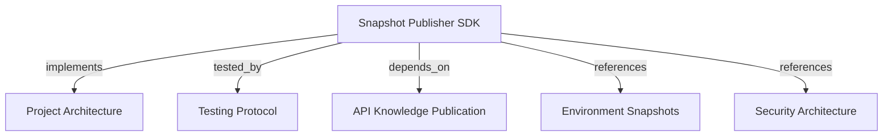

# Snapshot Publisher SDK
Extract repository context, synthesize knowledge graph via local LLM, validate schema, and publish snapshots over REST.

```graph
{
  "node_id": "feature:snapshot-publisher",
  "domain": "snapshot_publisher",
  "implements": ["adr:architecture"],
  "tested_by": ["adr:tests"],
  "entrypoints": ["sdk/src/cli/index.ts", "sdk/src/index.ts"],
  "registration_files": [
    "sdk/package.json",
    "sdk/src/cli/cli-app.ts",
    "sdk/src/infrastructure/llm/agent-runner-factory.ts"
  ],
  "reference_files": [
    "sdk/src/application/publish-snapshot/publish-snapshot.use-case.ts",
    "sdk/src/application/publish-snapshot/phases/abstract-publication-phase.ts",
    "sdk/src/infrastructure/api/rest-publication-client.ts",
    "sdk/src/infrastructure/validator/graph-validator.ts"
  ],
  "code_files": [
    "sdk/src/application/publish-snapshot/phases/publication-phase-context.ts",
    "sdk/src/application/publish-snapshot/phases/validate-options-phase.ts",
    "sdk/src/application/publish-snapshot/phases/collect-context-phase.ts",
    "sdk/src/application/publish-snapshot/phases/generate-with-docs-phase.ts",
    "sdk/src/application/publish-snapshot/phases/route-documentation-phase.ts",
    "sdk/src/application/publish-snapshot/phases/validate-graph-phase.ts",
    "sdk/src/application/publish-snapshot/phases/publish-phase.ts",
    "sdk/src/application/memory/project-memory-workflow.ts",
    "sdk/src/application/memory/project-memory-completeness.ts",
    "sdk/src/application/memory/project-memory-prompt.ts",
    "sdk/src/application/memory/memory-graph.ts",
    "sdk/src/application/memory/memory-document-validator.ts",
    "sdk/src/application/memory/document-content-codec.ts",
    "sdk/src/application/ports/docs-store.port.ts",
    "sdk/src/application/ports/documentation-directory.port.ts",
    "sdk/src/application/ports/memory-workflow.port.ts",
    "sdk/src/application/ports/publication-baseline.port.ts",
    "sdk/src/infrastructure/memory/local-docs-store.ts",
    "sdk/src/infrastructure/memory/local-docs-directory.ts",
    "sdk/src/infrastructure/api/publication-baseline-client.ts",
    "sdk/src/application/ports/llm-runner.port.ts",
    "sdk/src/application/ports/publication-client.port.ts",
    "sdk/src/domain/contracts.ts",
    "sdk/src/domain/exit-code.ts",
    "sdk/src/domain/llm-agent.ts",
    "sdk/src/domain/publisher-error.ts",
    "sdk/src/infrastructure/config/config-resolver.ts",
    "sdk/src/infrastructure/git/git-context-collector.ts",
    "sdk/src/infrastructure/llm/llm-agent-runner.ts",
    "sdk/src/infrastructure/llm/codex-cli-runner.ts",
    "sdk/src/infrastructure/llm/claude-cli-runner.ts",
    "sdk/src/infrastructure/llm/local-llm-runner.ts"
  ],
  "test_files": [
    "sdk/tests/unit/application/publish-snapshot/publish-snapshot-phases.test.ts",
    "sdk/tests/unit/application/memory/memory-graph.test.ts",
    "sdk/tests/unit/application/memory/memory-document-validator.test.ts",
    "sdk/tests/unit/application/memory/document-content-codec.test.ts",
    "sdk/tests/unit/application/memory/project-memory-workflow.test.ts",
    "sdk/tests/unit/infrastructure/api/publication-baseline-client.test.ts",
    "sdk/tests/integration/infrastructure/memory/local-docs-store.test.ts",
    "sdk/tests/unit/application/publish-snapshot.use-case.test.ts",
    "sdk/tests/unit/cli/cli-app.test.ts",
    "sdk/tests/unit/infrastructure/api/rest-publication-client.test.ts",
    "sdk/tests/unit/infrastructure/git/git-context-collector.test.ts",
    "sdk/tests/unit/infrastructure/llm/agent-runner-factory.test.ts",
    "sdk/tests/unit/infrastructure/llm/codex-cli-runner.test.ts",
    "sdk/tests/unit/infrastructure/llm/claude-cli-runner.test.ts",
    "sdk/tests/unit/infrastructure/llm/local-llm-runner.test.ts",
    "sdk/tests/unit/infrastructure/validator/graph-validator.test.ts",
    "sdk/tests/integration/child-process-llm.test.ts",
    "sdk/tests/integration/http-publication-boundary.test.ts",
    "sdk/tests/e2e/cli-publish.test.ts"
  ]
}
```

## OVERVIEW

The SDK collects Git context, validates generated graphs, and publishes through REST.

## FOLDER STRUCTURE

```text
sdk/
  src/{domain,application,infrastructure,cli}/
  tests/{unit,integration,e2e}/
```

## MAIN CONCEPTS / COMPONENTS

- **Publication phases**: `PublishSnapshotUseCase` chains option, Git, document, graph, and publication handlers.
- **Memory workflow**: Complete local docs are required. Load them with the baseline, validate the graph, and publish corporate memory. Run model synthesis only when ADR or feature documents change; ignore whitespace-only changes. First publication runs synthesis.
- **Deployment identity**: Reuse an explicit CLI, config, environment, or CI ID for retries. Otherwise generate an ID from project key, UTC timestamp, and UUID.
- **Dry run**: Returns validation metadata without REST. A failed phase preserves its error.
- **Git collector**: Collect files and diffs within path and size limits. `--exclude-paths` skips paths; never exclude `docs/`.
- **Agent runners**: Select `codex-cli` or `claude-cli`; sanitize child environments and handle backpressure. Use `cmd.exe` for Windows npm shims. Cap Codex input at 1,048,576 serialized characters.
- **Validator**: Check Schema 1.0, canonicalize `canonical_key`, and compute SHA-256.
- **REST client**: Publish with `memory:publish`; retry 429/5xx with jitter.
- **CLI progress**: Report phases to stderr; keep JSON on stdout. `--debug` adds timings and redacted diagnostics; `--verbose` prints repository and target.
- **Exit codes**: Map domain failures to stable CLI statuses.

## HOW TO PUBLISH SNAPSHOTS

### Project memory process

1. Generate project documentation with the [harness-kit `project-memory` skill](https://github.com/romabeckman/harness-kit) before publishing.
2. Collect Git context and require `docs/`. If missing, stop and show the documentation setup guidance.
3. Load the authenticated project/environment baseline (HTTP 404 means none) and local docs, including untracked files. Complete docs are authoritative; source content is not sent to Codex.
4. Compare document text under `docs/adr/` and `docs/feature/` with the baseline. Ignore spaces, tabs, and line breaks; treat any other character or document-set change as a change. Skip model synthesis when there is no baseline difference.
5. Publish Markdown under `docs/adr/` and `docs/feature/`, plus `docs/.digest.md`, as document entities. Store `docs/.graph.json` in snapshot `metadata`.
6. Reconcile document content and history. Store initial docs in `document_revision.metadata.content`; store later changed lines in `content` with Git merge conflict markers in `metadata.conflict_marker`.
7. Validate the graph before publishing. `--dry-run` skips publication.

### Storage and history

REQUIRED: Store docs in **entities, relations, and evidence**, never `project_memory`. Preserve path, full Markdown, SHA-256, source commit, and change state. Split large docs into ordered `document_section` entities with `part_of` edges and checksums; decode exact text.

Publish only `adr`, `feature`, `document`, `document_revision`, and `document_section` entities. Exclude README, BUSINESS, specs, and extracted rules. Immutable snapshots preserve history; line revisions retain both versions with conflict markers.

REQUIRED: Filter unsupported legacy entities and dangling relations before republishing.

### Prerequisites
1. Node.js 20+ with the selected CLI (`codex` or `claude`) in `PATH`.
2. User or service-account token with `memory:publish` in `HARNESS_MEMORY_API_KEY`, or supply a token through `--token-env` or the programmatic `token` option.

### Steps
1. Set `--agent codex-cli` or `--agent claude-cli`, plus model and publication settings.
2. Run publication via CLI or programmatic use case.

Programmatic callers pass `ProjectMemoryWorkflow` and `LocalDocsDirectory` to `PublishSnapshotUseCase`; see `CliApp`.

## PARAMETERS / CONFIGURATIONS

| Option | Env Var | Required | Description | Default |
|--------|---------|----------|-------------|---------|
| `--agent` | `HARNESS_MEMORY_AGENT` | Yes | `codex-cli` or `claude-cli`; JSON config may supply it | — |
| `--environment` | `HARNESS_MEMORY_ENVIRONMENT` | Yes | Target deployment environment | — |
| `--project-key` | `HARNESS_MEMORY_PROJECT_KEY` | Yes | Target project identifier | — |
| `--deployment-id` | `HARNESS_MEMORY_DEPLOYMENT_ID` | No | Deployment execution ID; CLI, config, environment, and CI values take precedence | Project key + UTC timestamp + UUID |
| `--version` | `HARNESS_MEMORY_VERSION` | Yes | Release version / git SHA | CI fallback |
| `--api-url` | `HARNESS_MEMORY_API_URL` | Yes | Harness Memory API endpoint | — |
| `--token-env` | `HARNESS_MEMORY_TOKEN_ENV` | No | Token env var name | `HARNESS_MEMORY_API_KEY` |
| `--dry-run` | `HARNESS_MEMORY_DRY_RUN` | No | Synthesize without publish | `false` |
| `--exclude-paths` | `HARNESS_MEMORY_EXCLUDE_PATHS` | No | Comma-separated repository-relative source paths; JSON config and SDK accept `excludePaths` arrays | — |
| `--output` | `HARNESS_MEMORY_OUTPUT` | No | Format: `json` or `text` | `json` in CI |
| `--verbose` | `HARNESS_MEMORY_VERBOSE` | No | Print repository and target to stderr | `false` |
| `--debug` | `HARNESS_MEMORY_DEBUG` | No | Print phase times, memory diagnostics, and redacted error stacks to stderr | `false` |

## EXIT CODES

| Code | Name | Cause |
|------|------|-------|
| `0` | `SUCCESS` | Published or validated |
| `2` | `USAGE_OR_CONFIG` | Invalid options |
| `3` | `CONTEXT_COLLECTION` | Git, path, or budget failure |
| `4` | `LLM_EXECUTION` | Runner failure |
| `5` | `VALIDATION` | Invalid graph |
| `6` | `API_AUTH` | 401/403 |
| `7` | `CONFLICT` | 409 |
| `8` | `API_SERVER_OR_RETRY_EXHAUSTED` | Server failure |
| `130` | `INTERRUPTED` | Signal |

## BEST PRACTICES

REQUIRED: Use `HARNESS_MEMORY_API_KEY` by default. When absent, provide another credential through `--token-env` or the programmatic `token` option. Forbidden flags (`--tenant`, `--token`) exit with code 2.
REQUIRED: Sanitize child LLM process environment and stdin to prevent token leakage.
REQUIRED: Check symlink targets before reading file contents to prevent filesystem traversal.
REQUIRED: Handle backpressure on stdin stream using `drain` events during chunked transfer.
PROHIBITED: Publishing knowledge snapshots over interactive MCP tool channels.
PROHIBITED: Retrying on HTTP 400, 401, 403, or 409 response codes.

## TIPS

Use `--dry-run` to validate. `CliApp` enables memory by default; the fifth `PublishSnapshotUseCase` argument supplies the workflow.

## DOCUMENT MAP



## REFERENCES

- [**ARCHITECTURE.md**](../../adr/ARCHITECTURE.md): Global module map and hexagonal architecture boundaries.
- [**TESTS.md**](../../adr/TESTS.md): Vitest and pytest test tiers and coverage thresholds.
- [**knowledge-publication.md**](../api/knowledge-publication.md): REST contract for `POST /v1/knowledge-publications`.
- [**environment-snapshots.md**](../core/environment-snapshots.md): Environment lifecycle and immutable snapshot rules.
- [**SECURITY.md**](../../adr/SECURITY.md): Scope policy, service-account authentication, and secret sanitization.
