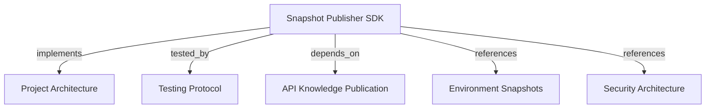

# Snapshot Publisher SDK
Extract repository context, synthesize knowledge graph via local LLM, validate schema, and publish snapshots over REST.

```graph
{"node_id":"feature:snapshot-publisher","domain":"snapshot_publisher","implements":["adr:architecture"],"tested_by":["adr:tests"],"entrypoints":["sdk/src/cli/index.ts","sdk/src/index.ts"],"registration_files":["sdk/package.json","sdk/src/cli/cli-app.ts","sdk/src/infrastructure/llm/agent-runner-factory.ts"],"reference_files":["sdk/src/application/publish-snapshot/publish-snapshot.use-case.ts","sdk/src/application/publish-snapshot/phases/abstract-publication-phase.ts","sdk/src/infrastructure/api/rest-publication-client.ts","sdk/src/infrastructure/validator/graph-validator.ts"],"code_files":["sdk/src/application/publish-snapshot/phases/publication-phase-context.ts","sdk/src/application/publish-snapshot/phases/validate-options-phase.ts","sdk/src/application/publish-snapshot/phases/validate-publication-target-phase.ts","sdk/src/application/publish-snapshot/phases/collect-context-phase.ts","sdk/src/application/publish-snapshot/phases/generate-with-docs-phase.ts","sdk/src/application/publish-snapshot/phases/route-documentation-phase.ts","sdk/src/application/publish-snapshot/phases/validate-graph-phase.ts","sdk/src/application/publish-snapshot/phases/publish-phase.ts","sdk/src/application/memory/project-memory-workflow.ts","sdk/src/application/memory/project-memory-completeness.ts","sdk/src/application/memory/project-memory-prompt.ts","sdk/src/application/memory/memory-graph.ts","sdk/src/application/memory/memory-document-validator.ts","sdk/src/application/memory/document-content-codec.ts","sdk/src/application/ports/docs-store.port.ts","sdk/src/application/ports/documentation-directory.port.ts","sdk/src/application/ports/memory-workflow.port.ts","sdk/src/application/ports/publication-baseline.port.ts","sdk/src/infrastructure/memory/local-docs-store.ts","sdk/src/infrastructure/memory/local-docs-directory.ts","sdk/src/infrastructure/api/publication-baseline-client.ts","sdk/src/application/ports/llm-runner.port.ts","sdk/src/application/ports/publication-client.port.ts","sdk/src/domain/contracts.ts","sdk/src/domain/exit-code.ts","sdk/src/domain/llm-agent.ts","sdk/src/domain/publisher-error.ts","sdk/src/infrastructure/config/config-resolver.ts","sdk/src/infrastructure/git/git-context-collector.ts","sdk/src/infrastructure/llm/llm-agent-runner.ts","sdk/src/infrastructure/llm/codex-cli-runner.ts","sdk/src/infrastructure/llm/claude-cli-runner.ts","sdk/src/infrastructure/llm/antigravity-cli-runner.ts","sdk/src/infrastructure/llm/copilot-cli-runner.ts","sdk/src/infrastructure/llm/local-llm-runner.ts"],"test_files":["sdk/tests/unit/application/publish-snapshot/publish-snapshot-phases.test.ts","sdk/tests/unit/application/memory/memory-graph.test.ts","sdk/tests/unit/application/memory/memory-document-validator.test.ts","sdk/tests/unit/application/memory/document-content-codec.test.ts","sdk/tests/unit/application/memory/project-memory-workflow.test.ts","sdk/tests/unit/infrastructure/api/publication-baseline-client.test.ts","sdk/tests/integration/infrastructure/memory/local-docs-store.test.ts","sdk/tests/unit/application/publish-snapshot.use-case.test.ts","sdk/tests/unit/cli/cli-app.test.ts","sdk/tests/unit/infrastructure/api/rest-publication-client.test.ts","sdk/tests/unit/infrastructure/git/git-context-collector.test.ts","sdk/tests/unit/infrastructure/llm/agent-runner-factory.test.ts","sdk/tests/unit/infrastructure/llm/codex-cli-runner.test.ts","sdk/tests/unit/infrastructure/llm/claude-cli-runner.test.ts","sdk/tests/unit/infrastructure/llm/antigravity-cli-runner.test.ts","sdk/tests/unit/infrastructure/llm/copilot-cli-runner.test.ts","sdk/tests/unit/infrastructure/llm/local-llm-runner.test.ts","sdk/tests/unit/infrastructure/validator/graph-validator.test.ts","sdk/tests/integration/child-process-llm.test.ts","sdk/tests/integration/http-publication-boundary.test.ts","sdk/tests/e2e/cli-publish.test.ts"]}
```

## OVERVIEW

The SDK collects Git context, validates generated graphs, and publishes through REST.

## KNOWLEDGE

```json
{"schema_version":1,"entities":[{"id":"contract:temporary-llm-graph-output","type":"contract","label":"Temporary LLM graph output","definition":"The SDK prompt identifies a per-invocation temporary JSON file for the generated graph.","aliases":[]},{"id":"rule:temporary-output-cleanup","type":"rule","label":"Temporary output cleanup","definition":"The SDK removes its per-invocation temporary output directory after the LLM run.","aliases":[]}],"claims":[{"id":"claim:llm-graph-file-contract","subject":"contract:temporary-llm-graph-output","relation":null,"object":null,"statement":"Each invocation includes an absolute graph-output.json path in the prompt, runs the selected CLI from that temporary directory, parses the file when present, and falls back to provider stdout when the file is absent.","kind":"observation","status":"supported","evidence":[{"kind":"code","source":"sdk/src/infrastructure/llm/local-llm-runner.ts","locator":"LocalLlmRunner.run, runWithTemporaryOutput, readTemporaryGraph","snapshot":null},{"kind":"test_definition","source":"sdk/tests/unit/infrastructure/llm/local-llm-runner.test.ts","locator":"reads the graph from the prompted temporary JSON file when stdout has no graph; runs node script as fake llm and parses json stdout","snapshot":null}],"derived_from":[],"gap":null},{"id":"claim:temporary-output-cleanup","subject":"rule:temporary-output-cleanup","relation":null,"object":null,"statement":"The runner removes the temporary output directory after the child process succeeds or fails.","kind":"observation","status":"supported","evidence":[{"kind":"code","source":"sdk/src/infrastructure/llm/local-llm-runner.ts","locator":"LocalLlmRunner.run finally block","snapshot":null},{"kind":"test_definition","source":"sdk/tests/unit/infrastructure/llm/local-llm-runner.test.ts","locator":"reads the graph from the prompted temporary JSON file when stdout has no graph; asserts file and directory removal","snapshot":null}],"derived_from":[],"gap":null},{"id":"claim:provider-file-write-compatibility","subject":"contract:temporary-llm-graph-output","relation":null,"object":null,"statement":"Each supported provider CLI can write the requested output file under its actual permission configuration.","kind":"hypothesis","status":"unresolved","evidence":[{"kind":"test_definition","source":"sdk/tests/unit/infrastructure/llm/local-llm-runner.test.ts","locator":"temporary-file response is simulated by a Node child process; provider CLI permissions are not exercised","snapshot":null}],"derived_from":[],"gap":"Run integration checks with each installed Codex, Claude, Antigravity, and Copilot CLI."}]}
```

## FOLDER STRUCTURE

```text
sdk/
  src/{domain,application,infrastructure,cli}/
  tests/{unit,integration,e2e}/
```

## MAIN CONCEPTS / COMPONENTS

- **Publication phases**: Validate options and API target before Git collection; route docs, validate the graph, and publish. Dry runs skip target checks.
- **Memory workflow**: Require complete docs. Synthesize on non-whitespace ADR/feature changes. Return `NO_CHANGES` when publishable docs and graph match the active baseline; reconcile other docs without model execution.
- **Git collector**: Collect files and diffs within limits; `--exclude-paths` skips paths. Keep `docs/` included.
- **Agent runners**: Select `codex-cli`, `claude-cli`, `antigravity-cli`, or `copilot-cli`. Pass a per-run `graph-output.json` path in the prompt, read graph JSON from that file when present, and retain stdout fallback. Sanitize environments and honor backpressure. Antigravity uses `--dangerously-skip-permissions`; Copilot uses `--allow-all --autopilot` and passes prompts as arguments (30,000-character Windows cap). Codex input cap: 1,048,576 characters.
- **Validator**: Check Schema 1.0, canonicalize `canonical_key`, and compute SHA-256.
- **REST client**: Preflight project, environment, deployment, and snapshot with `memory:publish`; publish after graph validation with a baseline precondition; retry 429/5xx with jitter.

## SECURITY AND EXECUTION

REQUIRED: Default to `HARNESS_MEMORY_API_KEY`; pass alternatives through `--token-env` or programmatic `token`. Reject `--tenant` and `--token` with exit code 2.
REQUIRED: Sanitize child LLM environments, keep symlinks inside the repository, and honor stdin backpressure.
REQUIRED: Run LLM commands from a per-invocation temporary directory; accept only regular JSON output files within the 50 MiB limit and remove the directory after each run.
PROHIBITED: Publish snapshots through MCP or retry HTTP 400, 401, 403, or 409 responses.

## DOCUMENT MAP



## REFERENCES

- [**ARCHITECTURE.md**](../../adr/ARCHITECTURE.md): Global module map and hexagonal architecture boundaries.
- [**TESTS.md**](../../adr/TESTS.md): Vitest and pytest test tiers and coverage thresholds.
- [**knowledge-publication.md**](../api/knowledge-publication.md): REST contract for `POST /v1/knowledge-publications`.
- [**environment-snapshots.md**](../core/environment-snapshots.md): Environment lifecycle and immutable snapshot rules.
- [**SECURITY.md**](../../adr/SECURITY.md): Scope policy, service-account authentication, and secret sanitization.
