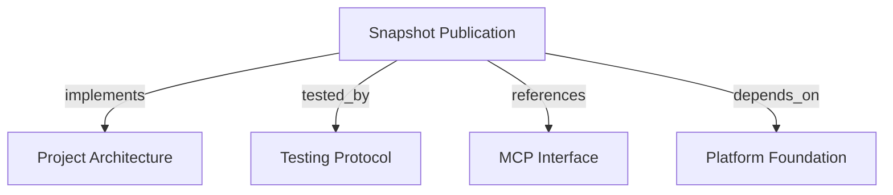

```graph
{
  "node_id": "feature:snapshot-publication",
  "domain": "snapshot_publication",
  "implements": ["adr:architecture"],
  "tested_by": ["adr:tests"],
  "entrypoints": ["mcp/tools/publish_project_snapshot.py"],
  "registration_files": ["mcp/server/factory.py"],
  "reference_files": [
    "core/domain/snapshot_publication/aggregates/project_knowledge_snapshot.py",
    "core/infrastructure/postgres/repositories/snapshot_publication_repository.py"
  ],
  "code_files": [
    "mcp/services/tenant_context.py",
    "mcp/services/publication_response_mapper.py",
    "core/application/snapshot_publication/contracts/base.py",
    "core/application/snapshot_publication/contracts/entity_input.py",
    "core/application/snapshot_publication/contracts/evidence_input.py",
    "core/application/snapshot_publication/contracts/project_input.py",
    "core/application/snapshot_publication/contracts/relation_input.py",
    "core/application/snapshot_publication/errors/missing_tenant_context.py",
    "core/application/snapshot_publication/ports/snapshot_publication_store.py",
    "core/application/snapshot_publication/services/canonical_payload_serializer.py",
    "core/application/snapshot_publication/services/payload_hash_calculator.py",
    "core/application/snapshot_publication/types/publication_context.py",
    "core/application/snapshot_publication/types/publication_record.py",
    "core/application/snapshot_publication/types/publication_status.py",
    "core/application/snapshot_publication/use_cases/publish_project_snapshot/handler.py",
    "core/application/snapshot_publication/use_cases/publish_project_snapshot/inbound.py",
    "core/application/snapshot_publication/use_cases/publish_project_snapshot/outbound.py",
    "core/domain/snapshot_publication/entities/entity_fact.py",
    "core/domain/snapshot_publication/entities/evidence_fact.py",
    "core/domain/snapshot_publication/entities/project_descriptor.py",
    "core/domain/snapshot_publication/entities/relation_fact.py",
    "core/domain/snapshot_publication/errors/persistence_failure.py",
    "core/domain/snapshot_publication/errors/revision_conflict.py",
    "core/domain/snapshot_publication/errors/snapshot_invariant_violation.py",
    "core/domain/snapshot_publication/errors/stale_revision.py",
    "core/domain/snapshot_publication/services/snapshot_builder.py",
    "core/domain/snapshot_publication/services/snapshot_revision_policy.py",
    "core/domain/snapshot_publication/types/entity_type.py",
    "core/domain/snapshot_publication/types/provenance_kind.py",
    "core/domain/snapshot_publication/types/relation_type.py",
    "core/domain/snapshot_publication/types/revision_decision.py",
    "core/domain/snapshot_publication/value_objects/current_snapshot_descriptor.py",
    "core/domain/snapshot_publication/value_objects/entity_key.py",
    "core/domain/snapshot_publication/value_objects/generated_at.py",
    "core/domain/snapshot_publication/value_objects/metadata_object.py",
    "core/domain/snapshot_publication/value_objects/payload_hash.py",
    "core/domain/snapshot_publication/value_objects/project_descriptor.py",
    "core/domain/snapshot_publication/value_objects/project_key.py",
    "core/domain/snapshot_publication/value_objects/relation_reference.py",
    "core/domain/snapshot_publication/value_objects/revision.py",
    "core/domain/snapshot_publication/value_objects/schema_version.py",
    "core/infrastructure/postgres/repositories/snapshot_graph_rows.py",
    "core/infrastructure/postgres/repositories/snapshot_persistence_mapper.py"
  ],
  "test_files": [
    "tests/unit/core/application/snapshot_publication/contracts/test_inbound.py",
    "tests/unit/core/application/snapshot_publication/helpers.py",
    "tests/unit/core/application/snapshot_publication/services/test_payload_hash.py",
    "tests/unit/core/application/snapshot_publication/use_cases/test_publish_project_snapshot.py",
    "tests/unit/core/domain/snapshot_publication/services/test_revision_policy.py",
    "tests/unit/core/domain/snapshot_publication/test_snapshot_domain.py",
    "tests/unit/core/infrastructure/postgres/repositories/test_snapshot_persistence_mapper.py",
    "tests/integration/core/infrastructure/postgres/repositories/test_snapshot_publication_repository.py",
    "tests/e2e/mcp/test_publish_project_snapshot.py"
  ]
}
```

# Snapshot Publication
Publish a complete immutable project snapshot and switch its active pointer atomically.

## OVERVIEW

The application validates a complete `schema_version` 1.0 payload, builds an immutable domain aggregate, and hashes canonical content. Persist through one **tenant-scoped transaction**; retain old snapshots and change only the Project's active pointer.

## FOLDER STRUCTURE

```text
core/domain/snapshot_publication/       # Snapshot invariants and revision policy
core/application/snapshot_publication/  # Contracts, hashing, and publication use case
core/infrastructure/postgres/           # Graph mapping and atomic persistence
mcp/tools/                              # Public publication adapter
tests/{unit,integration,e2e}/           # Domain, persistence, and MCP contracts
```

## PUBLICATION CONTRACT

| Field | Contract |
|---|---|
| Version and revision | REQUIRED: Use schema `1.0` and positive integer revisions. |
| Time | REQUIRED: Supply offset-aware `generated_at`; normalize to UTC. |
| Fact limits | ALLOWED: Up to 10,000 entities, 50,000 relations, and 50,000 evidence items. |
| Metadata and payload | REQUIRED: Use JSON object metadata up to 64 KiB each; reject canonical payloads over 10 MiB. |
| References | REQUIRED: Resolve relation endpoints and evidence references within the same snapshot. |

## REVISION POLICY

- REQUIRED: **Hash validated content** with deterministic JSON; include revision and normalized timestamp, exclude trusted tenant context.
- REQUIRED: Return `ALREADY_PUBLISHED` for identical stored revision and hash without reactivation.
- PROHIBITED: Reuse a revision with different content or accept a new revision lower than the active revision.
- REQUIRED: Insert the snapshot and facts, then update `active_snapshot_id` in one **atomic transaction**; roll back all writes on failure.
- REQUIRED: Obtain tenant identity from trusted `PublicationContext`; never accept `tenant_id` in the payload.

## HOW TO EXTEND

1. Add each new contract or domain type in its own file; keep Pydantic shape checks separate from domain invariants.
2. Extend the aggregate builder and persistence mapper for any new snapshot fact.
3. Test revision outcomes, tenant isolation, rollback, and retry behavior at their owning unit or persistence boundary.
4. Map stable error categories in the MCP adapter; keep SQL, credentials, and payload contents private.

## KNOWN GAPS

- PROHIBITED: Assume frozen inbound models deeply freeze nested metadata dictionaries; current input metadata remains mutable.
- REQUIRED: Validate text bounds after trimming; current Pydantic limits may reject padded boundary values.
- REQUIRED: Reject revisions above PostgreSQL `Integer` range and non-finite JSON numbers before persistence.
- REQUIRED: Prove locks, rollback, and concurrent publication against PostgreSQL; current repository integration tests use SQLite.

## DOCUMENT MAP



## REFERENCES

- [**ARCHITECTURE.md**](../adr/ARCHITECTURE.md): Defines dependency direction and persistence ownership.
- [**TESTS.md**](../adr/TESTS.md): Defines the test strategy for domain and persistence behavior.
- [**MCP.md**](../adr/MCP.md): Defines the tool and trusted-context boundary.
- [**platform-foundation.md**](./platform-foundation.md): Supplies the PostgreSQL schema, engine, and migration base.
