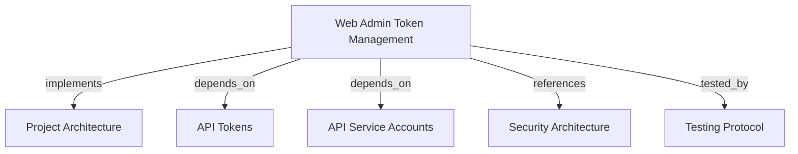

# Web Admin Token Management
Admin console interface for operator session authentication, tenant bootstrapping, and scoped access token lifecycle management.

```graph
{"node_id":"feature:web-admin-token-management","domain":"admin-token-management","implements":["adr:architecture"],"tested_by":["adr:tests"],"entrypoints":["web/src/middleware.ts","web/src/app/page.tsx","web/src/app/login/page.tsx"],"registration_files":["web/src/infrastructure/api/client-factory.ts"],"reference_files":["web/src/application/use-cases/issue-token.use-case.ts"],"code_files":["web/src/app/actions/auth.ts","web/src/app/actions/tokens.ts","web/src/application/ports/harness-api-client.port.ts","web/src/application/use-cases/bootstrap-tenant.use-case.ts","web/src/application/use-cases/revoke-token.use-case.ts","web/src/components/create-token-dialog.tsx","web/src/components/secret-reveal-modal.tsx","web/src/components/token-list.tsx","web/src/domain/access-token-order.ts","web/src/domain/admin-session.ts","web/src/domain/secret-reveal-view.ts","web/src/domain/token-scope.ts","web/src/infrastructure/api/rest-harness-api-client.ts","web/src/infrastructure/auth/auth-service.ts","web/src/infrastructure/auth/session-manager.ts","web/src/app/actions/projects.ts"],"test_files":["web/tests/unit/application/bootstrap-tenant.use-case.test.ts","web/tests/unit/application/issue-token.use-case.test.ts","web/tests/unit/application/revoke-token.use-case.test.ts","web/tests/unit/domain/access-token-order.test.ts","web/tests/unit/domain/admin-session.test.ts","web/tests/unit/domain/secret-reveal-view.test.ts","web/tests/unit/domain/token-scope.test.ts","web/tests/unit/infrastructure/rest-harness-api-client.test.ts","web/tests/unit/infrastructure/session-manager.test.ts","web/tests/e2e/admin-console.spec.ts","web/tests/e2e/demo-walkthrough.spec.ts"]}
```

## OVERVIEW

The Web Admin module implements a **BFF in Next.js 15 (App Router)** with hexagonal architecture. It provides operators with a secure UI to authenticate with administrative credentials, bootstrap tenants and service accounts, issue scoped opaque tokens (`hm_...`), reveal secrets once, and revoke active tokens.

The browser client never receives `API_ADMIN_TOKEN`. REST API calls run server-side via Server Actions and the API client; sessions rely on signed HTTP-only cookies.

## FOLDER STRUCTURE

<folder_structure>
```
web/
├── src/
│   ├── domain/                 # Models: TokenScope, AccessTokenOrder, AdminSession
│   ├── application/            # Ports and use cases: Bootstrap, Issue, Revoke
│   ├── infrastructure/         # RestHarnessApiClient, SessionManager, AuthService
│   ├── app/                    # Next.js App Router (actions, login, page)
│   ├── components/             # UI: TokenList, CreateTokenDialog, SecretRevealModal
│   └── middleware.ts           # Route guard and session verification
└── tests/
    ├── unit/                   # Vitest unit suites for domain, application, infra
    └── e2e/                    # Playwright E2E suites for auth and token journeys
```
</folder_structure>

## CORE CONCEPTS

- **Admin Session**: Ephemeral session from password check against `API_ADMIN_TOKEN`, stored in an HTTP-only cookie.
- **Tenant Bootstrap**: Verifies tenant/service account presence on load; provisions them via REST if missing.
- **Token Order**: Validates request parameters (description, scopes `memory:read`/`publish`/`impact`, expiry).
- **One-Time Secret Reveal**: Shows raw token (`hm_...`) in a mandatory acknowledgement modal; discarded on close.

## TOKEN MANAGEMENT WORKFLOW

### Prerequisites
1. REST API server running and healthy.
2. `API_ADMIN_TOKEN` set in environment.
3. Node.js 20+ runtime.

### Operational Flow
1. **Authenticate**: Operator submits admin token at `/login`. Middleware gates `/`.
2. **Bootstrap**: Dashboard triggers `BootstrapTenantUseCase` ensuring active tenant and service account.
3. **Issue Token**: The destination selector defaults to all tenants. The dialog loads every project and selects them by default. Keeping every project selected sends `project_keys: ["*"]`; a smaller selection sends explicit project keys to `POST /v1/tokens`.
4. **Reveal Secret**: Plaintext token is displayed in modal; operator copies and confirms.
5. **Revoke**: Operator confirms revocation in `TokenList`. `RevokeTokenUseCase` calls `DELETE /v1/tokens/{id}`.

<code_example>
# CORRECT: Server-side API communication through port interface
const client = ClientFactory.createHarnessApiClient();
const result = await issueTokenUseCase.execute(client, order);

# WRONG: Exposing API_ADMIN_TOKEN to client browser or fetching directly from client
const response = await fetch("http://api:8080/v1/tokens", {
  headers: { Authorization: `Bearer ${process.env.API_ADMIN_TOKEN}` }
});
</code_example>

## PARAMETERS & CONFIGURATIONS

| Variable | Type | Required | Description | Default |
|----------|------|----------|-------------|---------|
| `HARNESS_API_URL` | string | Yes | Harness Memory REST API base URL | `http://localhost:8080` |
| `API_ADMIN_TOKEN` | string | Yes | Master secret for admin auth and backend calls | — |
| `PORT` | number | No | HTTP listening port for Next.js server | `3000` |
| `NODE_ENV` | string | No | Execution environment (`development`, `production`, `test`) | `development` |

## BEST PRACTICES

REQUIRED: Validate token parameters in domain entities (`AccessTokenOrder`, `TokenScope`) before calling API.
REQUIRED: Label all-tenant project access clearly; selecting it grants access to every tenant's projects.
REQUIRED: Keep all admin API client calls in server actions; never leak tokens to browser scripts.
REQUIRED: Enforce one-time secret display pattern with explicit user confirmation before closing modal.
PROHIBITED: Bypassing middleware route guards or permitting unauthenticated requests to the dashboard.
PROHIBITED: Persisting plaintext token secrets in local storage, cookies, or logs.

## DOCUMENT MAP



## REFERENCES

- [**ARCHITECTURE.md**](../../adr/ARCHITECTURE.md): System architecture, layer definitions, and BFF integration.
- [**SECURITY.md**](../../adr/SECURITY.md): Authentication policies, token storage, and credential isolation.
- [**TESTS.md**](../../adr/TESTS.md): Vitest and Playwright test commands and execution patterns.
- [**tokens.md**](../api/tokens.md): API token lifecycle, opaque SHA-256 storage, and scopes.
- [**service-accounts.md**](../api/service-accounts.md): Non-human identity management and ownership.
