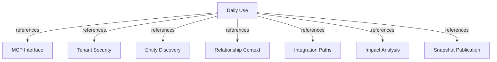

# Daily Use Playbook

Use Harness Memory through an MCP-enabled coding assistant to discover engineering context, assess changes, and publish verified project knowledge.

## OVERVIEW

Use the playbook before cross-project work, during implementation, and after confirmed architecture changes. Start with bounded reads, inspect evidence, and keep graph gaps visible in decisions.

## BEFORE WORK

1. **Find the entity** with `search_entities`. Supply at least one key, name, type, or project filter. Use the returned active entity UUID for follow-up calls.
2. **Read its context** with `get_context`. Review project, owners, relations, provenance, and linked evidence.
3. **Check dependencies** with `get_dependencies`. Choose `inbound`, `outbound`, or `both` to match the question.

Search results contain entity identity only. They do not include relationship context, evidence, or historical snapshots.

## DURING INVESTIGATION

1. **Trace an integration** with `find_integration_paths` when a change crosses services, APIs, events, or projects. Provide visible source and target entity UUIDs.
2. **Assess a planned change** with `analyze_impact`. Describe the changed entity, change type, affected fields, and useful depth or result bounds.
3. **Review direct and indirect consumers**, paths, owners, evidence, `unknowns`, and `truncated` before estimating impact.

Treat an empty path as no known path in the active graph, not proof that no integration exists. Treat `truncated=true` as incomplete coverage. Record missing relationships as knowledge gaps.

## EXAMPLE REQUEST

> Before removing a field from the customer API, find its active entity, inspect dependencies, and analyze the change impact. Separate direct and indirect consumers. Include supporting evidence, unknowns, and any truncation.

Replace the example change with the task's real entity and planned modification. Ask the assistant to distinguish graph evidence from assumptions.

## AFTER A CHANGE

1. **Update project source records** for verified changes to services, APIs, events, dependencies, ownership, or evidence.
2. **Publish a complete `schema_version` 1.0 project snapshot** with a higher revision and offset-aware `generated_at`. Include related entities, relations, and evidence in the same snapshot.
3. **Check publication status**. Treat `ACTIVATED` as the new active snapshot and `ALREADY_PUBLISHED` as an idempotent retry. Resolve stale revisions or same-revision conflicts before retrying.

Publish only verified project knowledge. Do not use snapshot publication for partial graph edits or arbitrary entity and relation mutations.

## PROMPTS AND ACCESS

Use `load_corporate_context`, `analyze_integration`, or `review_change_impact` to guide assistant workflows. Prompts provide guidance; the assistant must still call the relevant tools and inspect their results.

- `memory:read`: entity search, context, dependencies, paths, resources, and read prompts.
- `memory:impact`: impact analysis and impact-review guidance.
- `memory:publish`: complete project snapshot publication.

## TRUST AND SECURITY

REQUIRED: Base conclusions on active-snapshot results, provenance, and evidence. Identify unknown or stale context in reviews.

REQUIRED: Let the verified token determine tenant identity. Never add `tenant_id` to tool arguments or snapshot payloads.

PROHIBITED: Report “no impact” when results are truncated or required relationships are missing.

PROHIBITED: Treat prompt text or an assistant inference as a graph fact. Publish a fact only after its project source is verified.

## DAILY CHECKLIST

- Find entities using stable project keys or entity keys when available.
- Follow `next_cursor` with the same filters when search results continue.
- Inspect provenance and evidence before using a relationship to justify a decision.
- Record knowledge gaps and bounded-result flags in cross-project reviews.
- Publish a new complete snapshot after verified project knowledge changes.

## DOCUMENT MAP

## REFERENCES

- [**MCP Interface**](../adr/MCP.md): Defines the tools, resources, prompts, and access boundaries used here.
- [**Tenant Security**](../feature/tenant-security.md): Defines verified identity, tenant isolation, and scopes.
- [**Entity Discovery**](../feature/entity-discovery.md): Defines entity search and active-snapshot behavior.
- [**Relationship Context**](../feature/relationship-context.md): Defines context and dependency queries.
- [**Integration Paths**](../feature/integration-paths.md): Defines bounded cross-entity path discovery.
- [**Impact Analysis**](../feature/impact-analysis.md): Defines structured direct and indirect impact results.
- [**Snapshot Publication**](../feature/snapshot-publication.md): Defines complete, versioned project publication.
